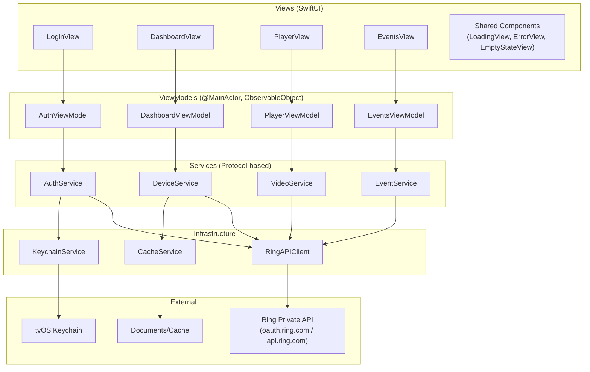
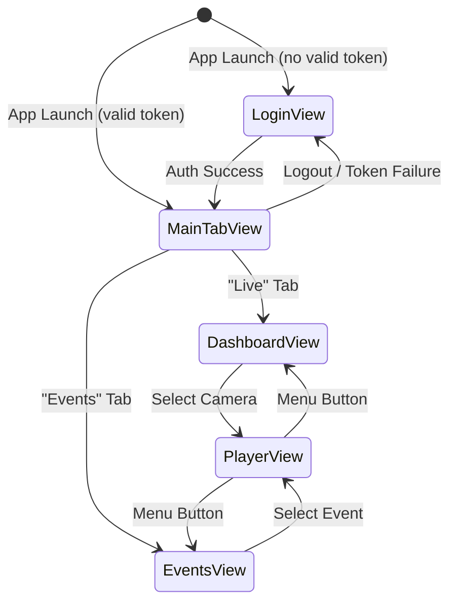

# Apple TV Ring Camera Viewer — Design Document

**Feature Name**: Apple TV Ring Camera Viewer (AppleTVRing)
**Version**: 1.0
**Last Updated**: January 2026

## Overview

This document describes the technical design for a tvOS application that allows Ring camera owners to view live streams and recorded events on their Apple TV. The app uses Ring's private (reverse-engineered) API for authentication, device discovery, HLS live streaming, and event history retrieval.

The application follows an MVVM architecture with protocol-based dependency injection, built entirely in SwiftUI targeting tvOS 15.0+. All network communication uses HTTPS, tokens are stored in the iOS/tvOS Keychain, and video playback is handled by AVPlayer consuming HLS streams provided by Ring's API.

Key design drivers:
- **Testability**: Protocol-based services enable full mock injection; property-based tests cover critical business logic invariants.
- **Security**: Keychain-only token storage, no credential logging, HTTPS everywhere.
- **Resilience**: Automatic token refresh, exponential backoff retries, graceful degradation for offline devices and missing Ring Protect subscriptions.
- **tvOS UX**: Focus Engine integration, 10-foot UI readability, Siri Remote navigation.

### Research Summary

The design is informed by the following research:

1. **Ring Private API** — Based on reverse-engineered endpoints documented in open-source libraries ([python-ring-doorbell](https://github.com/python-ring-doorbell/python-ring-doorbell), [ring-client-api](https://github.com/dgreif/ring)). Authentication uses an OAuth-like flow against `https://oauth.ring.com/oauth/token` with email/password grant, returning access + refresh tokens. Device discovery hits `https://api.ring.com/clients_api/ring_devices`. Live streaming requests an HLS URL via a POST to the device's live stream endpoint. Event history is fetched per-device from `https://api.ring.com/clients_api/doorbots/{id}/history`. 2FA is handled via a header-based verification code flow.

2. **tvOS Video Playback** — Apple recommends using `AVPlayerViewController` for media playback on tvOS to get native transport controls and system integration ([WWDC 2021 - Deliver a great playback experience on tvOS](https://developer.apple.com/videos/play/wwdc2021/10191/)). HLS streams work natively with `AVPlayer` — no custom demuxing needed. Adaptive bitrate switching is handled automatically by the player.

3. **Keychain on tvOS** — tvOS supports the Security framework's `SecItemAdd`/`SecItemCopyMatching` APIs with `kSecClassGenericPassword`. Tokens are stored as `Data` blobs keyed by service + account identifiers.

4. **Property-Based Testing in Swift** — [SwiftCheck](https://github.com/philsquared/SwiftCheck) is the most established PBT library for Swift, providing QuickCheck-style property testing with automatic shrinking. It integrates with XCTest and supports custom `Arbitrary` generators.

---

## Architecture

### High-Level Architecture



### Layer Responsibilities

| Layer | Responsibility | Key Constraint |
|-------|---------------|----------------|
| **Views** | SwiftUI rendering, focus management, user input | No business logic; delegates to ViewModels |
| **ViewModels** | State management, UI state machine, async coordination | `@MainActor`; publishes `ViewState` enum |
| **Services** | Business logic, orchestration, caching strategy | Protocol-defined; injected via init |
| **Infrastructure** | Network I/O, Keychain, file cache | Thin wrappers; no business logic |

### Navigation Flow



---

## Components and Interfaces

### Service Protocols

```swift
// MARK: - Authentication

protocol AuthService {
    func login(email: String, password: String) async throws -> AuthToken
    func login(email: String, password: String, twoFactorCode: String) async throws -> AuthToken
    func logout() async
    func getValidToken() async throws -> AuthToken
    func refreshToken() async throws -> AuthToken
    var isAuthenticated: Bool { get }
}

// MARK: - Device Management

protocol DeviceService {
    func fetchDevices() async throws -> [RingDevice]
    func filterDevices(_ devices: [RingDevice], by filter: DeviceFilter) -> [RingDevice]
    func sortDevices(_ devices: [RingDevice], by sort: DeviceSort) -> [RingDevice]
    func refreshDevices() async throws -> [RingDevice]
}

// MARK: - Video Streaming

protocol VideoService {
    func requestLiveStream(for deviceId: Int) async throws -> StreamSession
    func validateStreamSession(_ session: StreamSession) -> Bool
}

// MARK: - Event History

protocol EventService {
    func fetchEvents(for deviceId: Int?) async throws -> [RingEvent]
    func fetchEventVideoURL(for event: RingEvent) async throws -> URL
}
```

### Infrastructure Protocols

```swift
// MARK: - Ring API Client

protocol RingAPIClient {
    func authenticate(email: String, password: String) async throws -> AuthTokenResponse
    func authenticate(email: String, password: String, twoFactorCode: String) async throws -> AuthTokenResponse
    func refreshToken(_ refreshToken: String) async throws -> AuthTokenResponse
    func fetchDevices(token: String) async throws -> [RingDeviceResponse]
    func requestLiveStream(deviceId: Int, token: String) async throws -> StreamSessionResponse
    func fetchEvents(deviceId: Int, token: String, limit: Int) async throws -> [RingEventResponse]
    func fetchEventVideoURL(eventId: Int, token: String) async throws -> URL
}

// MARK: - Keychain

protocol KeychainService {
    func save(_ data: Data, for key: String) throws
    func load(for key: String) throws -> Data?
    func delete(for key: String) throws
}

// MARK: - Cache

protocol CacheService {
    func save<T: Codable>(_ value: T, for key: String, ttl: TimeInterval) throws
    func load<T: Codable>(for key: String, as type: T.Type) throws -> T?
    func remove(for key: String) throws
    func clear() throws
    func isExpired(for key: String) -> Bool
}
```

### ViewModel State Machine

All ViewModels use a shared `ViewState` pattern:

```swift
enum ViewState<T> {
    case idle
    case loading
    case loaded(T)
    case error(String)
    case empty(String)
}
```

### Filtering and Sorting

```swift
enum DeviceFilter {
    case all
    case name(String)
    case type(DeviceType)
    case status(DeviceStatus)
}

enum DeviceSort {
    case nameAscending
    case nameDescending
    case type
    case status
}

enum DeviceStatus {
    case online
    case offline
}
```

---

## Data Models

### AuthToken

```swift
struct AuthToken: Codable, Equatable {
    let accessToken: String
    let refreshToken: String
    let expiresAt: Date
    let scope: String?
    let tokenType: String

    var isExpired: Bool {
        Date() >= expiresAt
    }

    var needsRefresh: Bool {
        // Refresh 5 minutes before expiry
        Date() >= expiresAt.addingTimeInterval(-300)
    }
}
```

### RingDevice

```swift
struct RingDevice: Codable, Identifiable, Equatable {
    let id: Int
    let description: String
    let deviceType: DeviceType
    let firmwareVersion: String?
    let address: String?
    let batteryLife: Int?
    let features: DeviceFeatures?
    var isOnline: Bool
    var snapshotURL: URL?

    enum DeviceType: String, Codable, CaseIterable {
        case doorbell = "doorbell"
        case doorbellPro = "doorbell_pro"
        case doorbellV2 = "doorbell_v2"
        case stickupCam = "stickup_cam"
        case spotlightCam = "spotlight_cam"
        case floodlightCam = "floodlight_cam"
        case indoorCam = "indoor_cam"
        case unknown

        var displayName: String {
            switch self {
            case .doorbell, .doorbellPro, .doorbellV2: return "Video Doorbell"
            case .stickupCam: return "Stick Up Cam"
            case .spotlightCam: return "Spotlight Cam"
            case .floodlightCam: return "Floodlight Cam"
            case .indoorCam: return "Indoor Cam"
            case .unknown: return "Camera"
            }
        }
    }

    struct DeviceFeatures: Codable, Equatable {
        let motionDetection: Bool
        let nightVision: Bool
    }
}
```

### RingEvent

```swift
struct RingEvent: Codable, Identifiable, Equatable {
    let id: Int
    let deviceId: Int
    let deviceName: String
    let eventType: EventType
    let createdAt: Date
    let duration: TimeInterval?
    let thumbnailURL: URL?
    let videoAvailable: Bool

    enum EventType: String, Codable {
        case motion = "motion"
        case ding = "ding"        // doorbell press
        case onDemand = "on_demand"

        var displayName: String {
            switch self {
            case .motion: return "Motion Detected"
            case .ding: return "Doorbell Press"
            case .onDemand: return "On Demand"
            }
        }

        var iconName: String {
            switch self {
            case .motion: return "figure.walk"
            case .ding: return "bell.fill"
            case .onDemand: return "video.fill"
            }
        }
    }
}
```

### StreamSession

```swift
struct StreamSession: Codable, Equatable {
    let deviceId: Int
    let hlsURL: URL
    let createdAt: Date
    let maxDuration: TimeInterval  // API-imposed limit

    var isValid: Bool {
        remainingTime > 0
    }

    var remainingTime: TimeInterval {
        max(0, maxDuration - Date().timeIntervalSince(createdAt))
    }
}
```

### Error Types

```swift
enum RingAPIError: Error, Equatable {
    case invalidCredentials
    case twoFactorRequired
    case twoFactorInvalid
    case tokenExpired
    case tokenRefreshFailed
    case networkError(String)
    case serverError(Int)
    case decodingError(String)
    case deviceOffline
    case streamUnavailable
    case rateLimited
    case unknown(String)

    var userMessage: String {
        switch self {
        case .invalidCredentials: return "Invalid email or password. Please try again."
        case .twoFactorRequired: return "Two-factor authentication code required."
        case .twoFactorInvalid: return "Invalid verification code. Please try again."
        case .tokenExpired: return "Your session has expired. Please log in again."
        case .tokenRefreshFailed: return "Unable to refresh session. Please log in again."
        case .networkError: return "Network connection error. Please check your connection."
        case .serverError: return "Ring servers are temporarily unavailable. Please try later."
        case .decodingError: return "Unexpected response from Ring. Please try again."
        case .deviceOffline: return "This device is currently offline."
        case .streamUnavailable: return "Live stream is not available for this device."
        case .rateLimited: return "Too many requests. Please wait a moment."
        case .unknown: return "An unexpected error occurred. Please try again."
        }
    }
}

enum KeychainError: Error, Equatable {
    case saveFailed(OSStatus)
    case loadFailed(OSStatus)
    case deleteFailed(OSStatus)
    case dataConversionFailed
    case itemNotFound

    var userMessage: String {
        switch self {
        case .saveFailed: return "Unable to save credentials securely."
        case .loadFailed: return "Unable to retrieve stored credentials."
        case .deleteFailed: return "Unable to remove stored credentials."
        case .dataConversionFailed: return "Credential data is corrupted."
        case .itemNotFound: return "No stored credentials found."
        }
    }
}
```

### AppConfiguration

```swift
struct AppConfiguration: Codable {
    var useMocks: Bool = false
    var enableDebugLogging: Bool = false
    var streamTimeoutSeconds: TimeInterval = 600  // 10 min default
    var maxStreamDuration: TimeInterval = 600
    var deviceRefreshInterval: TimeInterval = 60
    var eventHistoryHours: Int = 48
    var maxEventCount: Int = 50
    var cacheExpirationSeconds: TimeInterval = 300
    var enableCrashReporting: Bool = true
    var enableLocalAnalytics: Bool = false
}
```

### API Response Models (Codable DTOs)

```swift
struct AuthTokenResponse: Codable {
    let accessToken: String
    let refreshToken: String
    let expiresIn: Int
    let scope: String?
    let tokenType: String

    enum CodingKeys: String, CodingKey {
        case accessToken = "access_token"
        case refreshToken = "refresh_token"
        case expiresIn = "expires_in"
        case scope
        case tokenType = "token_type"
    }

    func toDomain() -> AuthToken {
        AuthToken(
            accessToken: accessToken,
            refreshToken: refreshToken,
            expiresAt: Date().addingTimeInterval(TimeInterval(expiresIn)),
            scope: scope,
            tokenType: tokenType
        )
    }
}

struct RingDeviceResponse: Codable {
    let id: Int
    let description: String
    let kind: String
    let firmwareVersion: String?
    let address: String?
    let batteryLife: String?
    let features: [String: Bool]?

    enum CodingKeys: String, CodingKey {
        case id, description, kind
        case firmwareVersion = "firmware_version"
        case address
        case batteryLife = "battery_life"
        case features
    }

    func toDomain() -> RingDevice {
        RingDevice(
            id: id,
            description: description,
            deviceType: RingDevice.DeviceType(rawValue: kind) ?? .unknown,
            firmwareVersion: firmwareVersion,
            address: address,
            batteryLife: Int(batteryLife ?? ""),
            features: nil,
            isOnline: true,
            snapshotURL: nil
        )
    }
}
```

---

## Correctness Properties

*A property is a characteristic or behavior that should hold true across all valid executions of a system — essentially, a formal statement about what the system should do. Properties serve as the bridge between human-readable specifications and machine-verifiable correctness guarantees.*

### Property 1: Token persistence round-trip

*For any* valid `AuthToken`, encoding it to `Data`, saving it to the Keychain, loading it back, and decoding it should produce an `AuthToken` equal to the original.

**Validates: Requirements FR-1.1.3, FR-1.1.4**

### Property 2: Token refresh always yields a non-expired token

*For any* expired `AuthToken` where the refresh token is still valid, calling `getValidToken()` should return an `AuthToken` whose `isExpired` is `false` and whose `expiresAt` is in the future.

**Validates: Requirements FR-1.2.1, FR-1.2.5**

### Property 3: Device type parsing correctness

*For any* device kind string, if the string matches a known `DeviceType` raw value then parsing should produce that exact case; otherwise parsing should produce `.unknown`. No valid kind string should ever be lost or misclassified.

**Validates: Requirements FR-2.1.2**

### Property 4: Device filtering produces a valid subset

*For any* list of `RingDevice` and any `DeviceFilter`, the filtered result should be a subset of the original list (count ≤ original count), and every device in the result should satisfy the filter predicate.

**Validates: Requirements FR-2.2.4**

### Property 5: Device sorting preserves elements and maintains order

*For any* list of `RingDevice` and any `DeviceSort`, the sorted result should contain exactly the same elements as the input (same count, same set), and adjacent pairs should satisfy the sort comparator.

**Validates: Requirements FR-2.2.5**

### Property 6: Stream session validity is consistent with elapsed time

*For any* `StreamSession` with a given `createdAt` and `maxDuration`, `isValid` should be `true` if and only if `remainingTime > 0`, and `remainingTime` should always be `≥ 0` and `≤ maxDuration`.

**Validates: Requirements FR-3.3.4**

### Property 7: Event processing enforces limit and descending order

*For any* list of `RingEvent`, after applying the 50-event limit and timestamp sort, the result should have count `≤ 50`, be sorted in strictly non-ascending `createdAt` order, and contain only the most recent events from the input.

**Validates: Requirements FR-4.1.3, FR-4.2.2**

### Property 8: All error types produce non-empty user messages

*For any* `RingAPIError` case, the `userMessage` computed property should return a non-empty `String` that does not contain raw technical identifiers (e.g., HTTP status codes, exception names).

**Validates: Requirements FR-5.5.1**

---

## Error Handling

### Error Propagation Strategy

Errors flow upward through the layer stack and are translated at each boundary:

```
Ring API → RingAPIError (Infrastructure)
    → Service layer catches, may retry or re-throw
        → ViewModel catches, maps to ViewState.error(userMessage)
            → View displays error with retry/dismiss actions
```

### Retry Strategy

- **Exponential backoff**: Retries use delays of `2^attempt` seconds, capped at 60 seconds.
- **Retryable errors**: Network errors, server errors (5xx), rate limiting (429).
- **Non-retryable errors**: Invalid credentials, 2FA required, decoding errors.
- **Max retries**: 3 attempts before surfacing error to user.

### Token Error Handling

| Scenario | Behavior |
|----------|----------|
| Token expired, refresh succeeds | Transparent refresh, operation continues |
| Token expired, refresh fails | Navigate to login, show "Session expired" |
| Initial auth fails | Show error on login screen, stay on login |
| 2FA required | Show 2FA input field |
| 2FA code invalid | Show error, allow retry |

### Network Error Handling

| Scenario | Behavior |
|----------|----------|
| No network connection | Show "Check your connection" with retry |
| Request timeout | Retry with backoff, then show timeout error |
| Server error (5xx) | Retry with backoff, then show "servers unavailable" |
| Rate limited (429) | Wait and retry, show "too many requests" if persistent |
| Malformed response | Show generic error, log for debugging |

### Stream Error Handling

| Scenario | Behavior |
|----------|----------|
| Device offline | Show "device offline" message, return to dashboard |
| Stream URL request fails | Show error with retry option |
| Stream playback fails mid-stream | Show error overlay with retry, keep player open |
| Stream session expires | Show "stream ended" message, offer to restart |
| Network interruption during stream | AVPlayer handles buffering; show error if unrecoverable |

---

## Testing Strategy

### Overview

The testing strategy uses a dual approach: example-based unit tests for specific scenarios and edge cases, plus property-based tests for universal invariants across generated inputs. All external dependencies are mocked via protocol injection.

### Testing Framework

- **Unit Tests**: XCTest (built-in)
- **Property-Based Tests**: [SwiftCheck](https://github.com/philsquared/SwiftCheck) — QuickCheck-style PBT for Swift with automatic shrinking and `Arbitrary` generators
- **Mocking**: Protocol-based manual mocks (no mocking framework needed)

### Coverage Targets

| Layer | Target | Rationale |
|-------|--------|-----------|
| Models | 100% | All `Codable` conformance, computed properties, enums |
| Services | 90%+ | Core business logic, filtering, sorting, token management |
| ViewModels | 80%+ | State transitions, error handling, async coordination |
| Views | Manual | Focus management, layout — tested via simulator |
| Overall | 80%+ | Per requirements TST-1 |

### Property-Based Test Configuration

- **Library**: SwiftCheck (Swift Package Manager dependency)
- **Minimum iterations**: 100 per property test
- **Tag format**: `Feature: AppleTVRing, Property {N}: {title}`
- Each property test maps to exactly one Correctness Property from this design document
- Custom `Arbitrary` generators for: `AuthToken`, `RingDevice`, `RingEvent`, `StreamSession`, `DeviceFilter`, `DeviceSort`

### Property Test Plan

| Property | Test Location | Generator |
|----------|--------------|-----------|
| P1: Token persistence round-trip | `KeychainServiceTests` | Random `AuthToken` (random strings, future/past dates) |
| P2: Token refresh yields valid token | `AuthServiceTests` | Random expired `AuthToken` with mock refresh |
| P3: Device type parsing | `RingDeviceTests` | Random strings including known `DeviceType` raw values |
| P4: Device filtering subset | `DeviceServiceTests` | Random `[RingDevice]` + random `DeviceFilter` |
| P5: Device sorting preserves elements | `DeviceServiceTests` | Random `[RingDevice]` + random `DeviceSort` |
| P6: Stream session validity | `StreamSessionTests` | Random `StreamSession` with varying `createdAt`/`maxDuration` |
| P7: Event limit and ordering | `EventServiceTests` | Random `[RingEvent]` of varying sizes (0–200) |
| P8: Error messages non-empty | `RingAPIErrorTests` | All `RingAPIError` cases (exhaustive, not random) |

### Unit Test Plan

Key example-based tests (non-exhaustive):

- **AuthViewModel**: Login success → `.loaded`, login failure → `.error(message)`, 2FA flow, logout clears state
- **DashboardViewModel**: Load devices success/failure, background refresh timer, filter/sort state changes
- **PlayerViewModel**: Stream request success/failure, retry logic, session expiration handling
- **EventsViewModel**: Load events success/failure, Ring Protect inactive message, sort verification
- **RingAPIClient**: Request construction, JSON parsing, error mapping for each endpoint
- **KeychainService**: Save/load/delete operations, error cases (item not found, save failure)
- **CacheService**: Save/load with TTL, expiration, clear, thread safety

### Mock Infrastructure

All mocks implement the corresponding protocol and support:
- **Configurable return values**: Set success/failure responses per method
- **Call tracking**: Record method calls with arguments for verification
- **Error injection**: Throw specific errors on demand

```swift
// Example mock structure
class MockRingAPIClient: RingAPIClient {
    var authenticateResult: Result<AuthTokenResponse, Error> = .failure(RingAPIError.unknown("not configured"))
    var authenticateCalls: [(email: String, password: String)] = []

    func authenticate(email: String, password: String) async throws -> AuthTokenResponse {
        authenticateCalls.append((email, password))
        return try authenticateResult.get()
    }
    // ... other methods follow same pattern
}
```

### Test Data Generators (for PBT)

```swift
// SwiftCheck Arbitrary conformances
extension AuthToken: Arbitrary {
    static var arbitrary: Gen<AuthToken> {
        Gen<AuthToken>.compose { c in
            AuthToken(
                accessToken: c.generate(using: String.arbitrary),
                refreshToken: c.generate(using: String.arbitrary),
                expiresAt: c.generate(using: Date.arbitrary),
                scope: c.generate(using: Optional<String>.arbitrary),
                tokenType: "Bearer"
            )
        }
    }
}

extension RingDevice: Arbitrary {
    static var arbitrary: Gen<RingDevice> {
        Gen<RingDevice>.compose { c in
            RingDevice(
                id: c.generate(using: Int.arbitrary.suchThat { $0 > 0 }),
                description: c.generate(using: String.arbitrary.suchThat { !$0.isEmpty }),
                deviceType: c.generate(using: DeviceType.arbitrary),
                firmwareVersion: c.generate(using: Optional<String>.arbitrary),
                address: c.generate(using: Optional<String>.arbitrary),
                batteryLife: c.generate(using: Optional<Int>.arbitrary),
                features: nil,
                isOnline: c.generate(using: Bool.arbitrary),
                snapshotURL: nil
            )
        }
    }
}
```

### Manual Testing Checklist

Per requirements TST-4 through TST-6:
- Simulator: Keyboard navigation, focus management, all view states, mock data
- Device: Siri Remote gestures, real Ring API, video quality, performance metrics
- Accessibility: VoiceOver on all views, high contrast, reduced motion
