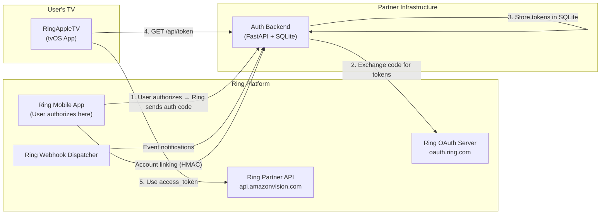
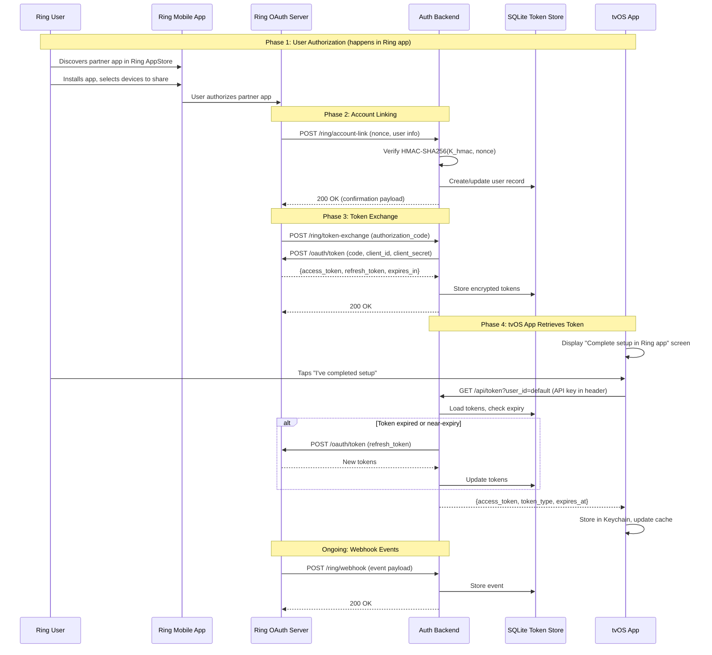
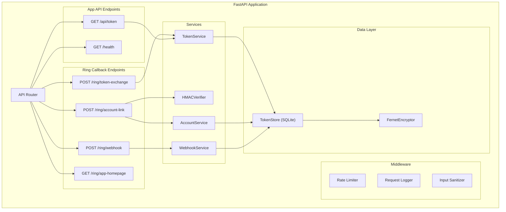

# Design Document: Partner Auth Backend

## Overview

This design describes a lightweight Python (FastAPI) backend service that acts as the OAuth 2.0 intermediary between Ring's Partner API and the RingAppleTV tvOS application, plus the corresponding changes to the tvOS app's authentication layer.

**Why a backend is needed:** Ring's Partner API uses the Authorization Code flow, which requires a server-side callback endpoint to receive authorization codes, HMAC-SHA256 signature verification for account linking, and secure storage of `client_secret` and HMAC signing keys. The tvOS app cannot participate in this flow directly — it has no web server, cannot receive HTTP callbacks, and should not embed secrets in the app binary for production use.

**What changes:**
- A new Python/FastAPI service (`partner-auth-backend/`) handles Ring callbacks (token exchange, account linking, webhooks, app homepage), stores tokens in SQLite, and exposes a token retrieval API for the tvOS app.
- The tvOS app replaces its Device Authorization Grant flow with a simple "fetch token from backend" flow. The existing `PartnerAPIClient`, WHEP streaming, device/event services remain unchanged.

**Key design decisions:**
1. **FastAPI over Flask** — async-native, automatic OpenAPI docs, Pydantic validation, minimal boilerplate.
2. **SQLite for token storage** — zero-infrastructure, single-file database, sufficient for single-user/small-scale partner apps. Easily swappable for PostgreSQL later.
3. **Fernet encryption for tokens at rest** — symmetric encryption using a key derived from an environment variable. Simple, well-supported in Python's `cryptography` library.
4. **Shared API key for tvOS ↔ backend auth** — a pre-shared key sent in the `Authorization` header. Simple and sufficient for a single-app backend; upgradeable to JWT later.

## Architecture

### System Context



### End-to-End Authentication Flow



### Backend Component Architecture



## Components and Interfaces

### Backend Components

#### 1. FastAPI Application (`main.py`)

Entry point that wires together all routes, middleware, and services. Validates required environment variables at startup (fail-fast).

```python
# Environment variables (all required unless noted):
# RING_CLIENT_ID        - Partner client ID
# RING_CLIENT_SECRET    - Partner client secret
# RING_HMAC_KEY         - HMAC-SHA256 signing key (base64-encoded)
# APP_API_KEY           - Shared API key for tvOS app authentication
# TOKEN_ENCRYPTION_KEY  - Fernet key for encrypting tokens at rest
# DATABASE_PATH         - SQLite file path (default: ./tokens.db)
# LOG_LEVEL             - Logging level (default: INFO)
```

#### 2. Token Exchange Handler (`routes/ring_callbacks.py`)

```python
@router.post("/ring/token-exchange")
async def token_exchange(request: TokenExchangeRequest) -> Response:
    """
    Receives authorization code from Ring after user authorizes the partner app.
    Exchanges code for access/refresh tokens via Ring's OAuth endpoint.
    Stores encrypted tokens in SQLite.
    Returns 200 to Ring on success, 4xx/5xx on failure.
    """
```

#### 3. Account Link Handler (`routes/ring_callbacks.py`)

```python
@router.post("/ring/account-link")
async def account_link(request: AccountLinkRequest) -> AccountLinkResponse:
    """
    Receives account linking request from Ring with HMAC-signed nonce.
    Verifies HMAC-SHA256(K_hmac, nonce) matches provided signature.
    Creates/updates user record in token store.
    Returns 200 with confirmation on success, 403 on HMAC mismatch.
    """
```

#### 4. Webhook Handler (`routes/ring_callbacks.py`)

```python
@router.post("/ring/webhook")
async def webhook(request: Request) -> Response:
    """
    Receives real-time event notifications from Ring.
    Validates payload, logs event, stores for tvOS polling.
    Always returns 200 to prevent Ring retries.
    """
```

#### 5. Token Retrieval API (`routes/app_api.py`)

```python
@router.get("/api/token")
async def get_token(
    user_id: str = Query(default="default"),
    api_key: str = Depends(verify_api_key)
) -> TokenResponse:
    """
    Returns a valid access token for the specified user.
    Proactively refreshes if within 5 minutes of expiry.
    Requires valid API key in Authorization header.
    Returns 401 if session is invalid or refresh fails.
    Returns 404 if no tokens exist for the user.
    """
```

#### 6. TokenService (`services/token_service.py`)

Core business logic for token lifecycle management.

```python
class TokenService:
    async def exchange_code(self, code: str, user_id: str) -> TokenRecord:
        """Exchange authorization code for tokens via Ring OAuth."""

    async def get_valid_token(self, user_id: str) -> TokenRecord:
        """Return valid token, refreshing proactively if near expiry."""

    async def refresh_token(self, user_id: str) -> TokenRecord:
        """Refresh tokens using stored refresh_token."""

    async def invalidate_session(self, user_id: str) -> None:
        """Mark session as invalid (e.g., after 401 from Ring)."""
```

#### 7. HMACVerifier (`services/hmac_verifier.py`)

```python
class HMACVerifier:
    def verify(self, nonce: str, provided_signature: str) -> bool:
        """
        Compute HMAC-SHA256(K_hmac, nonce) and compare to provided_signature.
        Uses hmac.compare_digest for timing-safe comparison.
        """
```

#### 8. TokenStore (`data/token_store.py`)

SQLite-backed persistence with Fernet encryption for token values.

```python
class TokenStore:
    async def save_tokens(self, user_id: str, tokens: TokenRecord) -> None:
    async def get_tokens(self, user_id: str) -> Optional[TokenRecord]:
    async def update_tokens(self, user_id: str, tokens: TokenRecord) -> None:
    async def invalidate(self, user_id: str) -> None:
    async def save_event(self, event: WebhookEvent) -> None:
    async def get_recent_events(self, limit: int = 50) -> List[WebhookEvent]:
```

#### 9. FernetEncryptor (`data/encryptor.py`)

```python
class FernetEncryptor:
    def encrypt(self, plaintext: str) -> str:
        """Encrypt a string value, return base64-encoded ciphertext."""

    def decrypt(self, ciphertext: str) -> str:
        """Decrypt a base64-encoded ciphertext, return plaintext."""
```

### tvOS App Changes

#### 10. Updated AuthService Protocol

The `AuthService` protocol is updated to remove device-code-specific methods and add backend-mediated token retrieval:

```swift
protocol AuthService: Sendable {
    /// Request a valid token from the Auth Backend.
    /// The backend handles refresh transparently.
    func fetchTokenFromBackend() async throws -> AuthToken

    /// Return a non-expired token, fetching from backend if needed.
    func getValidToken() async throws -> AuthToken

    /// Clear all stored tokens and transition to unauthenticated state.
    func logout() async

    /// Whether a valid (non-expired) token exists in memory or the Keychain.
    var isAuthenticated: Bool { get }
}
```

#### 11. BackendAuthService (replaces DefaultAuthService)

```swift
final class BackendAuthService: AuthService, @unchecked Sendable {
    /// Base URL of the auth backend (configurable per environment).
    private let backendBaseURL: String  // e.g., "https://your-backend.example.com"
    private let apiKey: String
    private let userId: String  // default: "default"

    func fetchTokenFromBackend() async throws -> AuthToken {
        // GET {backendBaseURL}/api/token?user_id={userId}
        // Authorization: Bearer {apiKey}
        // Decode response → AuthToken
        // Store in Keychain + memory cache
    }

    func getValidToken() async throws -> AuthToken {
        // 1. Check memory cache
        // 2. Check Keychain
        // 3. If expired/near-expiry → fetchTokenFromBackend()
        // On 401 from backend → clear tokens, throw unauthorized
    }
}
```

#### 12. Updated AuthViewModel

```swift
@MainActor
final class AuthViewModel: ObservableObject {
    @Published var state: ViewState<AuthToken> = .idle
    @Published var setupInstructionsVisible: Bool = false

    /// Show setup instructions instead of device code.
    func showSetupInstructions() { ... }

    /// User indicates they completed Ring AppStore authorization.
    func checkBackendForToken() async { ... }

    /// Check for existing valid session on launch.
    func checkExistingAuth() async { ... }

    func logout() async { ... }
}
```

#### 13. Updated LoginView

Replaces the device code display with setup instructions directing the user to the Ring AppStore:

- Shows "Complete setup in the Ring app" with step-by-step instructions
- "Check for Authorization" button that calls `checkBackendForToken()`
- Polling/retry UX if tokens aren't available yet

## Data Models

### Backend Data Models (Python/Pydantic)

#### TokenExchangeRequest
```python
class TokenExchangeRequest(BaseModel):
    """Payload Ring sends to the Token Exchange URL."""
    code: str                    # Authorization code
    grant_type: str = "authorization_code"
    redirect_uri: Optional[str] = None
```

#### AccountLinkRequest
```python
class AccountLinkRequest(BaseModel):
    """Payload Ring sends to the Account Link URL."""
    nonce: str                   # Format: "<timestamp>:<account_id>"
    signature: str               # HMAC-SHA256(K_hmac, nonce)
    account_id: str              # Ring user's account identifier
    partner_account_id: Optional[str] = None
```

#### AccountLinkResponse
```python
class AccountLinkResponse(BaseModel):
    """Confirmation payload returned to Ring."""
    status: str = "linked"
    account_id: str
```

#### TokenRecord
```python
class TokenRecord(BaseModel):
    """Internal representation of stored tokens."""
    user_id: str
    access_token: str            # Encrypted at rest
    refresh_token: str           # Encrypted at rest
    expires_at: datetime
    token_type: str = "Bearer"
    scope: Optional[str] = None
    is_valid: bool = True        # False when refresh fails with 401
    created_at: datetime
    updated_at: datetime
```

#### TokenResponse
```python
class TokenResponse(BaseModel):
    """Response to tvOS app token requests."""
    access_token: str
    token_type: str = "Bearer"
    expires_at: str              # ISO 8601 datetime string
```

#### WebhookEvent
```python
class WebhookEvent(BaseModel):
    """Stored webhook event from Ring."""
    event_id: str
    event_type: str              # e.g., "motion", "ding", "device_status"
    device_id: str
    timestamp: datetime
    payload: dict                # Raw event data
    received_at: datetime
```

#### RingOAuthTokenResponse
```python
class RingOAuthTokenResponse(BaseModel):
    """Response from Ring's OAuth token endpoint."""
    access_token: str
    refresh_token: str
    expires_in: int              # Seconds until expiry
    token_type: str = "Bearer"
    scope: Optional[str] = None
```

### SQLite Schema

```sql
CREATE TABLE IF NOT EXISTS users (
    user_id       TEXT PRIMARY KEY,
    account_id    TEXT,           -- Ring account ID from account linking
    created_at    TEXT NOT NULL,  -- ISO 8601
    updated_at    TEXT NOT NULL   -- ISO 8601
);

CREATE TABLE IF NOT EXISTS tokens (
    user_id        TEXT PRIMARY KEY REFERENCES users(user_id),
    access_token   TEXT NOT NULL,  -- Fernet-encrypted
    refresh_token  TEXT NOT NULL,  -- Fernet-encrypted
    expires_at     TEXT NOT NULL,  -- ISO 8601
    token_type     TEXT NOT NULL DEFAULT 'Bearer',
    scope          TEXT,
    is_valid       INTEGER NOT NULL DEFAULT 1,
    created_at     TEXT NOT NULL,
    updated_at     TEXT NOT NULL
);

CREATE TABLE IF NOT EXISTS webhook_events (
    event_id      TEXT PRIMARY KEY,
    event_type    TEXT NOT NULL,
    device_id     TEXT NOT NULL,
    timestamp     TEXT NOT NULL,
    payload       TEXT NOT NULL,  -- JSON string
    received_at   TEXT NOT NULL,
    INDEX idx_events_device (device_id),
    INDEX idx_events_timestamp (timestamp)
);
```

### tvOS Data Models (Swift)

#### BackendTokenResponse (new)
```swift
/// Response from the Auth Backend's GET /api/token endpoint.
struct BackendTokenResponse: Codable {
    let accessToken: String
    let tokenType: String
    let expiresAt: String  // ISO 8601

    enum CodingKeys: String, CodingKey {
        case accessToken = "access_token"
        case tokenType = "token_type"
        case expiresAt = "expires_at"
    }

    /// Convert to the existing AuthToken domain model.
    func toDomain() -> AuthToken {
        let formatter = ISO8601DateFormatter()
        let expiry = formatter.date(from: expiresAt) ?? Date()
        return AuthToken(
            accessToken: accessToken,
            refreshToken: "",  // Backend manages refresh
            expiresAt: expiry,
            scope: nil,
            tokenType: tokenType,
            clientId: nil
        )
    }
}
```

#### AppConfiguration additions
```swift
// New properties added to AppConfiguration:
var authBackendBaseURL: String   // e.g., "http://localhost:8000" or production URL
var authBackendAPIKey: String    // Pre-shared API key
var authBackendUserId: String    // Default: "default"
```


## Correctness Properties

*A property is a characteristic or behavior that should hold true across all valid executions of a system — essentially, a formal statement about what the system should do. Properties serve as the bridge between human-readable specifications and machine-verifiable correctness guarantees.*

### Property 1: Token exchange and persistence round-trip

*For any* valid authorization code and corresponding OAuth token response from Ring (with random access_token, refresh_token, expires_in, scope values), exchanging the code and then reading the stored token back from the TokenStore SHALL produce a TokenRecord whose decrypted access_token, refresh_token, expiry time, and user_id match the original values.

**Validates: Requirements 1.2, 1.3, 3.3**

### Property 2: HMAC verification correctness

*For any* randomly generated HMAC signing key and nonce string, the HMACVerifier SHALL accept the signature produced by HMAC-SHA256(key, nonce) and SHALL reject any signature that differs from the correct one by at least one byte.

**Validates: Requirements 2.2, 2.5**

### Property 3: Account linking persistence

*For any* valid account linking request (random account_id, nonce with correct HMAC signature), after the account link endpoint processes the request, the TokenStore SHALL contain a user record with the correct account_id, and re-linking with the same account_id SHALL update (not duplicate) the existing record.

**Validates: Requirements 2.3**

### Property 4: Proactive token refresh decision (backend)

*For any* TokenRecord with a random expires_at value, the TokenService SHALL refresh the token if and only if the current time is within 5 minutes of expires_at or past it. Tokens with more than 5 minutes remaining SHALL be returned without a refresh call.

**Validates: Requirements 3.2**

### Property 5: Webhook event storage round-trip

*For any* randomly generated webhook event payload (with random event_type, device_id, timestamp, and nested payload data), storing the event via the webhook endpoint and then retrieving it from the store SHALL produce an event record with all original fields preserved.

**Validates: Requirements 4.2, 4.3**

### Property 6: Token encryption round-trip

*For any* random string value, encrypting it with the FernetEncryptor and then decrypting the result SHALL produce the original string. Additionally, the encrypted ciphertext SHALL NOT equal the original plaintext.

**Validates: Requirements 9.4**

### Property 7: Fail-fast environment variable validation

*For any* non-empty subset of required environment variables that is omitted at startup, the application SHALL raise a startup error whose message contains the name of every missing variable.

**Validates: Requirements 6.8**

### Property 8: Input sanitization

*For any* request parameter containing SQL injection patterns (e.g., `'; DROP TABLE --`), script injection (`<script>...</script>`), or null bytes, the Auth_Backend's validation layer SHALL either reject the request or sanitize the input such that the stored/processed value does not contain the dangerous pattern.

**Validates: Requirements 9.2**

### Property 9: Error response minimality

*For any* error condition triggered by a request to the Auth_Backend, the HTTP response body SHALL NOT contain Python tracebacks, internal file paths, database schema details, or raw exception messages. Only a generic error message and status code SHALL be exposed.

**Validates: Requirements 9.3**

### Property 10: API key rejection

*For any* randomly generated string that does not equal the configured API key, sending a request to the token retrieval endpoint with that string as the Authorization header SHALL result in an HTTP 401 response.

**Validates: Requirements 9.6**

### Property 11: tvOS token refresh decision

*For any* AuthToken with a random expiresAt value, the BackendAuthService SHALL fetch a fresh token from the backend if and only if the current time is within 60 seconds of expiresAt or past it. Tokens with more than 60 seconds remaining SHALL be returned from the local cache without a backend call.

**Validates: Requirements 7.5**

### Property 12: Request logging completeness

*For any* HTTP request to any Auth_Backend endpoint (with random method, path, headers, and body), the resulting log entry SHALL contain a timestamp, a unique request identifier, and the request method and path.

**Validates: Requirements 6.5**

## Error Handling

### Backend Error Handling Strategy

| Error Scenario | HTTP Status | Response to Caller | Internal Action |
|---|---|---|---|
| Invalid authorization code | 400 | `{"error": "invalid_code"}` | Log error details, code value (redacted) |
| Token exchange fails (Ring 5xx) | 502 | `{"error": "upstream_error"}` | Log Ring's response, retry once |
| HMAC signature mismatch | 403 | `{"error": "forbidden"}` | Log nonce, expected vs. received signature hash |
| User not found (token request) | 404 | `{"error": "user_not_found"}` | Log user_id |
| Token expired, refresh fails (Ring 401) | 401 | `{"error": "session_invalid", "message": "Re-authorization required"}` | Mark session invalid in DB, log event |
| Token expired, refresh fails (Ring 5xx) | 502 | `{"error": "upstream_error"}` | Log Ring's response, don't invalidate session |
| Invalid/missing API key | 401 | `{"error": "unauthorized"}` | Log attempt (no sensitive data) |
| Rate limit exceeded | 429 | `{"error": "rate_limited", "retry_after": N}` | Log user_id and request count |
| Missing required env var at startup | N/A (process exits) | Stderr: list of missing vars | Exit code 1 |
| Malformed request body | 422 | `{"error": "validation_error", "detail": [...]}` | FastAPI's built-in Pydantic validation |
| Database error | 500 | `{"error": "internal_error"}` | Log full exception, alert if configured |
| Unrecognized webhook event type | 200 | Empty body | Log raw payload at WARNING level |

### Backend Error Handling Principles

1. **External responses are minimal** — never expose stack traces, file paths, or internal state. Use generic error codes.
2. **Internal logging is verbose** — log full error details, request context, and timing for debugging.
3. **Ring callbacks always return quickly** — webhook and token exchange endpoints should not block on retries. If Ring's OAuth server is slow, use a timeout (10s default).
4. **Fail-fast on configuration errors** — missing env vars cause immediate exit with a clear message, not a runtime crash on first request.
5. **Graceful degradation on refresh failure** — if Ring returns 5xx during refresh, return the existing (possibly expired) token and let the caller retry, rather than invalidating the session.

### tvOS Error Handling

| Error Scenario | App Behavior |
|---|---|
| Backend returns 401 (session invalid) | Clear Keychain + cache, show login screen with "Re-authorize in Ring app" message |
| Backend returns 404 (no tokens yet) | Show "Waiting for authorization" with retry button |
| Backend unreachable (network error) | Show "Cannot reach server" with retry, use cached token if available |
| Backend returns 5xx | Show "Server error, try again later" with retry |
| Cached token expired, backend unavailable | Show degraded state message, retry on next app foreground |

## Testing Strategy

### Property-Based Testing

**Library:** [Hypothesis](https://hypothesis.readthedocs.io/) for Python backend tests.

Property-based tests will be used for the backend service where the logic is pure or mockable. Each property test runs a minimum of **100 iterations** with randomly generated inputs.

**Tag format:** `# Feature: partner-auth-backend, Property {N}: {title}`

Properties 1–10 and 12 are tested on the Python backend. Property 11 is tested on the tvOS side (if a Swift PBT library like SwiftCheck is available; otherwise, use parameterized example-based tests with representative expiry values).

### Unit Tests (Example-Based)

**Backend (pytest):**
- Token exchange with valid code returns 200 (validates 1.4)
- Token exchange with invalid code returns 400 (validates 1.5)
- Account link with valid HMAC returns 200 with confirmation payload (validates 2.4)
- Token refresh failure (Ring 401) marks session invalid and returns 401 (validates 3.4)
- API key authentication: valid key accepted, missing key rejected, wrong key rejected (validates 3.6)
- Webhook with unrecognized event type returns 200 (validates 4.4)
- Webhook always returns 200 for valid payloads (validates 4.5)
- App homepage returns 200 with HTML containing app name and description (validates 5.1, 5.2, 5.3)
- Health check returns 200 (validates 6.4)
- Rate limiting: 61st request in a minute returns 429 (validates 9.5)

**tvOS (XCTest):**
- BackendAuthService fetches token from backend on user action (validates 7.3)
- BackendAuthService stores token in Keychain after successful fetch (validates 7.4)
- BackendAuthService clears tokens on 401 and transitions to unauthenticated (validates 7.6)
- BackendAuthService includes API key in Authorization header (validates 7.7)
- BackendTokenResponse.toDomain() correctly converts ISO 8601 dates (validates data model)

### Integration Tests

- End-to-end token exchange flow with mocked Ring OAuth server
- End-to-end account linking flow with real HMAC computation
- tvOS app → backend → mocked Ring: full token retrieval cycle
- Webhook delivery → storage → retrieval cycle
- Startup with missing env vars → descriptive error and exit

### Test Organization

```
partner-auth-backend/
├── tests/
│   ├── test_token_service.py          # Property tests for token exchange/refresh
│   ├── test_hmac_verifier.py          # Property tests for HMAC verification
│   ├── test_token_store.py            # Property tests for persistence round-trips
│   ├── test_encryptor.py              # Property tests for encryption round-trip
│   ├── test_input_validation.py       # Property tests for sanitization
│   ├── test_api_key_auth.py           # Property tests for API key rejection
│   ├── test_logging.py               # Property tests for log completeness
│   ├── test_config_validation.py      # Property tests for fail-fast env vars
│   ├── test_endpoints.py             # Example-based endpoint tests
│   ├── test_webhook.py               # Property + example tests for webhooks
│   └── test_integration.py           # Integration tests
```
