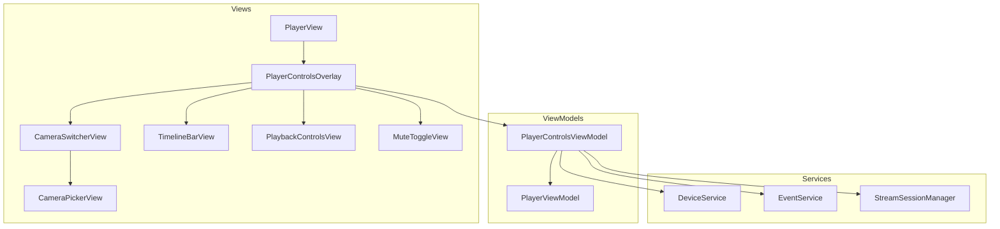

# Design Document: Player Controls

## Overview

This design adds a Netflix-style playback controls overlay to the full-screen `PlayerView` in the RingAppleTV tvOS app. The overlay surfaces camera switching, event timeline scrubbing, play/pause/skip transport controls, and an audio mute toggle — all navigable via the Siri Remote's focus system. Controls appear on tap, auto-hide after 5 seconds of inactivity, and integrate cleanly with the existing `PlayerViewModel` / `StreamSessionManager` architecture.

The implementation follows the app's established MVVM pattern: a new `PlayerControlsViewModel` owns overlay state and coordinates with existing services (`DeviceService`, `EventService`, `StreamSessionManager`), while a `PlayerControlsOverlay` SwiftUI view renders the UI and participates in the tvOS focus engine.

## Architecture



The overlay is a child view of `PlayerView`, layered on top of the video content. `PlayerControlsViewModel` is the single source of truth for overlay visibility, inactivity timing, timeline position, mute state, and camera selection. It delegates stream lifecycle to the existing `PlayerViewModel` and `StreamSessionManager`.

### Key Design Decisions

1. **Separate ViewModel** — A dedicated `PlayerControlsViewModel` keeps overlay concerns (visibility, timer, focus routing) out of `PlayerViewModel`, which remains focused on stream lifecycle. The two communicate via direct method calls (same `@MainActor` context).

2. **Inactivity timer in the ViewModel** — The 5-second auto-hide timer lives in `PlayerControlsViewModel` so it can be unit-tested without UI. Any user interaction calls `resetInactivityTimer()`.

3. **Focus management via `@FocusState`** — tvOS focus is driven by SwiftUI's `@FocusState` enum bound to the overlay's control regions. When the overlay hides, all focusable elements are removed from the hierarchy (`.focusable(false)` or conditional rendering).

4. **Timeline as discrete event markers** — Rather than a continuous time scrubber, the timeline shows discrete event dots from `EventService`. Skip-back/forward move one event at a time. This matches the Ring data model where recorded clips are event-based, not continuous DVR.

## Mock Screens

Low-fidelity wireframes of the key states. These are layout references — exact spacing, typography, and colors are set in the view code per Requirement 7.

### State A — Overlay hidden (default)

The user is watching live video. No controls visible except the always-on device name and the source banner (when not on WebRTC).

```text
┌──────────────────────────────────────────────────────────────────────┐
│ Front Door                                        ┌─ Live via bridge ┐│
│                                                   └──────────────────┘│
│                                                                      │
│                                                                      │
│                        [ live video frame ]                          │
│                                                                      │
│                                                                      │
│                                                                      │
│                                                                      │
└──────────────────────────────────────────────────────────────────────┘
```

### State B — Overlay visible, at live edge

Center-click on the Siri Remote reveals the overlay. The camera switcher is top-center, playback controls centered, timeline spans the bottom with the playhead at the right and "Live" showing, and the mute toggle sits bottom-right. Initial focus is on play/pause (shown with a thicker border).

```text
┌──────────────────────────────────────────────────────────────────────┐
│ ▓▓▓▓▓▓▓▓▓▓▓▓▓▓▓▓▓ gradient (darkened top edge) ▓▓▓▓▓▓▓▓▓▓▓▓▓▓▓▓▓▓▓▓ │
│                     ╭────────────────────╮                           │
│ Front Door          │  Front Door    ⌄   │                           │
│                     ╰────────────────────╯                           │
│                                                                      │
│                                                                      │
│                  ┌─────┐  ╔═════╗  ┌─────┐                           │
│                  │ ⏪  │  ║ ⏸  ║  │ ⏩  │   (skip-fwd disabled)       │
│                  └─────┘  ╚═════╝  └─────┘                           │
│                                                                      │
│                                                                      │
│ ▓▓▓▓▓▓▓▓▓▓▓▓▓▓▓▓▓ gradient (darkened bottom edge) ▓▓▓▓▓▓▓▓▓▓▓▓▓▓▓▓▓ │
│  ○──○────○──○───────○──○─────────────────────────────●  • Live    🔊 │
│  ↑ event markers          ↑ earlier events          ↑ playhead       │
└──────────────────────────────────────────────────────────────────────┘
```

### State C — Overlay visible, scrubbed into event history

The user swiped left on the trackpad. The playhead sits on an event marker, the "Live" badge is replaced by a focusable "● Live" button on the right, and skip-forward is now enabled.

```text
┌──────────────────────────────────────────────────────────────────────┐
│ ▓▓▓▓▓▓▓▓▓▓▓▓▓▓▓▓▓ gradient (darkened top edge) ▓▓▓▓▓▓▓▓▓▓▓▓▓▓▓▓▓▓▓▓ │
│                     ╭────────────────────╮                           │
│ Front Door          │  Front Door    ⌄   │      ┌─ Recorded ──┐      │
│                     ╰────────────────────╯      └─────────────┘      │
│                                                                      │
│                                                                      │
│                  ┌─────┐  ╔═════╗  ┌─────┐   ╭──────────╮            │
│                  │ ⏪  │  ║ ▶  ║  │ ⏩  │   │  ● Live  │            │
│                  └─────┘  ╚═════╝  └─────┘   ╰──────────╯            │
│                                                                      │
│                                                                      │
│ ▓▓▓▓▓▓▓▓▓▓▓▓▓▓▓▓▓ gradient (darkened bottom edge) ▓▓▓▓▓▓▓▓▓▓▓▓▓▓▓▓▓ │
│  ○──○────●──○───────○──○────────────────────────────────○        🔊 │
│           ↑ playhead on event                                        │
└──────────────────────────────────────────────────────────────────────┘
```

### State D — Camera picker presented

Selecting the camera switcher opens a modal list of online devices. The list is focusable; the inactivity timer is paused while the picker is visible.

```text
┌──────────────────────────────────────────────────────────────────────┐
│                                                                      │
│                  ┌────────────────────────────────┐                  │
│                  │  Choose a camera               │                  │
│                  ├────────────────────────────────┤                  │
│                  │  ● Front Door            ✓     │                  │
│                  │  ● Back Yard                   │                  │
│                  │  ● Driveway                    │                  │
│                  │  ● Garage                      │                  │
│                  │  ○ Side Gate  (offline)        │                  │
│                  └────────────────────────────────┘                  │
│                                                                      │
│                        [ dimmed live video ]                         │
│                                                                      │
└──────────────────────────────────────────────────────────────────────┘
```

### State E — Mute toggled

The mute toggle flips between `speaker.wave.2.fill` and `speaker.slash.fill`. All other overlay state is unchanged.

```text
              bottom-right of overlay
              ┌──────────┐      ┌──────────┐
              │    🔊    │  →   │    🔇    │
              └──────────┘      └──────────┘
               unmuted            muted
```

### State F — Single device available

When `DeviceService` returns exactly one online device, the camera switcher is hidden. The rest of the overlay renders normally.

```text
┌──────────────────────────────────────────────────────────────────────┐
│   (no camera switcher pill)                                          │
│                                                                      │
│                                                                      │
│                                                                      │
│                  ┌─────┐  ╔═════╗  ┌─────┐                           │
│                  │ ⏪  │  ║ ⏸  ║  │ ⏩  │                           │
│                  └─────┘  ╚═════╝  └─────┘                           │
│                                                                      │
│                                                                      │
│  ○──○────○──○───────○──○─────────────────────────────●  • Live    🔊 │
└──────────────────────────────────────────────────────────────────────┘
```

### Focus navigation map

Trackpad directional input moves focus between the three rows. Horizontal input moves within a row. The `liveButton` appears beside the playback row only when not at the live edge.

```text
          ┌─────────────────────┐
          │   cameraSwitcher    │   ← top row
          └─────────┬───────────┘
                    │ swipe down
                    ▼
 ┌───────┬──────────┬─────────┬─────────────┐
 │skipBack│playPause │skipFwd │ liveButton │  ← middle row
 └───────┴──────────┴─────────┴─────────────┘
                    │ swipe down
                    ▼
                                   ┌────────┐
                                   │muteTgl │  ← bottom-right
                                   └────────┘
```

## Components and Interfaces

### PlayerControlsViewModel

```swift
@MainActor
final class PlayerControlsViewModel: ObservableObject {
    // MARK: - Published State
    @Published var isOverlayVisible: Bool = false
    @Published var isMuted: Bool = false
    @Published var isAtLiveEdge: Bool = true
    @Published var currentEventIndex: Int? = nil
    @Published var events: [RingEvent] = []
    @Published var availableDevices: [RingDevice] = []
    @Published var activeDevice: RingDevice
    @Published var isCameraPickerPresented: Bool = false

    // MARK: - Dependencies
    private let playerViewModel: PlayerViewModel
    private let deviceService: DeviceService
    private let eventService: EventService
    private var inactivityTimer: Timer?

    // MARK: - Constants
    static let inactivityTimeout: TimeInterval = 5.0
    static let fadeAnimationDuration: TimeInterval = 0.3

    // MARK: - Actions
    func toggleOverlay()
    func showOverlay()
    func hideOverlay()
    func resetInactivityTimer()
    func pauseInactivityTimer()
    func resumeInactivityTimer()

    func togglePlayPause()
    func skipBack()
    func skipForward()
    func jumpToLive()

    func toggleMute()

    func selectCamera(_ device: RingDevice) async
    func loadAvailableDevices() async
    func loadEvents() async
}
```

### PlayerControlsOverlay (View)

```swift
struct PlayerControlsOverlay: View {
    @ObservedObject var viewModel: PlayerControlsViewModel
    @FocusState private var focusedControl: ControlFocus?

    enum ControlFocus: Hashable {
        case cameraSwitcher
        case skipBack
        case playPause
        case skipForward
        case muteToggle
        case liveButton
    }
}
```

### CameraSwitcherView

Pill-shaped button showing the active camera name + chevron. Hidden when only one device is available. Tapping presents `CameraPickerView`.

### CameraPickerView

Modal list of online devices from `DeviceService`. Selecting a device triggers `selectCamera(_:)` which stops the current stream and starts a new one.

### TimelineBarView

Horizontal bar with event markers (dots colored by event type). A playhead indicator shows the current position. Displays "Live" label when at the live edge. Responds to left/right swipe gestures for scrubbing.

### PlaybackControlsView

Horizontal stack: skip-back, play/pause, skip-forward. The skip-forward button is visually disabled and non-interactive when at the live edge.

### MuteToggleView

Speaker icon button. Toggles between `speaker.wave.2.fill` and `speaker.slash.fill`. State persists across camera switches within the session.

## Data Models

### ControlFocus (enum)

```swift
enum ControlFocus: Hashable {
    case cameraSwitcher
    case skipBack
    case playPause
    case skipForward
    case muteToggle
    case liveButton
}
```

Drives `@FocusState` for Siri Remote navigation. Initial focus is `.playPause` when the overlay appears.

### TimelinePosition

```swift
struct TimelinePosition: Equatable {
    let eventIndex: Int?      // nil = live edge
    let events: [RingEvent]

    var isAtLiveEdge: Bool { eventIndex == nil }
    var currentEvent: RingEvent? {
        guard let idx = eventIndex, events.indices.contains(idx) else { return nil }
        return events[idx]
    }

    func movingBack() -> TimelinePosition
    func movingForward() -> TimelinePosition
    static func live(events: [RingEvent]) -> TimelinePosition
}
```

### MuteState

Stored as a simple `Bool` on `PlayerControlsViewModel.isMuted`. Persists in memory for the player session lifetime (not persisted to disk).

### Extended StreamSession usage

No changes to `StreamSession` model. Camera switching reuses the existing `PlayerViewModel.requestStream(for:powerSource:)` and `stopStream()` flow.

## Correctness Properties

*A property is a characteristic or behavior that should hold true across all valid executions of a system — essentially, a formal statement about what the system should do. Properties serve as the bridge between human-readable specifications and machine-verifiable correctness guarantees.*

### Property 1: Overlay toggle is an involution

*For any* overlay visibility state (visible or hidden), calling `toggleOverlay()` twice in succession SHALL return the overlay to its original visibility state.

**Validates: Requirements 1.1, 1.2**

### Property 2: Any interaction resets inactivity timer

*For any* control interaction (play/pause, skip, mute, camera switcher selection, scrub) performed while the overlay is visible, the inactivity timer SHALL be reset to 5 seconds.

**Validates: Requirements 1.4**

### Property 3: Camera switch transitions stream correctly

*For any* camera switch from device A to device B (where A ≠ B), the system SHALL stop the stream for device A, start a stream for device B, and update `activeDevice` to device B.

**Validates: Requirements 2.3, 2.4, 2.5**

### Property 4: Camera switcher hidden for single device

*For any* device list containing exactly one device, the camera switcher SHALL not be shown (i.e., `availableDevices.count <= 1` implies camera switcher is hidden).

**Validates: Requirements 2.7**

### Property 5: Timeline navigation respects bounds

*For any* timeline position and event list, navigating backward from the earliest event SHALL remain at the earliest event, and navigating forward from the live edge SHALL remain at the live edge. For positions in between, backward moves to the previous event and forward moves to the next event or live edge.

**Validates: Requirements 3.3, 3.4, 3.6, 4.4, 4.5, 4.6**

### Property 6: Scrubbing pauses inactivity timer

*For any* scrubbing interaction (left/right swipe on timeline) while the overlay is visible, the inactivity timer SHALL be paused for the duration of the scrub and SHALL NOT expire during scrubbing.

**Validates: Requirements 3.8**

### Property 7: Play/pause toggle works regardless of overlay visibility

*For any* combination of overlay visibility (visible or hidden) and playback state (playing or paused), invoking the play/pause action SHALL invert the `isPlaying` state.

**Validates: Requirements 4.2, 4.3**

### Property 8: Mute toggle inverts audio state

*For any* audio mute state (muted or unmuted), selecting the mute toggle SHALL produce the opposite mute state.

**Validates: Requirements 5.2, 5.3**

### Property 9: Mute state persists across camera switches

*For any* mute state and any sequence of camera switches within a player session, the mute state after each switch SHALL equal the mute state before the switch.

**Validates: Requirements 5.4**

## Error Handling

| Scenario | Handling |
|----------|----------|
| `DeviceService.fetchDevices()` fails | Camera switcher shows only the current device; picker is disabled. Error is logged but not surfaced to the user (stream continues). |
| `EventService.fetchEvents()` fails | Timeline bar shows empty state (no markers). "Live" indicator remains visible. Error logged silently. |
| `EventService.fetchEventVideoURL()` fails | Toast-style error message appears briefly over the overlay: "Couldn't load recording". Playback remains at current position. |
| Stream start fails during camera switch | Existing `PlayerViewModel` error state is surfaced (error overlay with Retry/Back). Overlay hides. |
| Timer edge case: overlay hidden while picker is open | Inactivity timer is paused while `CameraPickerView` is presented. Resumes on dismiss. |
| Device goes offline during session | If the active device goes offline, the stream will fail naturally through `StreamSessionManager` and the existing error overlay handles it. The device list refreshes on next picker open. |

## Testing Strategy

### Unit Tests (example-based)

- Overlay show/hide transitions and animation triggers
- Initial focus placement on play/pause when overlay appears
- Focus navigation paths (up/down/horizontal)
- Timer start on overlay show, timer expiry hides overlay
- Camera picker presents all online devices
- Dismissing picker without selection leaves state unchanged
- Live button visibility when not at live edge
- Skip-forward disabled state at live edge
- Event markers rendered for each event in the list

### Property-Based Tests

**Library:** [swift-testing](https://github.com/apple/swift-testing) with custom generators (Swift doesn't have a mature PBT library in the ecosystem, so we'll use parameterized tests with randomized inputs via a lightweight generator helper).

**Configuration:** Minimum 100 iterations per property test.

**Tag format:** `Feature: player-controls, Property {number}: {property_text}`

Each correctness property (1–9) above will be implemented as a single parameterized test that generates random valid inputs and asserts the property holds. Key generators needed:

- `OverlayState` generator: random visibility + timer state
- `TimelinePosition` generator: random event list (0–50 events) + random index (including nil for live edge)
- `RingDevice` generator: random device with random name, type, power source, online status
- `MuteState` generator: random Bool
- `InteractionType` generator: random enum of all possible control interactions

### Integration Tests

- Camera switch end-to-end: stop old stream → start new stream → UI updates
- Event scrub to playback: navigate to event → fetch video URL → begin playback
- Live button → resume live stream flow
- Hardware Play/Pause button handling with overlay hidden

### Accessibility Tests

- VoiceOver labels on all controls
- Focus order matches visual layout
- Disabled state announced for skip-forward at live edge
