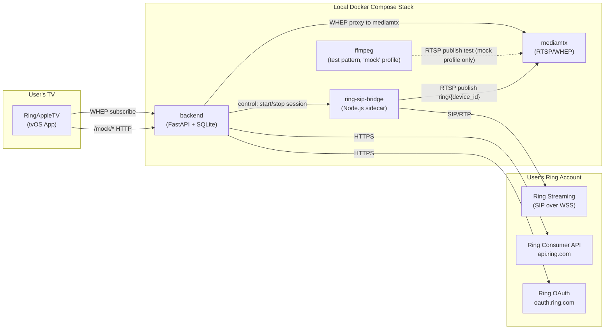
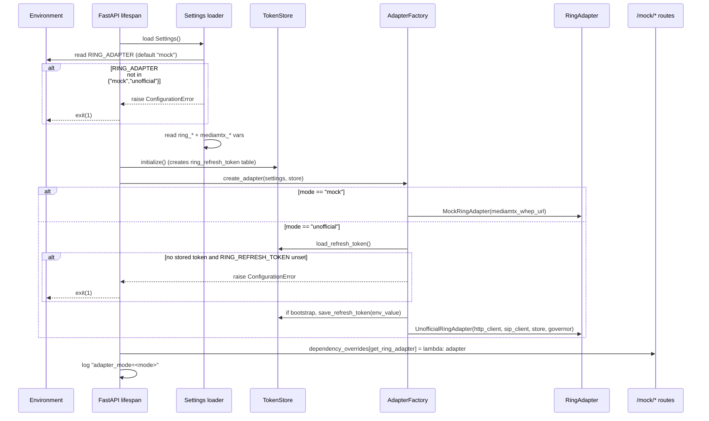
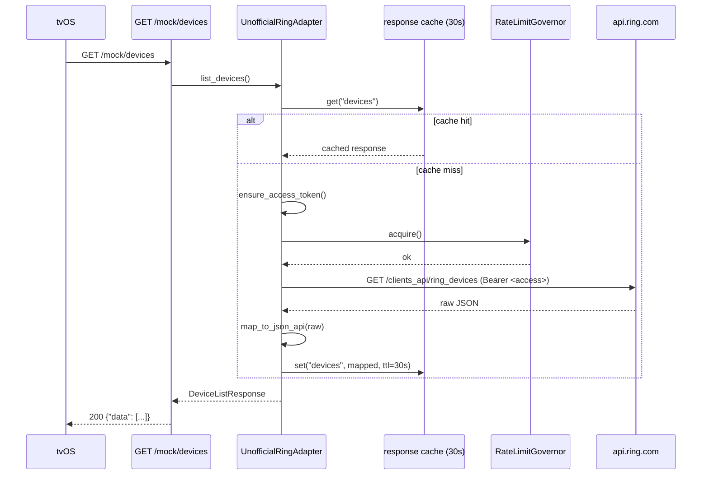
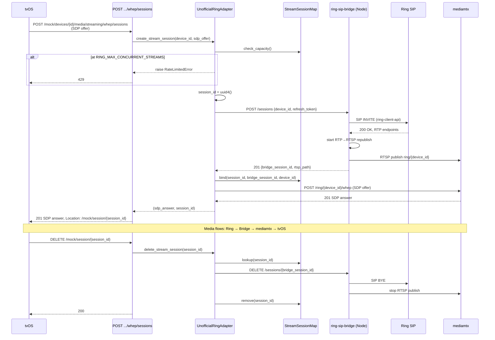
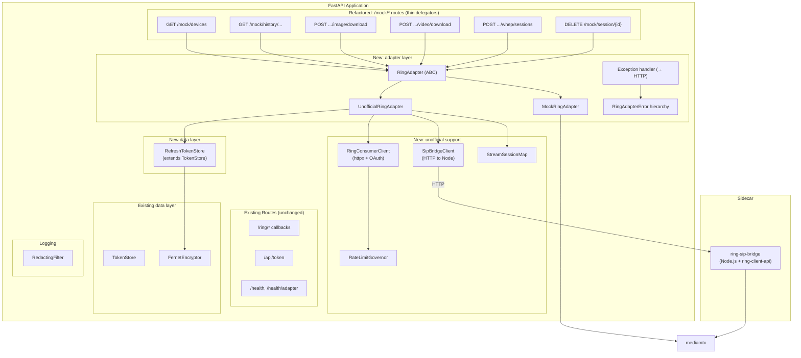

# Design Document: Ring Adapter Backend

## Overview

This design converts the existing `partner-auth-backend` service from a hardcoded mock of the Ring Partner API into a pluggable adapter-based backend. A single abstract interface, `RingAdapter`, defines every operation the tvOS app depends on (devices, events, snapshot, clip, WHEP session create/delete). Two concrete implementations live behind that interface: `MockRingAdapter` preserves today's behavior byte-for-byte, and `UnofficialRingAdapter` calls the Ring consumer API (the same undocumented HTTPS API exercised by `ring-client-api`) using the developer's personal refresh token. A single environment variable, `RING_ADAPTER`, selects which implementation is wired into the FastAPI routes at startup.

**Why an adapter:** Ring Partner API approval is a multi-week process, but the tvOS client is already complete. By abstracting Ring interactions behind `RingAdapter` today, a developer can exercise every tvOS code path against real cameras on their own account now, and the Partner API path can be added later as a third adapter without touching routes, tests, or the tvOS app.

**What changes in the existing backend:**

- The current `app/routes/mock_ring_api.py` handlers are refactored into thin delegators that call an injected `RingAdapter`. Request and response shapes under `/mock/*` are unchanged.
- A new `app/adapters/` package defines the `RingAdapter` ABC, the error hierarchy, and both concrete implementations.
- The existing `TokenStore` schema gains one singleton-row table for the Ring refresh token, reusing the existing `FernetEncryptor`.
- The existing partner-auth code (`ring_callbacks.py`, `app_api.py`, `HMACVerifier`, OAuth `TokenService`, webhook handling) stays in place unchanged. Those routes continue to respond the same way regardless of `RING_ADAPTER`.

**What does not change:** the `/mock/*` URL prefix, request and response shapes, the API key contract, the Fernet-encrypted SQLite store, the middleware stack, the mediamtx container, or the tvOS app.

**Key design decisions:**

1. **ABC-based adapter, not duck-typed.** `RingAdapter` is a `typing.Protocol`-compatible abstract base class so that type checkers catch missing operations and so that both adapters share a single declarative interface.
2. **Single exception hierarchy mapped in one place.** `RingAdapterError` subclasses carry stable error codes. A single FastAPI exception handler maps each subclass to an HTTP status, so every `/mock/*` route produces identical error envelopes.
3. **Startup-time adapter instantiation with FastAPI dependency override.** Exactly one adapter instance is created during the lifespan startup hook and injected via `Depends(get_ring_adapter)`. No per-request factory work, no race conditions, no accidental second instance.
4. **Node.js sidecar for the SIP→RTSP bridge.** Reusing the battle-tested `ring-client-api` library over a small HTTP control plane is the pragmatic choice. Option A (porting the SIP stack to Python) and Option C (waiting for `python-ring-doorbell` to grow SIP support) were evaluated and rejected; see the Video Bridge section for the trade-off analysis.
5. **Refresh token stored as a singleton row.** Reuse the existing `tokens` table pattern but add a small dedicated table `ring_refresh_token` with a known primary key. Encrypted at rest with the existing `FernetEncryptor`. Atomic rotation in a single transaction.
6. **Rate limiter is internal to the adapter, not a middleware.** Ring's 60/min ceiling applies to outbound calls, not inbound. A `RateLimitGovernor` inside `UnofficialRingAdapter` shapes outbound requests to `api.ring.com` and is independent of the existing `slowapi` inbound limiter.
7. **Structured log redaction via a logging filter.** One `RedactingFilter` attached to the root logger scrubs known-sensitive field names (`refresh_token`, `access_token`, `authorization`, `cookie`) from every record, regardless of which module logged it. This is simpler and harder to bypass than per-call-site redaction.

## Architecture

### System Context



### Adapter Selection at Startup



### Unofficial-Mode Data Flow: Devices



### Unofficial-Mode Data Flow: Live Stream (SIP → RTSP → WHEP)



### Backend Component Architecture



## Components and Interfaces

### 1. `RingAdapter` ABC (`app/adapters/base.py`)

The single interface every `/mock/*` route depends on. Methods are all `async` except `mode()`.

```python
from abc import ABC, abstractmethod
from typing import NamedTuple

class SnapshotPayload(NamedTuple):
    content: bytes
    content_type: str  # "image/png" or "image/jpeg"

class StreamSessionResult(NamedTuple):
    sdp_answer: str
    location: str       # value for the WHEP "Location" header
    session_id: str     # backend-generated UUID

class RingAdapter(ABC):
    @abstractmethod
    async def list_devices(self) -> dict: ...
    # Shape: {"data": [ {id, type, attributes: {...}}, ... ]}

    @abstractmethod
    async def list_events(self, device_id: str, limit: int) -> list[dict]: ...

    @abstractmethod
    async def download_snapshot(self, device_id: str) -> SnapshotPayload: ...

    @abstractmethod
    async def download_video(self, device_id: str, event_id: str | None) -> dict: ...
    # Shape: {"url": "..."}

    @abstractmethod
    async def create_stream_session(
        self, device_id: str, sdp_offer: str
    ) -> StreamSessionResult: ...

    @abstractmethod
    async def delete_stream_session(self, session_id: str) -> None: ...

    @abstractmethod
    def mode(self) -> str:
        """Stable identifier for this implementation, e.g. 'mock' or 'unofficial'."""
```

### 2. `RingAdapterError` Hierarchy (`app/adapters/errors.py`)

Every adapter failure raises a subclass of `RingAdapterError`. The route layer never catches these directly; a single `@app.exception_handler(RingAdapterError)` maps them.

```python
class RingAdapterError(Exception):
    code: str                  # stable machine-readable error code
    http_status: int           # mapped HTTP status code
    message: str = ""          # human message (never returned to client)

class AdapterConfigurationError(RingAdapterError):
    code = "adapter_misconfigured"; http_status = 500

class AuthenticationRequiredError(RingAdapterError):
    code = "authentication_required"; http_status = 401

class UpstreamUnavailableError(RingAdapterError):
    code = "upstream_error"; http_status = 502

class UpstreamTimeoutError(RingAdapterError):
    code = "upstream_timeout"; http_status = 504

class RateLimitedError(RingAdapterError):
    code = "rate_limited"; http_status = 429

class DeviceNotFoundError(RingAdapterError):
    code = "device_not_found"; http_status = 404

class SubscriptionRequiredError(RingAdapterError):
    code = "subscription_required"; http_status = 402

class SnapshotUnavailableError(RingAdapterError):
    code = "snapshot_unavailable"; http_status = 503

class StreamCapacityExceededError(RingAdapterError):
    code = "stream_capacity_exceeded"; http_status = 429

class StreamSessionNotFoundError(RingAdapterError):
    code = "session_not_found"; http_status = 404
```

### 3. Adapter Factory and FastAPI DI (`app/adapters/factory.py`, `app/dependencies.py`)

```python
# app/adapters/factory.py
async def create_adapter(settings: Settings, store: TokenStore) -> RingAdapter:
    if settings.ring_adapter == "mock":
        return MockRingAdapter(mediamtx_whep_url=settings.mediamtx_whep_url)
    if settings.ring_adapter == "unofficial":
        refresh_store = RefreshTokenStore(store)
        await _bootstrap_refresh_token(refresh_store, settings)
        http = httpx.AsyncClient(
            timeout=10.0,
            headers={"User-Agent": f"ring-adapter-backend/{__version__}"},
        )
        governor = RateLimitGovernor(
            max_per_minute=settings.ring_api_rate_limit_per_minute,
            queue_wait_seconds=5.0,
        )
        client = RingConsumerClient(http=http, governor=governor, store=refresh_store)
        sip = SipBridgeClient(
            base_url=settings.ring_sip_bridge_url,
            refresh_token_provider=refresh_store.load,
        )
        return UnofficialRingAdapter(
            client=client,
            sip=sip,
            sessions=StreamSessionMap(),
            max_concurrent=settings.ring_max_concurrent_streams,
            mediamtx_whep_base=settings.mediamtx_whep_base,
        )
    raise ConfigurationError(
        f"RING_ADAPTER must be one of 'mock' or 'unofficial', got '{settings.ring_adapter}'"
    )
```

```python
# app/dependencies.py
def get_ring_adapter() -> RingAdapter:
    """Placeholder; overridden at startup by main.py via dependency_overrides."""
    raise RuntimeError("RingAdapter not wired; check startup")
```

```python
# app/main.py (excerpt)
@asynccontextmanager
async def lifespan(app: FastAPI):
    settings = get_settings()  # validates all required env vars
    store = TokenStore(settings.database_path, FernetEncryptor(settings.token_encryption_key))
    await store.initialize()
    adapter = await create_adapter(settings, store)
    app.dependency_overrides[get_ring_adapter] = lambda: adapter
    logger.info("startup adapter_mode=%s", adapter.mode())
    try:
        yield
    finally:
        await adapter.aclose()  # closes httpx, terminates active sessions
```

### 4. `MockRingAdapter` (`app/adapters/mock.py`)

A 1:1 port of the existing `mock_ring_api.py` logic behind the `RingAdapter` interface. The existing module-level `MOCK_DEVICES`, `_generate_mock_events`, `_BLUE_PIXEL_PNG`, fallback SDP, and mediamtx proxy logic move verbatim into methods on this class. No behavior changes; byte-for-byte identical responses.

```python
class MockRingAdapter(RingAdapter):
    def __init__(self, mediamtx_whep_url: str) -> None:
        self._whep_url = mediamtx_whep_url

    def mode(self) -> str: return "mock"

    async def list_devices(self) -> dict:
        return {"data": MOCK_DEVICES}
    # ... five more methods, each delegating to the code currently inline
    # in mock_ring_api.py
```

### 5. `UnofficialRingAdapter` (`app/adapters/unofficial.py`)

The main adapter for the real Ring account path. Holds references to a `RingConsumerClient`, a `SipBridgeClient`, a `StreamSessionMap`, and capacity limits. Every method:

1. ensures an access token (via `client.ensure_access_token()`),
2. calls the appropriate endpoint through the governor,
3. maps the raw Ring response to the adapter's JSON:API-compatible shape,
4. converts upstream errors to `RingAdapterError` subclasses.

```python
class UnofficialRingAdapter(RingAdapter):
    def __init__(
        self,
        client: RingConsumerClient,
        sip: SipBridgeClient,
        sessions: StreamSessionMap,
        max_concurrent: int,
        mediamtx_whep_base: str,
    ) -> None: ...

    def mode(self) -> str: return "unofficial"

    async def list_devices(self) -> dict:
        raw = await self._client.get_devices()            # cached 30s
        return {"data": [_map_device(d) for d in raw]}

    async def list_events(self, device_id: str, limit: int) -> list[dict]:
        raw = await self._client.get_history(device_id, limit=limit)  # cached 10s
        return [_map_event(e) for e in raw]

    async def download_snapshot(self, device_id: str) -> SnapshotPayload: ...
    async def download_video(self, device_id: str, event_id: str | None) -> dict: ...
    async def create_stream_session(self, device_id: str, sdp_offer: str) -> StreamSessionResult: ...
    async def delete_stream_session(self, session_id: str) -> None: ...
    async def aclose(self) -> None: ...
```

### 6. `RingConsumerClient` (`app/adapters/ring_consumer_client.py`)

Thin client over `httpx.AsyncClient` that handles OAuth, access-token caching, refresh-token rotation, rate limiting, and retries. Deliberately purpose-built rather than depending on `python-ring-doorbell`: that library is synchronous, imports a large dependency tree, and does not expose the access-token lifecycle cleanly. A ~300-line client gives us the control we need.

```python
class RingConsumerClient:
    OAUTH_URL = "https://oauth.ring.com/oauth/token"
    API_BASE  = "https://api.ring.com"
    # Endpoints hit:
    #   GET  /clients_api/ring_devices
    #   GET  /clients_api/dings/active           (for events; optional)
    #   GET  /clients_api/doorbots/{id}/history
    #   POST /clients_api/snapshots/image/{id}
    #   GET  /clients_api/dings/{event_id}/recording
    #
    # Not used here (handled by Node sidecar):
    #   /clients_api/doorbots/{id}/live_view   (SIP negotiation)

    def __init__(self, http: httpx.AsyncClient, governor: RateLimitGovernor,
                 store: RefreshTokenStore) -> None: ...

    async def ensure_access_token(self) -> str:
        """Return a valid access token, refreshing if <=60s to expiry."""

    async def _refresh(self) -> None:
        """POST /oauth/token with grant_type=refresh_token; rotate if response
        contains a new refresh_token; persist atomically."""

    async def get_devices(self) -> list[dict]: ...
    async def get_history(self, device_id: str, limit: int) -> list[dict]: ...
    async def get_snapshot(self, device_id: str) -> tuple[bytes, str]: ...
    async def get_clip_url(self, event_id: str) -> str: ...
```

**Access token caching:** store `(token, expires_at)` in a `asyncio.Lock`-protected slot. On every request, if `now + 60s >= expires_at`, call `_refresh()`.

**Refresh token rotation:** Ring's OAuth endpoint may return a new `refresh_token` with every exchange. On every successful `_refresh()`, if the response contains a `refresh_token` field, call `store.rotate(new_token)` which performs an atomic UPDATE. The old token is overwritten in the same transaction; the new access token is cached in memory.

**Retry policy:** on 429 honor `Retry-After` if present, otherwise exponential 1s→30s. On 5xx retry up to 2 times with the same backoff. On 401 during refresh, mark the refresh token invalid (`store.mark_invalid()`) and raise `AuthenticationRequiredError`.

### 7. `RateLimitGovernor` (`app/adapters/rate_limit.py`)

Per-adapter rolling-window limiter. Independent of `slowapi` (which handles inbound).

```python
class RateLimitGovernor:
    def __init__(self, max_per_minute: int, queue_wait_seconds: float) -> None:
        self._max = max_per_minute
        self._wait = queue_wait_seconds
        self._events: deque[float] = deque()  # monotonic timestamps
        self._lock = asyncio.Lock()

    async def acquire(self) -> None:
        """Block until allowed or up to queue_wait_seconds; raise RateLimitedError on timeout."""
        # Trim events older than 60s, check len < max, else sleep and retry.
```

### 8. `RefreshTokenStore` (`app/data/refresh_token_store.py`)

A small adapter over the existing `TokenStore` / `FernetEncryptor` that manages one singleton row in a dedicated table, `ring_refresh_token`. Singleton row is keyed by `id=1` so there is exactly one Ring refresh token in the database, unambiguously.

```python
class RefreshTokenStore:
    def __init__(self, db_path: str, encryptor: FernetEncryptor) -> None: ...

    async def initialize(self) -> None:
        """CREATE TABLE IF NOT EXISTS ring_refresh_token (...)"""

    async def load(self) -> str | None:
        """Return decrypted token, or None if absent or marked invalid."""

    async def save(self, refresh_token: str) -> None:
        """Upsert (id=1, encrypt(refresh_token), now, is_valid=1) atomically."""

    async def rotate(self, new_refresh_token: str) -> None:
        """Single-transaction UPDATE; if the old ciphertext differs, log 'rotated'."""

    async def mark_invalid(self) -> None:
        """UPDATE is_valid = 0."""

    async def is_valid(self) -> bool: ...
```

The table shares the database file (`/data/tokens.db`) with the existing `tokens` and `webhook_events` tables; no second DB process, no second connection pool.

### 9. `SipBridgeClient` + `ring-sip-bridge` sidecar

The hardest piece, and the place with the most viable options. Evaluated:

| Option | Approach | Pros | Cons |
|---|---|---|---|
| **A. Python SIP port** | Reimplement `ring-client-api`'s SIP-over-WebSocket logic in Python | No sidecar, single process, pure Python dep graph | Weeks of work, SIP subtleties (DTLS-SRTP, ICE, codec negotiation), tight Ring protocol coupling, we would own maintenance |
| **B. Node sidecar** | Small Node.js container wrapping `ring-client-api` behind an HTTP control plane | Reuses battle-tested library, fast to build, clean isolation, can be removed if Partner API path arrives | Adds a container, cross-runtime debugging, two languages in repo |
| **C. `python-ring-doorbell`** | Use an existing Python library for streaming | Pure Python | Library currently delegates live streaming to the same Node library or lacks SIP support; does not meaningfully reduce risk |

**Decision: Option B.** A minimal Node.js sidecar service named `ring-sip-bridge` uses `ring-client-api` directly. The Python backend controls it over HTTP. The sidecar owns the SIP state machine; Python owns session IDs, capacity limits, and the tvOS-facing contract.

**Sidecar HTTP contract** (kept deliberately small):

```
POST /sessions
  body: { "device_id": "<ring-device-id>", "refresh_token": "<encrypted-at-rest-unwrapped>" }
  201:  { "bridge_session_id": "<uuid>", "rtsp_path": "ring/<device_id>" }
  409:  { "error": "device_busy" }
  502:  { "error": "sip_failed" }

DELETE /sessions/{bridge_session_id}
  204

GET /sessions
  200:  [ { bridge_session_id, device_id, state, started_at, has_audio } ]

GET /health
  200:  { "status": "ok", "active_sessions": <n> }
```

The sidecar:

- receives the device ID and a refresh token (the backend passes it per-request; the sidecar keeps no secrets on disk),
- uses `ring-client-api` to negotiate a SIP session with Ring,
- spawns an internal `ffmpeg`-backed or `node-rtsp-stream`-based republisher that takes the Ring RTP streams (H.264 video, optional Opus audio) and publishes RTSP to `rtsp://mediamtx:8554/ring/{device_id}`,
- monitors the SIP session and sends `DELETE` cleanup on remote termination.

**Python-side `SipBridgeClient`:**

```python
class SipBridgeClient:
    def __init__(self, base_url: str, refresh_token_provider: Callable[[], Awaitable[str]]) -> None: ...

    async def start(self, device_id: str) -> BridgeSession:
        """POST /sessions; raise StreamCapacityExceededError on 409,
        UpstreamUnavailableError on 5xx."""

    async def stop(self, bridge_session_id: str) -> None:
        """DELETE; idempotent."""

    async def healthy(self) -> bool: ...
```

**Session lifecycle and ID mapping:**

- The Python backend generates `session_id` (UUID v4) — this is what the tvOS app sees in the WHEP `Location` header and later `DELETE`s.
- The sidecar generates `bridge_session_id` for its own bookkeeping.
- The Python `StreamSessionMap` is a `dict[session_id, StreamSession]` protected by `asyncio.Lock`, tracking `(bridge_session_id, device_id, mediamtx_path, created_at, state)`.
- Capacity check (`RING_MAX_CONCURRENT_STREAMS`, default 2) is done in `create_stream_session` **before** calling the sidecar.
- Timeout: if `POST /sessions` on the sidecar does not return within 15 s, the adapter raises `UpstreamTimeoutError` (→ 504).
- Audio track: the sidecar reports `has_audio: false` when Ring does not provide an audio RTP stream; the RTSP publish proceeds with video only.

**Sidecar in the compose stack:** a new service `ring-sip-bridge` built from `./ring-sip-bridge/` (Node 20 slim, `ring-client-api` pinned). Always running by default; when `RING_ADAPTER=mock`, the backend simply never calls it, so its idle cost is negligible.

### 10. Refactored `/mock/*` Routes (`app/routes/mock_ring_api.py`)

Every handler becomes a one-liner plus exception translation (the exception translation is actually in the global handler, so handlers really are one-liners). Example for `GET /mock/devices`:

**Before:**

```python
@router.get("/devices")
async def get_devices() -> JSONResponse:
    return JSONResponse(status_code=200, content={"data": MOCK_DEVICES})
```

**After:**

```python
@router.get("/devices")
async def get_devices(adapter: RingAdapter = Depends(get_ring_adapter)) -> JSONResponse:
    return JSONResponse(status_code=200, content=await adapter.list_devices())
```

All six handlers follow the same pattern. The handler does not catch `RingAdapterError`; the global exception handler translates it. The module keeps its `/mock` prefix and path shapes.

### 11. Global Exception Handler (`app/main.py`)

One handler maps every adapter error to the response envelope specified in the Error Handling section.

```python
@app.exception_handler(RingAdapterError)
async def handle_adapter_error(request: Request, exc: RingAdapterError) -> JSONResponse:
    request_id = getattr(request.state, "request_id", "unknown")
    logger.warning(
        "adapter_error request_id=%s mode=%s code=%s status=%d device_id=%s",
        request_id, _current_adapter_mode(), exc.code, exc.http_status,
        getattr(request.path_params, "device_id", None),
    )
    return JSONResponse(status_code=exc.http_status, content={"error": exc.code})
```

### 12. Health Endpoints (`app/main.py`)

```python
@app.get("/health")
async def health(adapter: RingAdapter = Depends(get_ring_adapter)) -> dict:
    return {"status": "healthy", "adapter_mode": adapter.mode()}

@app.get("/health/adapter")
async def health_adapter(
    adapter: RingAdapter = Depends(get_ring_adapter),
    api_key: str = Depends(verify_api_key),
    refresh_store: RefreshTokenStore = Depends(get_refresh_store),
    sessions: StreamSessionMap = Depends(get_session_map),
    governor: RateLimitGovernor = Depends(get_governor),
) -> dict:
    return {
        "adapter_mode": adapter.mode(),
        "refresh_token_valid": await refresh_store.is_valid() if adapter.mode() == "unofficial" else None,
        "active_stream_sessions": await sessions.count(),
        "ring_api_requests_last_minute": await governor.current_rate() if adapter.mode() == "unofficial" else 0,
    }
```

### 13. Log Redaction (`app/logging_redaction.py`)

A single `logging.Filter` attached to the root logger. Redacts known field names from `record.args` dicts and from `record.msg` when formatted with `%`-style arguments. Applied unconditionally — safer than hoping every call site remembers to redact.

```python
REDACTED_FIELDS = frozenset({
    "refresh_token", "access_token", "authorization", "cookie",
    "ring_refresh_token", "ring_access_token",
})

class RedactingFilter(logging.Filter):
    _pattern = re.compile(
        r"(?i)\b(" + "|".join(REDACTED_FIELDS) + r")=([^\s]+)"
    )
    def filter(self, record: logging.LogRecord) -> bool:
        if isinstance(record.args, dict):
            record.args = {
                k: ("[REDACTED]" if k.lower() in REDACTED_FIELDS else v)
                for k, v in record.args.items()
            }
        record.msg = self._pattern.sub(r"\1=[REDACTED]", str(record.msg))
        return True
```

Attached at startup: `logging.getLogger().addFilter(RedactingFilter())`.

### 14. Docker Compose Changes

The `backend` service gains new env vars (with mock-mode-safe defaults so `docker compose up` still works out of the box). A new `ring-sip-bridge` service is added. The `ffmpeg` test-pattern service moves to a `mock` profile.

```yaml
services:
  backend:
    environment:
      RING_ADAPTER: ${RING_ADAPTER:-mock}
      RING_REFRESH_TOKEN: ${RING_REFRESH_TOKEN:-}
      RING_MAX_CONCURRENT_STREAMS: ${RING_MAX_CONCURRENT_STREAMS:-2}
      RING_API_RATE_LIMIT_PER_MINUTE: ${RING_API_RATE_LIMIT_PER_MINUTE:-60}
      MEDIAMTX_RTSP_URL: rtsp://mediamtx:8554/ring
      MEDIAMTX_WHEP_BASE: http://mediamtx:8889
      RING_SIP_BRIDGE_URL: http://ring-sip-bridge:3000
      # ... existing vars unchanged

  ring-sip-bridge:
    build: ./ring-sip-bridge
    container_name: ring-sip-bridge
    restart: unless-stopped
    depends_on: [mediamtx]
    environment:
      MEDIAMTX_RTSP_URL: rtsp://mediamtx:8554/ring
      PORT: 3000

  ffmpeg:
    profiles: ["mock"]
    # ... existing config unchanged
```

**Command lines:**

- `docker compose up` — default; `RING_ADAPTER` from `.env` (mock or unofficial), `ffmpeg` test pattern not started.
- `docker compose --profile mock up` — starts the `ffmpeg` test pattern in addition to the default services; useful for exercising the mock WHEP proxy fallback.

**Fail-fast on misconfiguration:** if `RING_ADAPTER=unofficial` and neither `RING_REFRESH_TOKEN` nor the stored token is present, the backend raises `ConfigurationError` during lifespan startup and the container exits with status 1 within ~5 seconds.

### 15. `.env.example` additions

```dotenv
# ----- Ring adapter selection -----
# Valid values: mock, unofficial.  Default: mock.
RING_ADAPTER=mock

# ----- Unofficial-mode variables (only required when RING_ADAPTER=unofficial) -----
# Generate with: npx -p ring-client-api ring-auth-cli
# DO NOT commit this value to version control.
RING_REFRESH_TOKEN=

# Maximum number of concurrent live Ring SIP sessions. Default 2.
RING_MAX_CONCURRENT_STREAMS=2

# Outbound Ring consumer API rate limit (requests per rolling minute). Default 60.
RING_API_RATE_LIMIT_PER_MINUTE=60

# mediamtx RTSP base URL used by the SIP bridge to publish Ring video.
# Default inside docker-compose: rtsp://mediamtx:8554/ring
MEDIAMTX_RTSP_URL=rtsp://mediamtx:8554/ring

# mediamtx WHEP base URL used by the backend to proxy WHEP offers.
MEDIAMTX_WHEP_BASE=http://mediamtx:8889

# ring-sip-bridge sidecar base URL.
RING_SIP_BRIDGE_URL=http://ring-sip-bridge:3000
```

## Data Models

### Python / Pydantic Models (`app/adapters/models.py`)

```python
class DeviceResource(BaseModel):
    """JSON:API device resource emitted to the tvOS app."""
    id: str
    type: str
    attributes: "DeviceAttributes"

class DeviceAttributes(BaseModel):
    name: str
    model: str
    firmware_version: str
    power_source: Literal["hardwired", "battery"]
    status: Literal["online", "offline"]

class EventResource(BaseModel):
    id: str
    device_id: str
    type: Literal["motion", "ding", "device_status"]
    created_at: str       # ISO 8601
    duration: int | None  # seconds, if known
```

### Internal Types (`app/adapters/types.py`)

```python
@dataclass(frozen=True)
class AccessTokenCacheEntry:
    token: str
    expires_at: datetime      # absolute UTC

@dataclass
class StreamSession:
    session_id: str           # backend UUID (what tvOS sees)
    bridge_session_id: str    # Node sidecar UUID
    device_id: str
    mediamtx_path: str        # "ring/{device_id}"
    created_at: datetime
    state: Literal["starting", "active", "terminating", "terminated"]
    has_audio: bool
```

### Ring Consumer API Response Models (`app/adapters/ring_schemas.py`)

Defensive Pydantic models for Ring's JSON. Fields we do not use are accepted but ignored, so minor Ring response changes do not break us.

```python
class RingDevice(BaseModel):
    id: int
    kind: str                      # e.g. "doorbell_pro", "stickup_cam_lunar"
    description: str               # user-given name
    firmware_version: str
    battery_life: int | None = None
    health: RingDeviceHealth

class RingDeviceHealth(BaseModel):
    wifi_name: str | None = None
    status: str | None = None      # "online" / "offline"

class RingEvent(BaseModel):
    id: int
    doorbot_id: int
    kind: str                      # "motion", "ding", etc.
    created_at: str                # ISO 8601
    duration: int | None = None

class RingOAuthTokenResponse(BaseModel):
    access_token: str
    refresh_token: str | None = None    # present only when Ring rotates
    expires_in: int                      # seconds
    token_type: str = "Bearer"
    scope: str | None = None
```

**Mapping functions** (`app/adapters/mappers.py`):

```python
def map_device(rd: RingDevice) -> DeviceResource:
    return DeviceResource(
        id=f"device_{rd.id}",
        type=rd.kind,
        attributes=DeviceAttributes(
            name=rd.description,
            model=rd.kind,
            firmware_version=rd.firmware_version,
            power_source="battery" if rd.battery_life is not None else "hardwired",
            status=(rd.health.status or "online"),
        ),
    )

def map_event(re: RingEvent, device_id: str) -> EventResource: ...
```

### SQLite Schema Addition

The existing `/data/tokens.db` gains one table. No changes to `users`, `tokens`, or `webhook_events`.

```sql
CREATE TABLE IF NOT EXISTS ring_refresh_token (
    id              INTEGER PRIMARY KEY CHECK (id = 1),   -- singleton row
    refresh_token   TEXT NOT NULL,                        -- Fernet ciphertext
    is_valid        INTEGER NOT NULL DEFAULT 1,
    created_at      TEXT NOT NULL,                        -- ISO 8601
    updated_at      TEXT NOT NULL                         -- ISO 8601
);
```

**Atomic rotation:**

```sql
BEGIN IMMEDIATE;
UPDATE ring_refresh_token
SET refresh_token = :new_ciphertext,
    is_valid      = 1,
    updated_at    = :now
WHERE id = 1;
COMMIT;
```

A single-statement transaction; SQLite guarantees the old value is never readable alongside the new one.

### Error Code Enum (`app/adapters/error_codes.py`)

Single source of truth for error codes emitted in response bodies, kept in one enum so the Error Handling table and the exception classes cannot drift.

```python
class ErrorCode(str, Enum):
    ADAPTER_MISCONFIGURED     = "adapter_misconfigured"
    AUTHENTICATION_REQUIRED   = "authentication_required"
    UPSTREAM_ERROR            = "upstream_error"
    UPSTREAM_TIMEOUT          = "upstream_timeout"
    RATE_LIMITED              = "rate_limited"
    DEVICE_NOT_FOUND          = "device_not_found"
    SUBSCRIPTION_REQUIRED     = "subscription_required"
    SNAPSHOT_UNAVAILABLE      = "snapshot_unavailable"
    STREAM_CAPACITY_EXCEEDED  = "stream_capacity_exceeded"
    SESSION_NOT_FOUND         = "session_not_found"
```


## Correctness Properties

*A property is a characteristic or behavior that should hold true across all valid executions of a system — essentially, a formal statement about what the system should do. Properties serve as the bridge between human-readable specifications and machine-verifiable correctness guarantees.*

Property-based tests use **Hypothesis** (already a dev dependency from the partner-auth-backend spec). Each property test runs a minimum of **100 iterations** and is tagged `# Feature: ring-adapter-backend, Property {N}: {title}`.

Properties 1–10 target the Python code. The Node.js `ring-sip-bridge` sidecar is validated by integration tests (see Testing Strategy) rather than PBT, because its logic is bound to the SIP protocol and is exercised end-to-end rather than as a pure function.

### Property 1: Mock adapter behavior is unchanged from current routes

*For any* valid request accepted by the current `app/routes/mock_ring_api.py` handlers (with randomly generated `device_id`, `limit`, `event_id`, `sdp_offer` values), calling the corresponding `MockRingAdapter` method through the refactored route SHALL produce a response body, status code, `Content-Type`, and `Location` header that are byte-for-byte identical to the response produced by today's handler for the same input (modulo the non-deterministic `session_id` UUID in the `Location` header, which is matched against the `^/mock/session/[0-9a-f-]{36}$` pattern).

**Validates: Requirements 2.1, 2.2, 2.3, 2.4, 2.5, 2.6, 2.7, 13.4**

### Property 2: Adapter errors map to stable HTTP responses

*For any* `RingAdapterError` subclass instance raised from any `RingAdapter` method during request handling (whether from the mock or unofficial adapter), the resulting HTTP response body SHALL equal `{"error": exc.code}` exactly (no other keys, no Python traceback, no upstream message), the response status code SHALL equal `exc.http_status`, and no non-`RingAdapterError` exception type SHALL escape any adapter method for any induced upstream failure (random status codes, timeouts, connection errors).

**Validates: Requirements 1.8, 11.2, 11.3**

### Property 3: Refresh token store round-trip and rotation

*For any* sequence of `save(t1)`, `rotate(t2)`, `rotate(t3)`, …, `rotate(tn)` operations on the `RefreshTokenStore` with random non-empty strings `t1..tn`:

- `load()` after the final operation SHALL return `tn`, and
- the raw ciphertext stored in the `ring_refresh_token` table SHALL NOT be equal to any of `t1..tn` in plaintext, and
- when both `RING_REFRESH_TOKEN=<env>` and a previously stored value `<stored>` are present at startup (with `env != stored`), bootstrap SHALL leave `<stored>` in place and `load()` SHALL return `<stored>`.

**Validates: Requirements 3.1, 3.2, 3.5, 9.1, 9.7, 13.6**

### Property 4: Access token refresh threshold

*For any* `expires_in` value (random integer in `[60, 86400]`) returned by a fake Ring OAuth endpoint, and any simulated "now" relative to the token's issue time, the `RingConsumerClient.ensure_access_token()` method SHALL call the OAuth endpoint a second time if and only if `(expires_at - now) <= 60 seconds`. Cached tokens with more than 60 seconds remaining SHALL be returned without any outbound call.

**Validates: Requirements 3.3, 3.4**

### Property 5: Rate limit governor enforces rolling window

*For any* `max_per_minute` in `[1, 300]` and any sequence of `acquire()` invocations spread over a simulated timeline, the `RateLimitGovernor` SHALL allow at most `max_per_minute` successful acquisitions in any rolling 60-second window. When a new request arrives while the window is full, the governor SHALL either return successfully after waiting for the window to drain (if drain occurs within 5 seconds of simulated time) or raise `RateLimitedError` (if no room opens within 5 seconds).

**Validates: Requirements 8.1, 8.2**

### Property 6: No plaintext secrets in log output

*For any* random refresh token, access token, or `Authorization` header value passed through any adapter operation or logged by the `RingConsumerClient`, `UnofficialRingAdapter`, or `RefreshTokenStore`, the captured log output (across all levels) SHALL NOT contain the plaintext value of that secret anywhere, and when the value is referenced by one of the redacted field names (`refresh_token`, `access_token`, `authorization`, `cookie`, `ring_refresh_token`, `ring_access_token`) the emitted log record SHALL contain the literal string `[REDACTED]` in place of the value.

**Validates: Requirements 3.8, 9.2, 9.5**

### Property 7: Single adapter instance across requests

*For any* sequence of HTTP requests served by the FastAPI application after startup, every call to `Depends(get_ring_adapter)` SHALL return the same Python object (identity `is` comparison), and the value of `adapter.mode()` on that object SHALL be stable (the same string for the lifetime of the process) and SHALL be one of the configured valid values (`"mock"` or `"unofficial"`).

**Validates: Requirements 1.7, 7.3**

### Property 8: `/mock/*` routes are thin delegators

*For any* request to any of the six `/mock/*` endpoints (`GET /mock/devices`, `GET /mock/history/devices/{device_id}/events`, `POST /mock/devices/{device_id}/media/image/download`, `POST /mock/devices/{device_id}/media/video/download`, `POST /mock/devices/{device_id}/media/streaming/whep/sessions`, `DELETE /mock/session/{session_id}`) with randomly generated path parameters, query parameters, and body, injecting a spy `RingAdapter` that records every method call SHALL result in exactly one call to the corresponding adapter method for each route invocation, with path/body parameters propagated unchanged. The route's response body SHALL be derived solely from the adapter's return value (no inline construction of response payloads in the route handler).

**Validates: Requirements 7.4, 12.5, 13.1**

### Property 9: Device and event mapping conform to the contract

*For any* randomly generated `RingDevice` response (random `id`, `kind`, `description`, `firmware_version`, `battery_life`, health status) and `RingEvent` response (random `id`, `doorbot_id`, `kind`, `created_at`, `duration`), the `map_device` and `map_event` functions SHALL produce a `DeviceResource` / `EventResource` that validates against the adapter's Pydantic schema (required fields populated, types correct, power_source derived correctly). For any randomly generated list of Ring events with random `limit` in `[0, 100]`, `UnofficialRingAdapter.list_events(device_id, limit)` SHALL return at most `limit` events.

**Validates: Requirements 4.1, 4.2, 4.3, 4.4**

### Property 10: Stream session lifecycle invariants

*For any* random sequence of `create_stream_session(device_id_i, sdp_offer_i)` and `delete_stream_session(session_id_j)` calls (with `max_concurrent in [1, 10]`, random interleaving) invoked against `UnofficialRingAdapter` backed by a fake `SipBridgeClient`:

- every `session_id` returned by `create_stream_session` SHALL be unique across the lifetime of the process (no collisions),
- the count of live sessions (those created and not yet deleted) SHALL never exceed `max_concurrent`, and any create attempt that would exceed the cap SHALL raise `StreamCapacityExceededError` before the sidecar is contacted,
- for every session_id currently live, `StreamSessionMap.lookup(session_id)` SHALL return a `StreamSession` with matching `device_id`, and after `delete_stream_session(session_id)` completes, `lookup(session_id)` SHALL return `None`.

**Validates: Requirements 6.4, 6.5, 6.7**

## Error Handling

### Adapter Error → HTTP Status Mapping

Every `RingAdapterError` subclass has a fixed `code` and `http_status`. The single exception handler in `app/main.py` converts any raised error to the envelope `{"error": "<code>"}`. This table is the single source of truth for the mapping; the enum in `app/adapters/error_codes.py` and the `http_status` class attributes on each exception must stay in sync with it.

| Exception class | Triggered by | HTTP status | Response body | Internal action |
|---|---|---|---|---|
| `AdapterConfigurationError` | Internal DI wiring error at request time | 500 | `{"error": "adapter_misconfigured"}` | Log full details; should never reach clients in a healthy deploy |
| `AuthenticationRequiredError` | Refresh token invalid or Ring returned 401 on refresh | 401 | `{"error": "authentication_required"}` | Mark store invalid; log `ring_auth_failed` event (no token values) |
| `UpstreamUnavailableError` | Ring API 5xx after retries exhausted; sidecar 5xx; network error | 502 | `{"error": "upstream_error"}` | Log status code and endpoint; include `request_id` for correlation |
| `UpstreamTimeoutError` | `httpx.TimeoutException` on Ring API; sidecar `/sessions` took >15s | 504 | `{"error": "upstream_timeout"}` | Log operation + elapsed time |
| `RateLimitedError` | Governor rejected request after queue wait; Ring 429 after backoff exhausted | 429 | `{"error": "rate_limited"}` | Log `ring_rate_limited`; include `Retry-After` response header when known |
| `DeviceNotFoundError` | Ring 404 on device/history endpoint; device not in user's account | 404 | `{"error": "device_not_found"}` | Log device_id (non-sensitive) |
| `SubscriptionRequiredError` | Ring clip download requires Ring Protect subscription | 402 | `{"error": "subscription_required"}` | Log operation + device_id |
| `SnapshotUnavailableError` | Ring 404 / "no snapshot" on current snapshot endpoint | 503 | `{"error": "snapshot_unavailable"}` | Retriable by client |
| `StreamCapacityExceededError` | Create stream while at `RING_MAX_CONCURRENT_STREAMS` | 429 | `{"error": "stream_capacity_exceeded"}` | Log active session count |
| `StreamSessionNotFoundError` | `DELETE /mock/session/{id}` for unknown id | 404 | `{"error": "session_not_found"}` | Log session_id (non-sensitive) |

### Non-Adapter Error Handling (unchanged from partner-auth-backend)

| Scenario | HTTP status | Response body | Action |
|---|---|---|---|
| Missing required env var at startup | N/A (exit 1 within 5 s) | Stderr: list of missing vars | Container exits before binding port |
| Invalid `RING_ADAPTER` value | N/A (exit 1) | Stderr: "RING_ADAPTER must be one of 'mock' or 'unofficial', got '<val>'" | Fail-fast in lifespan |
| `RING_ADAPTER=unofficial` + no refresh token | N/A (exit 1 within 5 s) | Stderr: "Unofficial mode requires RING_REFRESH_TOKEN env var or a stored token" | Fail-fast in lifespan |
| Invalid / missing API key on `/api/token` or `/health/adapter` | 401 | `{"error": "unauthorized"}` | Existing partner-auth behavior |
| Malformed request body | 422 | FastAPI default Pydantic error shape | Unchanged |
| Unhandled exception inside an adapter | 500 | `{"error": "internal_error"}` | Log full traceback server-side; never exposed |

### Error Handling Principles

1. **One place to map errors.** The `RingAdapterError` → HTTP translation lives in exactly one exception handler. Every `/mock/*` route benefits automatically; no route catches adapter errors.
2. **Never expose upstream messages.** Ring's error bodies, SIP signaling errors, and Python tracebacks never reach the client.
3. **Log the `request_id`.** Every adapter-error log record includes the `request_id` set by the existing request-logging middleware so logs and client reports can be correlated.
4. **Sidecar errors become adapter errors.** The `SipBridgeClient` translates every non-2xx response from the Node sidecar into the appropriate `RingAdapterError` subclass before returning to the adapter method.
5. **Fail-fast at startup, not at first request.** All configuration errors (missing env vars, unreachable mediamtx, invalid refresh token) surface during the lifespan startup hook, so `docker compose up` exits non-zero rather than serving 500s.

## Testing Strategy

### Libraries

- **Hypothesis 6.x** — already a dev dependency — for property-based tests. Integrates with pytest via `@given` decorators.
- **pytest 8.x** + **pytest-asyncio** — existing harness.
- **httpx's `MockTransport`** — for unit-testing `RingConsumerClient` without real network calls. Already available via the existing `httpx` dependency.
- **FastAPI `TestClient` + `app.dependency_overrides`** — for injecting spy or fake adapters into route tests.
- **A fake Ring API FastAPI fixture** — a tiny FastAPI app spun up in a `pytest-asyncio` fixture that emulates the Ring consumer API endpoints with in-memory state. Used for integration tests of the unofficial adapter. Lives in `tests/fakes/ring_api.py`.
- **A fake SIP bridge FastAPI fixture** — emulates the Node sidecar's HTTP contract without running Node. Lives in `tests/fakes/sip_bridge.py`.

### Test Organization

```
partner-auth-backend/
├── tests/
│   ├── adapters/
│   │   ├── test_base.py                  # ABC method signatures (1.1-1.6)
│   │   ├── test_mock_adapter.py          # Property 1: mock equivalence
│   │   ├── test_unofficial_adapter.py    # Properties 4, 9, 10; ring schema mappers
│   │   ├── test_error_mapping.py         # Property 2: RingAdapterError → HTTP
│   │   ├── test_rate_limit_governor.py   # Property 5
│   │   └── test_sip_bridge_client.py     # sidecar contract unit tests
│   ├── data/
│   │   └── test_refresh_token_store.py   # Property 3: round-trip, rotation
│   ├── test_log_redaction.py             # Property 6
│   ├── test_adapter_factory.py           # Startup validation, fail-fast
│   ├── test_dependency_injection.py      # Property 7: single instance
│   ├── test_route_delegation.py          # Property 8: thin routes, spy adapter
│   ├── test_health_endpoints.py          # 11.5, 11.6
│   ├── fakes/
│   │   ├── ring_api.py                   # FastAPI fake for api.ring.com
│   │   ├── sip_bridge.py                 # FastAPI fake for the Node sidecar
│   │   └── adapter_spy.py                # RingAdapter spy recording every call
│   └── integration/
│       ├── test_mock_mode_e2e.py         # Regression: all six endpoints (13.4)
│       ├── test_unofficial_mode_e2e.py   # With fake Ring + fake sidecar (13.5)
│       └── test_startup_failures.py      # Missing env vars, 5s exit (10.6)
```

### Unit Tests by Area

**`MockRingAdapter`:**

- Byte-for-byte equality with existing mock routes for each of the six operations (Property 1, includes 2.1-2.7).
- Mediamtx-unreachable fallback returns the stub SDP answer (2.6).
- No outbound call to any `*.ring.com` host during any mock operation (2.8) — verified by asserting no httpx request goes to a Ring domain.

**`RingConsumerClient`:**

- `ensure_access_token` refreshes iff remaining time ≤ 60 s (Property 4).
- Refresh response containing a new `refresh_token` triggers `store.rotate()` (3.5).
- `_refresh` 401 → `AuthenticationRequiredError` + `store.mark_invalid()` (3.6).
- `User-Agent` header includes backend name and version (8.6).
- Per-request timeout set to 10 s (8.5).
- 429 honors `Retry-After` header; absent → exponential 1→2→4→8→16→30 s (8.3).
- 5xx retried up to 2 times then raises `UpstreamUnavailableError` (8.4).

**`RateLimitGovernor`:**

- Property 5: rolling-window ceiling and queue-or-reject behavior.
- `current_rate()` returns the number of events in the last 60 s.

**`RefreshTokenStore`:**

- Property 3: round-trip, rotation, preference of stored over env on bootstrap.
- Encryption at rest: stored row's `refresh_token` column is not equal to plaintext for any input.
- `mark_invalid()` causes `load()` to return `None`.

**Route delegation:**

- Property 8 via a spy adapter (`tests/fakes/adapter_spy.py`) that records every call.
- Every one of the six routes produces the exact bytes returned by the adapter (including `Location` header propagation for the WHEP route).

**Dependency injection and startup:**

- Property 7: `Depends(get_ring_adapter)` returns the same object across requests.
- `RING_ADAPTER` validation: any string outside `{"mock", "unofficial"}` raises `ConfigurationError`.
- `RING_ADAPTER=unofficial` with no refresh token → `ConfigurationError`.

**Error mapping:**

- Property 2: parameterized over every `RingAdapterError` subclass. A test route raises each one; the response envelope is asserted.

**Log redaction:**

- Property 6: Hypothesis generates random 32-byte base64-looking strings and random field-name/value pairs; captured log records are scanned for plaintext leakage. The `RedactingFilter` is attached to the root logger in the test fixture.

### Integration Tests

**Mock-mode regression (13.4):**

- Start the FastAPI app with `RING_ADAPTER=mock` and no Ring credentials; hit all six `/mock/*` endpoints; compare responses to a snapshot captured from the current code before the refactor. Catches any drift in the refactored mock adapter.

**Unofficial-mode with fakes (13.5):**

- Compose the real `UnofficialRingAdapter` + `RingConsumerClient` + `SipBridgeClient` with the fake Ring API and fake SIP bridge fixtures. Exercise each of the six operations; assert the response shapes match the mock adapter's shapes (same contract regardless of mode, Requirement 7.4).

**Refresh token rotation (13.6):**

- Start the app with `RING_REFRESH_TOKEN=<initial>`; drive a device request that triggers a refresh; the fake OAuth server returns a new `refresh_token`; assert the store now decrypts to the new value and that the old ciphertext is overwritten in place (single row with `id=1`).

**Startup failure (10.6):**

- Launch the container with `RING_ADAPTER=unofficial` and no `RING_REFRESH_TOKEN` and an empty store; assert exit within 5 s and exit code ≠ 0.

### What Is Not Tested Automatically

- **Real Ring consumer API calls.** No CI job contacts `api.ring.com` or `oauth.ring.com`. These paths are exercised manually during development against the developer's personal Ring account; the manual procedure is documented in `partner-auth-backend/README.md`.
- **Real SIP negotiation with Ring.** The sidecar's interaction with Ring's SIP infrastructure is exercised only by manual end-to-end tests (live camera streaming to the tvOS app). The sidecar's own test suite, living in `ring-sip-bridge/test/`, mocks Ring's signaling and verifies the HTTP control plane (`POST /sessions` / `DELETE /sessions/{id}` happy paths and error cases).
- **Docker Compose networking.** Assumed to work as configured; not reverified in CI.
- **Full WebRTC media delivery from Ring to the tvOS app.** Integration test stops at "SDP answer is returned to the client." Media-plane verification is manual.

### Dual Testing Approach Summary

- **Property tests** (Hypothesis, 100+ iterations each): Properties 1–10. Cover universal correctness rules — mapping invariants, round-trips, capacity caps, rate limits, redaction, and the mock-equivalence regression.
- **Example tests** (pytest): specific startup failures, error-code surface area, HTTP header assertions, fixed-payload mock responses, OAuth exchange body shape, and every acceptance criterion classified as EXAMPLE in the prework.
- **Integration tests**: end-to-end flows against fake Ring and fake SIP bridge fixtures, plus container-level startup regression.
- **Manual verification**: real Ring account flows, real SIP media streaming. Scoped out of the automated suite by design (not flakiness-prone dependencies).
