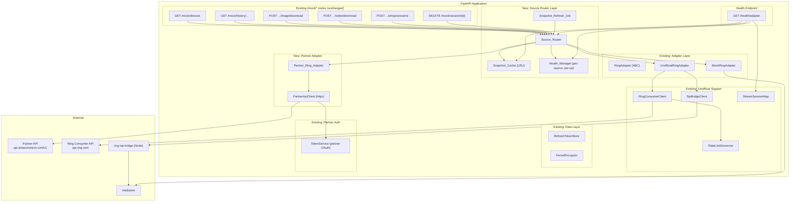
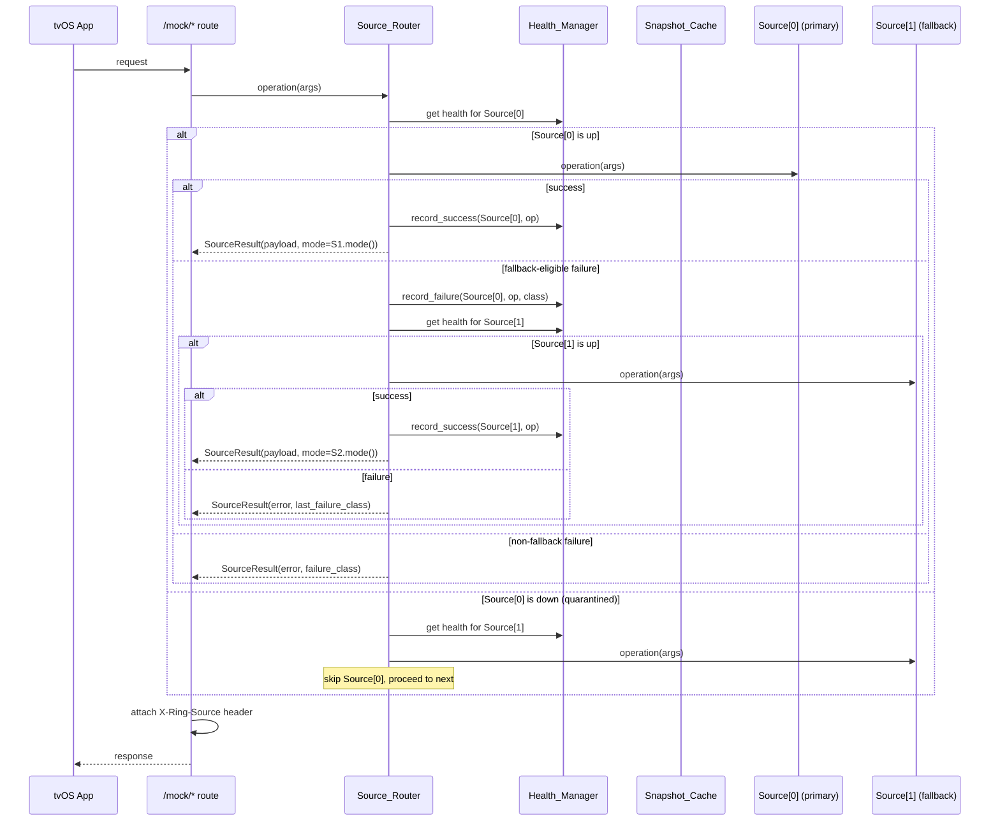
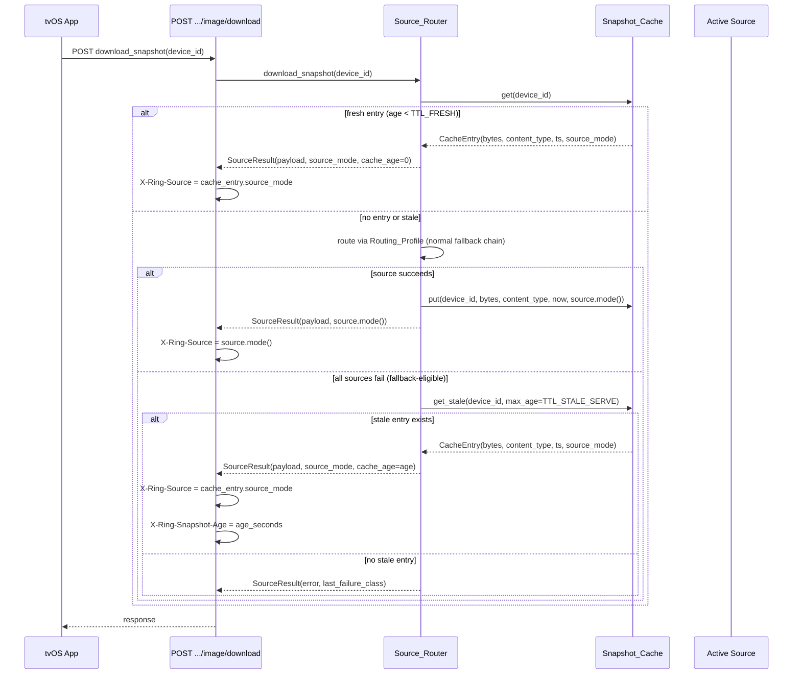
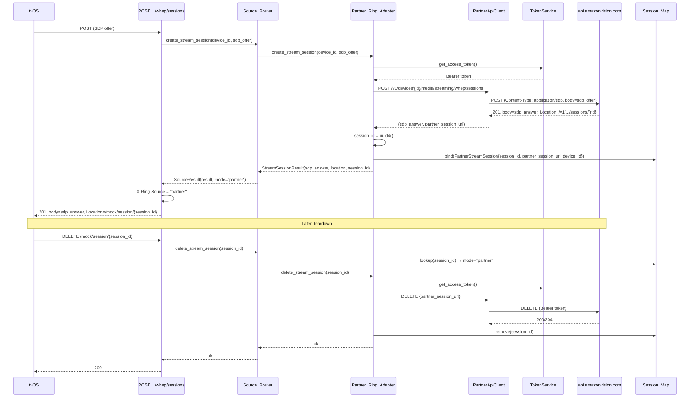
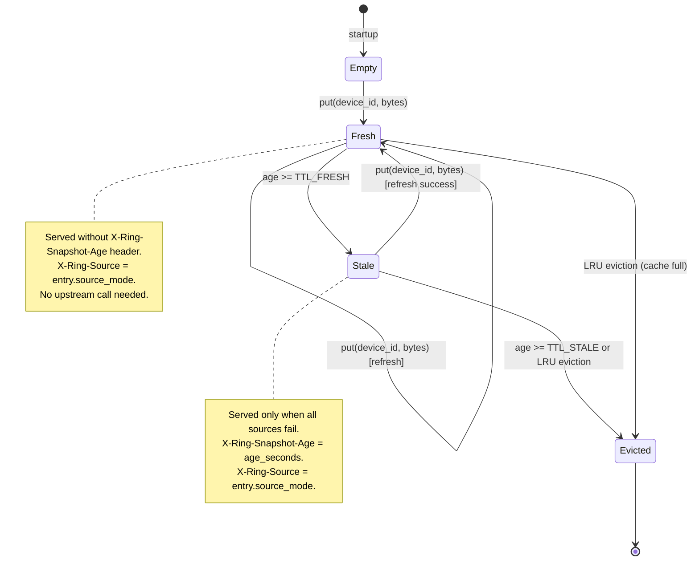
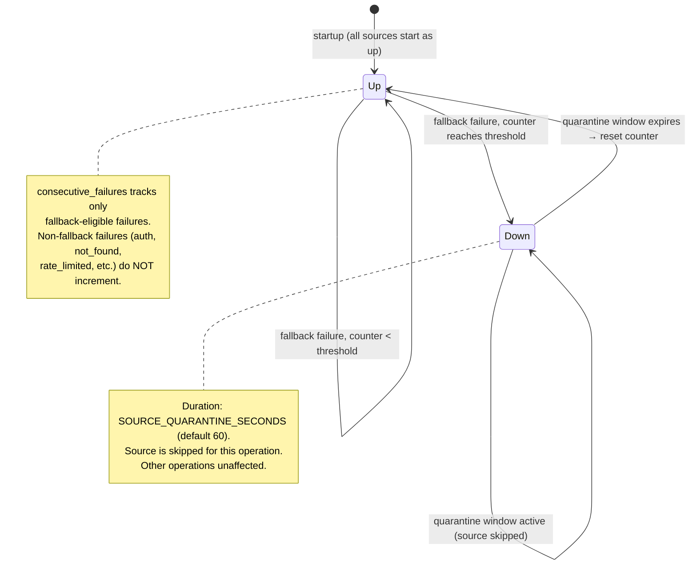

# Design Document: Ring Adapter Live Media

## Overview

This design extends the existing `ring-adapter-backend` architecture with three new first-class components that deliver **real live video and real camera snapshots** to the tvOS client. The existing `Ring_Adapter` ABC, `MockRingAdapter`, `UnofficialRingAdapter`, `Video_Bridge` (via `ring-sip-bridge` + `mediamtx`), `FernetEncryptor`-backed refresh token store, `RateLimitGovernor`, and the `/mock/*` route surface remain unchanged. This spec layers on top of them.

**New components introduced:**

1. **`Partner_Ring_Adapter`** — A third `RingAdapter` implementation that wraps the Ring Partner API at `https://api.amazonvision.com/v1` for devices, events, snapshots (`POST media/image/download`), clips (`POST media/video/download`), and WHEP streaming (`POST media/streaming/whep/sessions` with `Content-Type: application/sdp`, session teardown via `DELETE` on the `Location`-provided URL). Reuses the existing partner OAuth access-token path already implemented in `partner-auth-backend`.

2. **`Source_Router`** — The routing, health (binary `up`/`down`), quarantine, fallback classification, `X-Ring-Source`/`X-Ring-Snapshot-Age` header attachment, and "always show real data" guarantee layer. Sits between the `/mock/*` route handlers and the concrete adapters.

3. **`Snapshot_Cache` + `Snapshot_Refresh_Job`** — An in-process LRU byte-bounded cache with fresh/stale TTL semantics, plus a periodic refresh task with skip-if-running semantics. Refresh job calls participate in quarantine accounting.

**Key design decisions:**

1. **Source_Router replaces direct adapter injection.** Routes now depend on `Source_Router` (which internally holds all configured adapters) rather than a single `RingAdapter`. The router exposes the same operation signatures as `RingAdapter` but returns a `SourceResult` that includes the response payload plus metadata (producing mode, cache age).
2. **Binary health state.** Each (source, operation) pair is either `up` or `down`. No `degraded` state — simplifies reasoning and avoids ambiguous intermediate states.
3. **Session_Map is in-memory only.** On restart, previously active upstream sessions (Partner WHEP or unofficial SIP) are left to expire via their own TTLs. No startup reconciliation.
4. **Partner token refresh during streams.** The existing partner OAuth refresh-before-expiry logic (refresh when ≤60s to expiry) covers the `DELETE` path for long-lived WHEP sessions. No new token-refresh mechanism is needed — the `PartnerAuthClient` already refreshes proactively before any outbound call.
5. **Skip-if-running refresh job.** Uses an `asyncio.Lock.locked()` check (non-blocking) to detect whether a cycle is still executing. If locked, the scheduled tick is a no-op.

## Architecture

### Component Diagram



### Source Router Request Flow



### Snapshot Cache-First Path



### Partner WHEP Session Lifecycle



## Components and Interfaces

### 1. `FailureClass` Enum (`app/adapters/failure_class.py`)

Classifies every adapter failure for routing decisions. Distinct from `RingAdapterError` (which maps to HTTP status); `FailureClass` drives fallback logic.

```python
from enum import StrEnum

class FailureClass(StrEnum):
    """Classification of adapter operation failures for routing decisions."""
    CONFIGURATION = "configuration"
    AUTHENTICATION = "authentication"
    UPSTREAM_UNAVAILABLE = "upstream_unavailable"
    UPSTREAM_TIMEOUT = "upstream_timeout"
    NOT_FOUND = "not_found"
    SUBSCRIPTION_REQUIRED = "subscription_required"
    RATE_LIMITED = "rate_limited"
    CAPACITY_EXCEEDED = "capacity_exceeded"
    SNAPSHOT_UNAVAILABLE = "snapshot_unavailable"
    INTERNAL = "internal"

# Failures that permit fallback to the next source
FALLBACK_ELIGIBLE: frozenset[FailureClass] = frozenset({
    FailureClass.UPSTREAM_UNAVAILABLE,
    FailureClass.UPSTREAM_TIMEOUT,
})

# For snapshot operations only, snapshot_unavailable is also fallback-eligible
SNAPSHOT_FALLBACK_ELIGIBLE: frozenset[FailureClass] = FALLBACK_ELIGIBLE | {
    FailureClass.SNAPSHOT_UNAVAILABLE,
}
```

### 2. `AdapterError` — Extended Error with FailureClass (`app/adapters/errors.py` extension)

The existing `RingAdapterError` hierarchy gains a `failure_class` property so the `Source_Router` can classify failures without isinstance chains:

```python
# Added to each existing RingAdapterError subclass:
class UpstreamUnavailableError(RingAdapterError):
    code = ErrorCode.UPSTREAM_ERROR
    http_status = 502
    failure_class = FailureClass.UPSTREAM_UNAVAILABLE

class UpstreamTimeoutError(RingAdapterError):
    code = ErrorCode.UPSTREAM_TIMEOUT
    http_status = 504
    failure_class = FailureClass.UPSTREAM_TIMEOUT

class AuthenticationRequiredError(RingAdapterError):
    code = ErrorCode.AUTHENTICATION_REQUIRED
    http_status = 401
    failure_class = FailureClass.AUTHENTICATION

class DeviceNotFoundError(RingAdapterError):
    code = ErrorCode.DEVICE_NOT_FOUND
    http_status = 404
    failure_class = FailureClass.NOT_FOUND

class SubscriptionRequiredError(RingAdapterError):
    code = ErrorCode.SUBSCRIPTION_REQUIRED
    http_status = 402
    failure_class = FailureClass.SUBSCRIPTION_REQUIRED

class RateLimitedError(RingAdapterError):
    code = ErrorCode.RATE_LIMITED
    http_status = 429
    failure_class = FailureClass.RATE_LIMITED

class StreamCapacityExceededError(RingAdapterError):
    code = ErrorCode.STREAM_CAPACITY_EXCEEDED
    http_status = 429
    failure_class = FailureClass.CAPACITY_EXCEEDED

class SnapshotUnavailableError(RingAdapterError):
    code = ErrorCode.SNAPSHOT_UNAVAILABLE
    http_status = 503
    failure_class = FailureClass.SNAPSHOT_UNAVAILABLE
```

### 3. `SourceResult` — Router Response Wrapper (`app/routing/source_result.py`)

```python
from dataclasses import dataclass
from typing import Any

@dataclass(frozen=True, slots=True)
class SourceResult:
    """Result returned by Source_Router to route handlers."""
    payload: Any                    # The adapter's return value (dict, SnapshotPayload, etc.)
    source_mode: str                # Adapter_Mode that produced this response
    cache_age_seconds: int | None = None  # Set when served from Snapshot_Cache (stale)
```

### 4. `Partner_Ring_Adapter` (`app/adapters/partner.py`)

```python
from app.adapters.base import RingAdapter, SnapshotPayload, StreamSessionResult

class PartnerRingAdapter(RingAdapter):
    """Ring_Adapter implementation wrapping the Partner API at api.amazonvision.com/v1."""

    PARTNER_BASE = "https://api.amazonvision.com/v1"

    def __init__(
        self,
        http: httpx.AsyncClient,
        token_provider: Callable[[], Awaitable[str]],  # partner OAuth access token
        session_map: StreamSessionMap,
    ) -> None:
        self._http = http
        self._token_provider = token_provider
        self._session_map = session_map

    def mode(self) -> str:
        return "partner"

    async def list_devices(self) -> dict:
        """GET /v1/devices → JSON:API shape."""
        token = await self._token_provider()
        resp = await self._http.get(
            f"{self.PARTNER_BASE}/devices",
            headers={"Authorization": f"Bearer {token}"},
            timeout=10.0,
        )
        self._raise_for_status(resp, "list_devices")
        return resp.json()

    async def list_events(self, device_id: str, limit: int) -> list[dict]:
        """GET /v1/history/devices/{device_id}/events?limit={limit}."""
        token = await self._token_provider()
        resp = await self._http.get(
            f"{self.PARTNER_BASE}/history/devices/{device_id}/events",
            params={"limit": limit},
            headers={"Authorization": f"Bearer {token}"},
            timeout=10.0,
        )
        self._raise_for_status(resp, "list_events")
        return resp.json()

    async def download_snapshot(self, device_id: str) -> SnapshotPayload:
        """POST /v1/devices/{device_id}/media/image/download."""
        token = await self._token_provider()
        resp = await self._http.post(
            f"{self.PARTNER_BASE}/devices/{device_id}/media/image/download",
            headers={"Authorization": f"Bearer {token}"},
            timeout=10.0,
        )
        self._raise_for_snapshot_status(resp)
        return SnapshotPayload(
            content=resp.content,
            content_type=resp.headers.get("content-type", "image/jpeg"),
        )

    async def download_video(self, device_id: str, event_id: str | None) -> dict:
        """POST /v1/devices/{device_id}/media/video/download."""
        token = await self._token_provider()
        body = {"event_id": event_id} if event_id else {}
        resp = await self._http.post(
            f"{self.PARTNER_BASE}/devices/{device_id}/media/video/download",
            json=body,
            headers={"Authorization": f"Bearer {token}"},
            timeout=10.0,
        )
        self._raise_for_status(resp, "download_video")
        return resp.json()

    async def create_stream_session(
        self, device_id: str, sdp_offer: str
    ) -> StreamSessionResult:
        """POST /v1/devices/{device_id}/media/streaming/whep/sessions."""
        token = await self._token_provider()
        resp = await self._http.post(
            f"{self.PARTNER_BASE}/devices/{device_id}/media/streaming/whep/sessions",
            content=sdp_offer.encode(),
            headers={
                "Authorization": f"Bearer {token}",
                "Content-Type": "application/sdp",
            },
            timeout=10.0,
        )
        self._raise_for_whep_status(resp)
        session_id = str(uuid.uuid4())
        partner_session_url = resp.headers["location"]
        await self._session_map.bind(PartnerStreamSession(
            session_id=session_id,
            partner_session_url=partner_session_url,
            device_id=device_id,
            created_at=time.time(),
            state="active",
        ))
        return StreamSessionResult(
            sdp_answer=resp.text,
            location=f"/mock/session/{session_id}",
            session_id=session_id,
        )

    async def delete_stream_session(self, session_id: str) -> None:
        """DELETE the partner session URL, remove from Session_Map."""
        session = await self._session_map.lookup(session_id)
        try:
            token = await self._token_provider()
            await self._http.delete(
                session.partner_session_url,
                headers={"Authorization": f"Bearer {token}"},
                timeout=5.0,
            )
        finally:
            await self._session_map.remove(session_id)

    def _raise_for_whep_status(self, resp: httpx.Response) -> None:
        """Map Partner WHEP HTTP status to FailureClass."""
        # See failure-class mapping table below

    def _raise_for_snapshot_status(self, resp: httpx.Response) -> None:
        """Map Partner snapshot HTTP status to FailureClass."""
        # See failure-class mapping table below
```

### 5. `Source_Router` (`app/routing/source_router.py`)

The central routing component. Replaces direct adapter injection in route handlers.

```python
class SourceRouter:
    """Routes Ring_Adapter operations through the configured Routing_Profile."""

    def __init__(
        self,
        routing_profile: list[RingAdapter],
        health_manager: HealthManager,
        snapshot_cache: SnapshotCache,
        session_map: StreamSessionMap,
    ) -> None:
        self._profile = routing_profile
        self._health = health_manager
        self._cache = snapshot_cache
        self._session_map = session_map

    async def download_snapshot(self, device_id: str) -> SourceResult:
        """Cache-first snapshot path."""
        # 1. Check fresh cache
        entry = self._cache.get(device_id)
        if entry and entry.is_fresh():
            return SourceResult(
                payload=SnapshotPayload(entry.content, entry.content_type),
                source_mode=entry.source_mode,
                cache_age_seconds=None,  # fresh → no age header
            )
        # 2. Route through profile
        result = await self._route_operation(
            "download_snapshot",
            lambda adapter: adapter.download_snapshot(device_id),
            is_live_media=True,
            is_snapshot=True,
        )
        if result.payload is not None:
            # Write to cache on success
            payload: SnapshotPayload = result.payload
            self._cache.put(device_id, payload.content, payload.content_type, result.source_mode)
            return result
        # 3. Stale-serve fallback
        stale = self._cache.get_stale(device_id)
        if stale:
            age = stale.age_seconds()
            return SourceResult(
                payload=SnapshotPayload(stale.content, stale.content_type),
                source_mode=stale.source_mode,
                cache_age_seconds=age,
            )
        # 4. All failed, no cache
        return result  # contains the error

    async def create_stream_session(
        self, device_id: str, sdp_offer: str
    ) -> SourceResult:
        """Route stream creation through profile."""
        return await self._route_operation(
            "create_stream_session",
            lambda adapter: adapter.create_stream_session(device_id, sdp_offer),
            is_live_media=True,
            is_snapshot=False,
        )

    async def delete_stream_session(self, session_id: str) -> SourceResult:
        """Route to the adapter that owns the session."""
        session = await self._session_map.lookup(session_id)
        adapter = self._adapter_for_mode(session.source_mode)
        await adapter.delete_stream_session(session_id)
        return SourceResult(payload=None, source_mode=session.source_mode)

    async def list_devices(self) -> SourceResult:
        return await self._route_operation(
            "list_devices",
            lambda adapter: adapter.list_devices(),
            is_live_media=False,
            is_snapshot=False,
        )

    async def list_events(self, device_id: str, limit: int) -> SourceResult:
        return await self._route_operation(
            "list_events",
            lambda adapter: adapter.list_events(device_id, limit),
            is_live_media=False,
            is_snapshot=False,
        )

    async def download_video(self, device_id: str, event_id: str | None) -> SourceResult:
        return await self._route_operation(
            "download_video",
            lambda adapter: adapter.download_video(device_id, event_id),
            is_live_media=False,
            is_snapshot=False,
        )

    async def _route_operation(
        self,
        operation: str,
        call: Callable[[RingAdapter], Awaitable[Any]],
        *,
        is_live_media: bool,
        is_snapshot: bool,
    ) -> SourceResult:
        """Core routing algorithm. See pseudocode below."""
        ...
```

#### Source_Router Algorithm Pseudocode

```python
async def _route_operation(self, operation, call, *, is_live_media, is_snapshot):
    fallback_eligible = SNAPSHOT_FALLBACK_ELIGIBLE if is_snapshot else FALLBACK_ELIGIBLE
    last_error: RingAdapterError | None = None
    last_mode: str = ""

    for adapter in self._profile:
        mode = adapter.mode()

        # "Always show real data" guard: skip mock for live media
        # unless it's the only source or all real sources exhausted
        if is_live_media and mode == "mock" and self._has_real_source_up(operation):
            continue

        # Quarantine check
        if self._health.is_down(mode, operation):
            logger.info("quarantine_skip source=%s op=%s", mode, operation)
            continue

        try:
            result = await call(adapter)
            self._health.record_success(mode, operation)
            return SourceResult(payload=result, source_mode=mode)
        except RingAdapterError as exc:
            last_error = exc
            last_mode = mode
            fc = exc.failure_class

            if fc in fallback_eligible:
                self._health.record_failure(mode, operation, fc)
                logger.info("fallback from=%s op=%s class=%s", mode, operation, fc)
                continue  # try next source
            else:
                # Non-fallback: return immediately, do NOT affect health
                return SourceResult(payload=None, source_mode=mode, error=exc)

    # All sources exhausted with fallback-eligible failures
    if last_error:
        return SourceResult(payload=None, source_mode=last_mode, error=last_error)
    # No sources available (all quarantined)
    raise UpstreamUnavailableError("all sources quarantined")
```

### 6. `Health_Manager` (`app/routing/health_manager.py`)

Binary health state machine per (source_mode, operation).

```python
from dataclasses import dataclass, field
import time

@dataclass
class HealthState:
    """Per-(source, operation) health tracking."""
    state: Literal["up", "down"] = "up"
    consecutive_failures: int = 0
    quarantine_start: float | None = None
    last_success_at: float | None = None

class HealthManager:
    """Tracks binary health state per (source_mode, operation_name)."""

    def __init__(
        self,
        quarantine_threshold: int = 3,
        quarantine_seconds: int = 60,
    ) -> None:
        self._threshold = quarantine_threshold
        self._quarantine_seconds = quarantine_seconds
        self._states: dict[tuple[str, str], HealthState] = {}

    def is_down(self, source_mode: str, operation: str) -> bool:
        """Check if source is quarantined for this operation."""
        hs = self._states.get((source_mode, operation))
        if hs is None or hs.state == "up":
            return False
        # Check if quarantine has expired
        if hs.quarantine_start and (time.time() - hs.quarantine_start) >= self._quarantine_seconds:
            # Quarantine expired → restore
            hs.state = "up"
            hs.consecutive_failures = 0
            hs.quarantine_start = None
            return False
        return True

    def record_success(self, source_mode: str, operation: str) -> None:
        """Reset counter, mark up, record timestamp."""
        hs = self._get_or_create(source_mode, operation)
        hs.consecutive_failures = 0
        hs.state = "up"
        hs.quarantine_start = None
        hs.last_success_at = time.time()

    def record_failure(self, source_mode: str, operation: str, fc: FailureClass) -> None:
        """Increment counter; quarantine if threshold reached.
        
        Only called for fallback-eligible failures (upstream_unavailable,
        upstream_timeout, snapshot_unavailable for snapshot ops).
        Non-fallback failures do NOT affect health state.
        """
        hs = self._get_or_create(source_mode, operation)
        hs.consecutive_failures += 1
        if hs.consecutive_failures >= self._threshold:
            hs.state = "down"
            hs.quarantine_start = time.time()

    def snapshot(self) -> dict[tuple[str, str], HealthState]:
        """Return current state for /health/adapter."""
        return dict(self._states)
```

### 7. `Snapshot_Cache` (`app/routing/snapshot_cache.py`)

In-process LRU byte-bounded cache.

```python
from collections import OrderedDict
from dataclasses import dataclass
import time
import threading

@dataclass(slots=True)
class SnapshotCacheEntry:
    """Single cached snapshot."""
    content: bytes
    content_type: str
    fetched_at: float
    source_mode: str  # Adapter_Mode that produced this snapshot

    def age_seconds(self) -> int:
        return int(time.time() - self.fetched_at)

    def is_fresh(self, ttl_fresh: int) -> bool:
        return self.age_seconds() < ttl_fresh

    def is_stale_servable(self, ttl_stale: int) -> bool:
        return self.age_seconds() < ttl_stale


class SnapshotCache:
    """LRU byte-bounded in-memory snapshot cache.
    
    Thread-safe via a threading.Lock (not asyncio.Lock) because
    all operations are O(1) memory operations with no awaits.
    """

    def __init__(
        self,
        max_bytes: int = 67_108_864,  # 64 MiB
        ttl_fresh_seconds: int = 60,
        ttl_stale_serve_seconds: int = 600,
    ) -> None:
        self._max_bytes = max_bytes
        self._ttl_fresh = ttl_fresh_seconds
        self._ttl_stale = ttl_stale_serve_seconds
        self._entries: OrderedDict[str, SnapshotCacheEntry] = OrderedDict()
        self._total_bytes: int = 0
        self._lock = threading.Lock()

    def get(self, device_id: str) -> SnapshotCacheEntry | None:
        """Return fresh entry or None."""
        with self._lock:
            entry = self._entries.get(device_id)
            if entry and entry.is_fresh(self._ttl_fresh):
                self._entries.move_to_end(device_id)
                return entry
            return None

    def get_stale(self, device_id: str) -> SnapshotCacheEntry | None:
        """Return stale-but-servable entry or None."""
        with self._lock:
            entry = self._entries.get(device_id)
            if entry and entry.is_stale_servable(self._ttl_stale):
                return entry
            return None

    def put(self, device_id: str, content: bytes, content_type: str, source_mode: str) -> None:
        """Insert or update, evicting LRU if over byte bound."""
        entry = SnapshotCacheEntry(
            content=content,
            content_type=content_type,
            fetched_at=time.time(),
            source_mode=source_mode,
        )
        entry_size = len(content)
        with self._lock:
            # Remove old entry if exists
            if device_id in self._entries:
                old = self._entries.pop(device_id)
                self._total_bytes -= len(old.content)
            # Evict LRU until space available
            while self._total_bytes + entry_size > self._max_bytes and self._entries:
                _, evicted = self._entries.popitem(last=False)
                self._total_bytes -= len(evicted.content)
            self._entries[device_id] = entry
            self._total_bytes += entry_size
            self._entries.move_to_end(device_id)

    @property
    def total_bytes(self) -> int:
        with self._lock:
            return self._total_bytes

    @property
    def entry_count(self) -> int:
        with self._lock:
            return len(self._entries)

    def oldest_age(self) -> int | None:
        with self._lock:
            if not self._entries:
                return None
            first = next(iter(self._entries.values()))
            return first.age_seconds()

    def newest_age(self) -> int | None:
        with self._lock:
            if not self._entries:
                return None
            last = next(reversed(self._entries.values()))
            return last.age_seconds()
```

### 8. `Snapshot_Refresh_Job` (`app/routing/snapshot_refresh_job.py`)

```python
import asyncio
import logging
import time

logger = logging.getLogger(__name__)

class SnapshotRefreshJob:
    """Periodic background task that refreshes snapshot cache entries.
    
    Uses an asyncio.Lock to implement skip-if-running: if a cycle is
    still executing when the next tick fires, the tick is a no-op.
    """

    def __init__(
        self,
        source_router: SourceRouter,
        interval_seconds: int = 45,
        per_device_timeout: float = 10.0,
    ) -> None:
        self._router = source_router
        self._interval = interval_seconds
        self._timeout = per_device_timeout
        self._running_lock = asyncio.Lock()
        self._task: asyncio.Task | None = None

    async def start(self) -> None:
        """Start the periodic refresh loop."""
        self._task = asyncio.create_task(self._loop())

    async def stop(self) -> None:
        """Cancel the refresh loop."""
        if self._task:
            self._task.cancel()
            try:
                await self._task
            except asyncio.CancelledError:
                pass

    async def _loop(self) -> None:
        """Main loop: sleep then attempt a cycle."""
        while True:
            await asyncio.sleep(self._interval)
            await self._tick()

    async def _tick(self) -> None:
        """Attempt one refresh cycle. Skip if previous cycle still running."""
        if self._running_lock.locked():
            logger.debug("snapshot_refresh_skip reason=previous_cycle_running")
            return
        async with self._running_lock:
            await self._execute_cycle()

    async def _execute_cycle(self) -> None:
        """Refresh snapshots for all known devices."""
        start = time.time()
        devices_attempted = 0
        devices_refreshed = 0
        devices_failed = 0

        # Get device list via Source_Router (participates in quarantine)
        try:
            result = await self._router.list_devices()
            if result.payload is None:
                logger.warning("snapshot_refresh_cycle devices_fetch_failed")
                return
            device_list = result.payload.get("data", [])
        except Exception:
            logger.exception("snapshot_refresh_cycle devices_error")
            return

        for device in device_list:
            device_id = device.get("id", "")
            if not device_id:
                continue
            devices_attempted += 1
            try:
                snap_result = await asyncio.wait_for(
                    self._router.download_snapshot(device_id),
                    timeout=self._timeout,
                )
                if snap_result.payload is not None:
                    devices_refreshed += 1
                else:
                    devices_failed += 1
            except (asyncio.TimeoutError, Exception):
                devices_failed += 1

        elapsed_ms = int((time.time() - start) * 1000)
        logger.info(
            "snapshot_refresh_cycle devices_attempted=%d devices_refreshed=%d "
            "devices_failed=%d elapsed_ms=%d",
            devices_attempted, devices_refreshed, devices_failed, elapsed_ms,
        )
```


## Data Models

### Session_Map Entry — Tagged Union

The existing `StreamSession` dataclass (in `app/adapters/types.py`) is extended into a tagged union to support both partner and unofficial sessions:

```python
from dataclasses import dataclass
from typing import Literal

StreamSessionMode = Literal["partner", "unofficial", "mock"]

@dataclass(slots=True)
class BaseStreamSession:
    """Common fields for all session types."""
    session_id: str           # Backend-generated UUID v4
    device_id: str            # Ring device ID
    source_mode: StreamSessionMode
    created_at: float         # time.time() epoch seconds
    state: Literal["active", "terminated"]


@dataclass(slots=True)
class PartnerStreamSession(BaseStreamSession):
    """Partner API WHEP session."""
    source_mode: Literal["partner"] = "partner"
    partner_session_url: str = ""  # Location header from Partner API


@dataclass(slots=True)
class UnofficialStreamSession(BaseStreamSession):
    """Unofficial SIP→RTSP session (existing behavior, renamed for clarity)."""
    source_mode: Literal["unofficial"] = "unofficial"
    bridge_session_id: str = ""    # From ring-sip-bridge sidecar
    mediamtx_path: str = ""        # e.g. "ring/{device_id}"
    has_audio: bool = True


@dataclass(slots=True)
class MockStreamSession(BaseStreamSession):
    """Mock WHEP session (mediamtx test pattern)."""
    source_mode: Literal["mock"] = "mock"
```

The `StreamSessionMap` (existing, in `app/adapters/session_map.py`) stores `BaseStreamSession` instances. The `Source_Router` uses `session.source_mode` to dispatch `delete_stream_session` to the correct adapter.

### Snapshot_Cache Entry

```python
@dataclass(slots=True)
class SnapshotCacheEntry:
    content: bytes          # Raw image bytes (JPEG or PNG)
    content_type: str       # "image/jpeg" or "image/png"
    fetched_at: float       # time.time() when fetched
    source_mode: str        # Adapter_Mode that produced this ("partner", "unofficial")
```

### Health_State per (source, operation)

```python
@dataclass
class HealthState:
    state: Literal["up", "down"] = "up"
    consecutive_failures: int = 0
    quarantine_start: float | None = None
    last_success_at: float | None = None
```

### Configuration Model

Extended `Settings` class (additive to existing `app/config.py`):

```python
class Settings:
    # ... existing fields preserved ...

    # New: Routing profile
    ring_adapter_routing: list[str]  # Parsed from RING_ADAPTER_ROUTING or derived from RING_ADAPTER

    # New: Snapshot cache
    snapshot_ttl_fresh_seconds: int = 60
    snapshot_ttl_stale_serve_seconds: int = 600
    snapshot_refresh_interval_seconds: int = 45
    snapshot_cache_max_bytes: int = 67_108_864  # 64 MiB

    # New: Quarantine
    source_quarantine_threshold: int = 3
    source_quarantine_seconds: int = 60

    # Existing (preserved, now also used by Source_Router)
    ring_max_concurrent_streams: int = 2  # default 2
```

### Configuration Parsing and Validation

```python
def _parse_routing_profile(self) -> list[str]:
    """Parse RING_ADAPTER_ROUTING or fall back to RING_ADAPTER."""
    raw = os.environ.get("RING_ADAPTER_ROUTING", "").strip()
    if not raw:
        # Fallback to RING_ADAPTER
        adapter_raw = os.environ.get("RING_ADAPTER", "").strip().lower()
        if not adapter_raw:
            raise ConfigurationError(
                "Neither RING_ADAPTER_ROUTING nor RING_ADAPTER is set. "
                "At least one must be provided."
            )
        if adapter_raw not in {"partner", "unofficial", "mock"}:
            raise ConfigurationError(
                f"RING_ADAPTER must be one of 'partner', 'unofficial', 'mock', "
                f"got {adapter_raw!r}"
            )
        return [adapter_raw]

    tokens = [t.strip().lower() for t in raw.split(",")]
    valid_modes = {"partner", "unofficial", "mock"}

    # Validate
    for t in tokens:
        if not t:
            raise ConfigurationError(
                f"RING_ADAPTER_ROUTING contains an empty token: {raw!r}"
            )
        if t not in valid_modes:
            raise ConfigurationError(
                f"RING_ADAPTER_ROUTING contains invalid token {t!r}: {raw!r}"
            )
    if len(tokens) != len(set(tokens)):
        raise ConfigurationError(
            f"RING_ADAPTER_ROUTING contains duplicate entries: {raw!r}"
        )
    if len(tokens) > 3:
        raise ConfigurationError(
            f"RING_ADAPTER_ROUTING contains more than 3 tokens: {raw!r}"
        )

    return tokens


def _validate_snapshot_config(self) -> None:
    """Fail startup if TTL constraints are violated."""
    if self.snapshot_ttl_fresh_seconds >= self.snapshot_ttl_stale_serve_seconds:
        raise ConfigurationError(
            f"SNAPSHOT_TTL_FRESH_SECONDS ({self.snapshot_ttl_fresh_seconds}) must be "
            f"less than SNAPSHOT_TTL_STALE_SERVE_SECONDS ({self.snapshot_ttl_stale_serve_seconds})"
        )
    if self.snapshot_refresh_interval_seconds < 1:
        raise ConfigurationError(
            f"SNAPSHOT_REFRESH_INTERVAL_SECONDS must be >= 1, "
            f"got {self.snapshot_refresh_interval_seconds}"
        )
```

## Partner_Ring_Adapter — Failure-Class Mapping Table

| HTTP Status | Operation | FailureClass | Fallback Eligible? | Notes |
|---|---|---|---|---|
| 200/201 | any | — (success) | — | — |
| 204 | snapshot | `snapshot_unavailable` | Yes (snapshot only) | No image available |
| 401 | any | `authentication` | No | Partner token expired/invalid |
| 402 | WHEP, clip | `subscription_required` | No | Ring Protect required |
| 403 | any | `not_found` | No | Device not accessible |
| 404 | WHEP, snapshot | `not_found` / `snapshot_unavailable` | No / Yes | Device vs snapshot distinction |
| 429 | any | `rate_limited` | No | Partner rate limit hit |
| 5xx | any | `upstream_unavailable` | Yes | Partner API down |
| timeout | any | `upstream_timeout` | Yes | 10s (create/snapshot/clip), 5s (delete) |
| network error | any | `upstream_unavailable` | Yes | DNS, connection refused, etc. |

## Unofficial_Ring_Adapter — Failure-Class Mapping (Additions)

The existing `UnofficialRingAdapter` already raises `RingAdapterError` subclasses. This spec adds the `failure_class` attribute to each and documents the snapshot-specific mapping:

| Scenario | FailureClass | Fallback Eligible? |
|---|---|---|
| Ring consumer API 5xx | `upstream_unavailable` | Yes |
| Ring consumer API timeout (10s) | `upstream_timeout` | Yes |
| Ring consumer API 401 | `authentication` | No |
| Ring consumer API 404/204 on snapshot | `snapshot_unavailable` | Yes (snapshot only) |
| Ring consumer API 429 | `rate_limited` | No |
| SIP bridge 5xx / unreachable | `upstream_unavailable` | Yes |
| SIP bridge timeout (15s) | `upstream_timeout` | Yes |
| Session capacity exceeded | `capacity_exceeded` | No |

## Snapshot Cache State Machine



**Boundary conditions:**
- Entry exactly at `TTL_FRESH` seconds: treated as stale (strict `<` comparison)
- Entry exactly at `TTL_STALE_SERVE` seconds: not servable (strict `<` comparison)
- Cache at `max_bytes` with new entry larger than any single existing entry: evict multiple LRU entries until space available
- Single entry larger than `max_bytes`: stored (evicts everything else), total may momentarily equal entry size

## Health / Quarantine State Machine



**Key rules:**
- Health is tracked per `(source_mode, operation_name)` — a source can be `down` for `download_snapshot` but `up` for `list_devices`
- Only `upstream_unavailable` and `upstream_timeout` (and `snapshot_unavailable` for snapshot ops) increment the counter
- A single success resets the counter to 0 and restores `up`
- Quarantine expiry is checked lazily on the next routing attempt (no background timer)
- Snapshot_Refresh_Job calls count toward the quarantine counter (Req 6.6)

## Error Mapping Table (FailureClass → HTTP Status)

| FailureClass | HTTP Status | Error Code | Retriable? |
|---|---|---|---|
| `configuration` | 500 | `adapter_misconfigured` | No |
| `authentication` | 401 | `authentication_required` | No |
| `upstream_unavailable` | 502 | `upstream_error` | Yes |
| `upstream_timeout` | 504 | `upstream_timeout` | Yes |
| `not_found` | 404 | `device_not_found` | No |
| `subscription_required` | 402 | `subscription_required` | No |
| `rate_limited` | 429 | `rate_limited` | Yes |
| `capacity_exceeded` | 429 | `stream_capacity_exceeded` | Yes |
| `snapshot_unavailable` | 503 | `snapshot_unavailable` | Yes |
| `internal` | 500 | `internal_error` | No |

Response body shape (unchanged from `ring-adapter-backend`):
```json
{"error": "<error_code>"}
```

## `/health/adapter` Response Schema Extension

```json
{
  "adapter_mode": "unofficial",
  "routing_profile": ["partner", "unofficial", "mock"],
  "refresh_token_valid": true,
  "sources": {
    "partner": {
      "health_state": {
        "list_devices": {"state": "up", "consecutive_failures": 0, "last_success_at": "2025-01-15T10:30:00Z"},
        "download_snapshot": {"state": "down", "consecutive_failures": 3, "last_success_at": "2025-01-15T10:25:00Z"},
        "create_stream_session": {"state": "up", "consecutive_failures": 0, "last_success_at": null}
      }
    },
    "unofficial": {
      "health_state": {
        "list_devices": {"state": "up", "consecutive_failures": 0, "last_success_at": "2025-01-15T10:30:05Z"},
        "download_snapshot": {"state": "up", "consecutive_failures": 0, "last_success_at": "2025-01-15T10:30:05Z"},
        "create_stream_session": {"state": "up", "consecutive_failures": 0, "last_success_at": "2025-01-15T10:28:00Z"}
      }
    }
  },
  "snapshot_cache": {
    "entry_count": 4,
    "total_bytes": 2456789,
    "oldest_entry_age_seconds": 55,
    "newest_entry_age_seconds": 12
  },
  "active_streams": {
    "partner": 1,
    "unofficial": 0,
    "mock": 0
  },
  "ring_api_requests_last_minute": 12
}
```

## Concurrency Model

### Single-Flight Snapshots

The `Source_Router.download_snapshot` path uses the `Snapshot_Cache` as a natural deduplication mechanism. Because the cache is checked first (with a `threading.Lock` for O(1) operations), concurrent requests for the same device will:
1. First request: cache miss → fetches from source → writes to cache
2. Subsequent requests arriving during fetch: also cache miss → also fetch (acceptable; no single-flight coalescing needed because the cache write is idempotent and the upstream call is bounded by the rate limiter)

If single-flight coalescing becomes necessary under high concurrency, an `asyncio` event-per-device pattern can be added later without changing the external contract.

### Session_Map Locking

The existing `StreamSessionMap` uses an `asyncio.Lock` for all mutations (`bind`, `remove`, `check_capacity`). The `Source_Router` dispatches `delete_stream_session` to the adapter that owns the session (determined by `session.source_mode`), so there is no cross-adapter contention on session state.

### Snapshot_Refresh_Job Concurrency

The refresh job uses `asyncio.Lock.locked()` (non-blocking check) to implement skip-if-running:

```python
async def _tick(self) -> None:
    if self._running_lock.locked():
        return  # Previous cycle still running; skip this tick
    async with self._running_lock:
        await self._execute_cycle()
```

This guarantees at most one refresh cycle executes at any time. The `asyncio.Lock` is non-reentrant, so nested calls are impossible.

## Security Posture

1. **No new secret surfaces.** The `Partner_Ring_Adapter` obtains its access token from the existing `TokenService` (partner OAuth flow). No new secret storage is introduced.
2. **X-Ring-Source / X-Ring-Snapshot-Age headers** contain only the mode string (`"partner"`, `"unofficial"`, `"mock"`) and a non-negative integer. No secrets, no device IDs.
3. **Snapshot_Cache stores only bytes + metadata.** No tokens, no credentials, no session handles.
4. **Session_Map entries** store session IDs and URLs but no bearer tokens. The partner session URL is an opaque resource path, not a credential.
5. **Log redaction** (existing `RedactingFilter`) continues to scrub `refresh_token`, `access_token`, `authorization` from all log records. The new components emit only mode strings, device IDs, and failure classes.
6. **API_Key_Check** remains enforced on `GET /health/adapter` and `GET /api/token` regardless of routing profile.

## Backward-Compatibility Table

| Aspect | Before (ring-adapter-backend) | After (this spec) | Client Impact |
|---|---|---|---|
| `/mock/*` paths | Unchanged | Unchanged | None |
| Request shapes | Unchanged | Unchanged | None |
| Response body shapes | Unchanged | Unchanged | None |
| Response headers | Standard HTTP | + `X-Ring-Source`, `X-Ring-Snapshot-Age` | None (additive, optional) |
| `RING_ADAPTER` env var | `mock` \| `unofficial` | `mock` \| `unofficial` \| `partner` | None (new value) |
| `RING_ADAPTER_ROUTING` | N/A | New variable | None (optional) |
| Existing partner-auth routes | Active | Active | None |
| `ring-sip-bridge` sidecar | Required for unofficial | Required for unofficial | None |
| `mediamtx` | Required | Required | None |
| `ffmpeg` test pattern | Default | `mock` profile only | None |

## Deployment Delta

### docker-compose.yml Changes

```yaml
services:
  backend:
    environment:
      # Existing (preserved)
      - RING_CLIENT_ID=${RING_CLIENT_ID}
      - RING_CLIENT_SECRET=${RING_CLIENT_SECRET}
      - RING_HMAC_KEY=${RING_HMAC_KEY}
      - APP_API_KEY=${APP_API_KEY}
      - TOKEN_ENCRYPTION_KEY=${TOKEN_ENCRYPTION_KEY}
      - RING_ADAPTER=${RING_ADAPTER:-mock}
      - RING_REFRESH_TOKEN=${RING_REFRESH_TOKEN:-}
      - MEDIAMTX_WHEP_URL=${MEDIAMTX_WHEP_URL:-http://mediamtx:8889/test/whep}
      - MEDIAMTX_RTSP_URL=${MEDIAMTX_RTSP_URL:-rtsp://mediamtx:8554/ring}
      - MEDIAMTX_WHEP_BASE=${MEDIAMTX_WHEP_BASE:-http://mediamtx:8889}
      - RING_SIP_BRIDGE_URL=${RING_SIP_BRIDGE_URL:-http://ring-sip-bridge:3000}
      - RING_MAX_CONCURRENT_STREAMS=${RING_MAX_CONCURRENT_STREAMS:-2}
      - RING_API_RATE_LIMIT_PER_MINUTE=${RING_API_RATE_LIMIT_PER_MINUTE:-60}
      # New (this spec)
      - RING_ADAPTER_ROUTING=${RING_ADAPTER_ROUTING:-}
      - SNAPSHOT_TTL_FRESH_SECONDS=${SNAPSHOT_TTL_FRESH_SECONDS:-60}
      - SNAPSHOT_TTL_STALE_SERVE_SECONDS=${SNAPSHOT_TTL_STALE_SERVE_SECONDS:-600}
      - SNAPSHOT_REFRESH_INTERVAL_SECONDS=${SNAPSHOT_REFRESH_INTERVAL_SECONDS:-45}
      - SNAPSHOT_CACHE_MAX_BYTES=${SNAPSHOT_CACHE_MAX_BYTES:-67108864}
      - SOURCE_QUARANTINE_THRESHOLD=${SOURCE_QUARANTINE_THRESHOLD:-3}
      - SOURCE_QUARANTINE_SECONDS=${SOURCE_QUARANTINE_SECONDS:-60}
```

### .env.example Additions

```bash
# --- Live Media Routing (ring-adapter-live-media spec) ---
# Comma-separated ordered list of sources: partner, unofficial, mock
# If unset, falls back to RING_ADAPTER value as single-entry profile
# RING_ADAPTER_ROUTING=partner,unofficial,mock

# Snapshot cache TTLs
# SNAPSHOT_TTL_FRESH_SECONDS=60
# SNAPSHOT_TTL_STALE_SERVE_SECONDS=600
# SNAPSHOT_REFRESH_INTERVAL_SECONDS=45
# SNAPSHOT_CACHE_MAX_BYTES=67108864

# Source quarantine
# SOURCE_QUARANTINE_THRESHOLD=3
# SOURCE_QUARANTINE_SECONDS=60

# Max concurrent unofficial SIP streams
# RING_MAX_CONCURRENT_STREAMS=2
```

## Out-of-Scope Notes

- **tvOS client changes**: The client is unaware of source routing. No client changes.
- **Ring Partner API approval/onboarding**: This spec assumes the partner OAuth flow is already functional (implemented by `partner-auth-backend`).
- **2FA bootstrap for unofficial refresh token**: Users run `ring-auth-cli` externally.
- **Multi-tenant operation**: Single-user personal use only.
- **Production deployment**: Local Docker Compose only.
- **Persistent session reconciliation**: Session_Map is volatile. On restart, upstream sessions expire via their own TTLs.
- **Partner token refresh during streams**: The existing partner OAuth refresh-before-expiry logic (refresh when ≤60s to expiry) already covers the `DELETE` path for WHEP sessions. No new mechanism needed.


## Correctness Properties

*A property is a characteristic or behavior that should hold true across all valid executions of a system — essentially, a formal statement about what the system should do. Properties serve as the bridge between human-readable specifications and machine-verifiable correctness guarantees.*

### Property 1: Routing Profile Parser Correctness

*For any* input string to the routing profile parser, the parser SHALL either produce a normalized list of valid mode tokens (trimmed, lowercased, no duplicates, ≤3 entries, all in `{partner, unofficial, mock}`) or raise a `ConfigurationError` — no third outcome is possible.

**Validates: Requirements 1.1, 1.3**

### Property 2: Routing Determinism

*For any* routing profile and *for any* assignment of Health_State (`up` or `down`) to each (source, operation) pair, the Source_Router SHALL attempt sources in strict Routing_Profile order, skipping only those whose Health_State is `down`, and SHALL return the result of the first source that succeeds or the last fallback-eligible failure if all eligible sources fail.

**Validates: Requirements 1.4, 1.5, 1.11**

### Property 3: Non-Fallback Stops Routing

*For any* routing profile and *for any* source that returns a Non_Fallback_Class failure (`authentication`, `not_found`, `subscription_required`, `rate_limited`, `capacity_exceeded`, `configuration`, `internal`), the Source_Router SHALL return that failure immediately without attempting any subsequent source in the profile.

**Validates: Requirements 1.6**

### Property 4: Real Data Guarantee

*For any* routing profile containing at least one Real_Source (`partner` or `unofficial`) with Health_State `up` for a Live_Media_Path operation, the Source_Router SHALL NOT produce a response from the `MockRingAdapter` for that operation.

**Validates: Requirements 1.7, 7.1, 7.2, 7.4**

### Property 5: X-Ring-Source Header Correctness

*For any* response produced by the Source_Router (including cache-served responses), the `X-Ring-Source` header value SHALL equal the `mode()` of the adapter that originally produced the payload — for cache-served snapshots, this is the `source_mode` stored in the cache entry, not the mode of the adapter attempted on the current request.

**Validates: Requirements 1.8, 6.10, 13.1**

### Property 6: Session Binding Invariant

*For any* successful `create_stream_session` call, the Session_Map SHALL contain exactly one entry whose `session_id` matches the returned `session_id`, whose `source_mode` matches the producing adapter's `mode()`, and whose `device_id` matches the requested device.

**Validates: Requirements 2.3, 3.2, 13.2**

### Property 7: Session Cleanup Invariant

*For any* `delete_stream_session(session_id)` call that completes (whether the upstream DELETE succeeds or fails), the Session_Map SHALL contain no entry for that `session_id` after the call returns.

**Validates: Requirements 2.4, 3.3, 13.2**

### Property 8: Cache-First Snapshot Path

*For any* `download_snapshot(device_id)` invocation where the Snapshot_Cache contains an entry for `device_id` with age strictly less than `SNAPSHOT_TTL_FRESH_SECONDS`, the Source_Router SHALL return the cached payload without invoking any adapter, and the response SHALL NOT include an `X-Ring-Snapshot-Age` header.

**Validates: Requirements 6.2, 13.3**

### Property 9: Stale-Serve with Age Header

*For any* `download_snapshot(device_id)` invocation where all sources return a Fallback_Eligible_Class and the Snapshot_Cache contains an entry for `device_id` with age strictly less than `SNAPSHOT_TTL_STALE_SERVE_SECONDS`, the Source_Router SHALL return the cached payload with `X-Ring-Snapshot-Age` set to the entry's age in whole seconds and `X-Ring-Source` set to the entry's stored `source_mode`.

**Validates: Requirements 6.8, 6.9, 6.10**

### Property 10: Cache Bound Invariant

*For any* sequence of `Snapshot_Cache.put()` operations, the total byte size of all entries in the cache SHALL be less than or equal to `SNAPSHOT_CACHE_MAX_BYTES` after each operation completes.

**Validates: Requirements 6.11, 13.5**

### Property 11: Health State Machine Correctness

*For any* sequence of `record_success` and `record_failure` calls on a (source, operation) pair: (a) `consecutive_failures` equals the number of consecutive fallback-eligible failures since the last success or reset, (b) `state` transitions to `down` if and only if `consecutive_failures` reaches `SOURCE_QUARANTINE_THRESHOLD`, (c) a single `record_success` resets `consecutive_failures` to 0 and `state` to `up`, and (d) non-fallback failures do not change `consecutive_failures` or `state`.

**Validates: Requirements 8.1, 8.2, 8.5, 8.6**

### Property 12: Quarantine Lifecycle

*For any* source marked `down` for an operation, the Source_Router SHALL skip that source for that operation while `time.time() - quarantine_start < SOURCE_QUARANTINE_SECONDS`, and SHALL restore the source to `up` (resetting the counter) on the first routing attempt after the quarantine window expires.

**Validates: Requirements 8.3, 8.4**

### Property 13: Capacity Enforcement

*For any* state where the Session_Map contains `N` entries with `mode="unofficial"` and `N >= RING_MAX_CONCURRENT_STREAMS`, a `create_stream_session` call routed to the `UnofficialRingAdapter` SHALL raise `StreamCapacityExceededError` (classified as `capacity_exceeded`, non-fallback) without contacting the SIP bridge.

**Validates: Requirements 3.5**

### Property 14: Skip-If-Running Refresh

*For any* execution of the Snapshot_Refresh_Job, at most one refresh cycle SHALL be executing at any given time. If a cycle is still running when the next scheduled tick fires, the tick SHALL be a no-op.

**Validates: Requirements 6.4**

### Property 15: Refresh Participates in Quarantine

*For any* `download_snapshot` failure produced during a Snapshot_Refresh_Job cycle, the failure SHALL increment the same `consecutive_failures` counter used by client-initiated requests, and SHALL trigger quarantine if the threshold is reached.

**Validates: Requirements 6.6**

### Property 16: Fallback Observability

*For any* Source_Router response produced via the fallback path (i.e., the primary source returned a Fallback_Eligible_Class and a subsequent source was attempted), the backend's log stream SHALL contain a structured record with `decision=fallback` and a `request_id` matching the response's request context.

**Validates: Requirements 13.6**

## Error Handling

### Route-Level Exception Handler

The existing global `@app.exception_handler(RingAdapterError)` (from `ring-adapter-backend`) remains the single point of error-to-HTTP translation. The `Source_Router` raises `RingAdapterError` subclasses when all routing options are exhausted or when a non-fallback failure is encountered.

```python
@app.exception_handler(RingAdapterError)
async def handle_adapter_error(request: Request, exc: RingAdapterError) -> JSONResponse:
    return JSONResponse(
        status_code=exc.http_status,
        content={"error": exc.code},
    )
```

### Source_Router Error Flow

1. **Non-fallback failure from any source** → Source_Router re-raises the `RingAdapterError` immediately. The global handler maps it to HTTP.
2. **All sources exhausted with fallback-eligible failures** → Source_Router raises the last `RingAdapterError` encountered. For snapshots, stale-serve is attempted first.
3. **All sources quarantined** → Source_Router raises `UpstreamUnavailableError("all sources quarantined")`.

### Snapshot-Specific Error Flow

1. Fresh cache hit → return immediately (no error possible)
2. Cache miss → route through profile
3. All sources fail (fallback-eligible) → check stale cache
4. Stale cache hit → return with `X-Ring-Snapshot-Age` header
5. No stale cache → raise last `RingAdapterError`

## Testing Strategy

### Property-Based Testing

This feature is well-suited for property-based testing because:
- The Source_Router has clear input/output behavior with a large input space (routing profiles × health states × failure sequences)
- The Snapshot_Cache has invariants (byte bound, TTL semantics) that must hold across all input sequences
- The Health_Manager has a state machine with well-defined transitions

**Library:** [Hypothesis](https://hypothesis.readthedocs.io/) (Python)

**Configuration:** Minimum 100 iterations per property test.

**Tag format:** `# Feature: ring-adapter-live-media, Property {N}: {title}`

Each correctness property above maps to a single Hypothesis property test:

| Property | Test Module | Key Generators |
|---|---|---|
| 1: Parser Correctness | `test_routing_profile_parser.py` | `st.text()`, `st.lists(st.sampled_from(modes))` |
| 2: Routing Determinism | `test_source_router_routing.py` | Random profiles, random health states, mock adapters |
| 3: Non-Fallback Stops | `test_source_router_routing.py` | Random non-fallback FailureClass |
| 4: Real Data Guarantee | `test_source_router_routing.py` | Profiles with real+mock, healthy real sources |
| 5: X-Ring-Source | `test_source_router_headers.py` | Random responses, cache entries with various modes |
| 6: Session Binding | `test_session_lifecycle.py` | Random device IDs, SDP offers |
| 7: Session Cleanup | `test_session_lifecycle.py` | Random session IDs, success/failure DELETE |
| 8: Cache-First Path | `test_snapshot_cache_router.py` | Random cache entries with age < TTL |
| 9: Stale-Serve | `test_snapshot_cache_router.py` | Random stale entries, all-fail scenarios |
| 10: Cache Bound | `test_snapshot_cache.py` | Random put sequences with various sizes |
| 11: Health State Machine | `test_health_manager.py` | Random success/failure sequences |
| 12: Quarantine Lifecycle | `test_health_manager.py` | Random time progressions |
| 13: Capacity Enforcement | `test_session_lifecycle.py` | Random max values, fill to capacity |
| 14: Skip-If-Running | `test_snapshot_refresh_job.py` | Simulated long cycles |
| 15: Refresh Quarantine | `test_snapshot_refresh_job.py` | Refresh failures pushing to threshold |
| 16: Fallback Observability | `test_source_router_logging.py` | Fallback scenarios, log capture |

### Unit Tests (Example-Based)

Complement property tests with specific examples:

- Partner API failure classification: one test per HTTP status code (401, 402, 403, 404, 429, 5xx)
- Unofficial adapter failure classification: one test per scenario
- Configuration validation edge cases: both vars unset, fresh ≥ stale, interval < 1
- `/health/adapter` response shape verification
- Mock-only profile serves everything from mock
- Backward-compatibility: all 6 `/mock/*` endpoints return expected shapes

### Integration Tests

- Full FastAPI app with `RING_ADAPTER_ROUTING=unofficial,mock`, mocked HTTP clients, verify end-to-end routing
- Snapshot refresh job integration: verify cache is populated after one cycle
- Session lifecycle: create → verify map → delete → verify map empty
- Partner WHEP session: mock Partner API, verify SDP round-trip and Location header

### Test Fixtures

```python
# Fake adapters for Source_Router testing
class FakeAdapter(RingAdapter):
    """Configurable fake that can succeed or raise any RingAdapterError."""
    def __init__(self, mode_str: str, responses: dict[str, Any | Exception]):
        self._mode = mode_str
        self._responses = responses

    def mode(self) -> str:
        return self._mode

    async def download_snapshot(self, device_id: str) -> SnapshotPayload:
        resp = self._responses.get("download_snapshot")
        if isinstance(resp, Exception):
            raise resp
        return resp
    # ... similar for other operations
```
