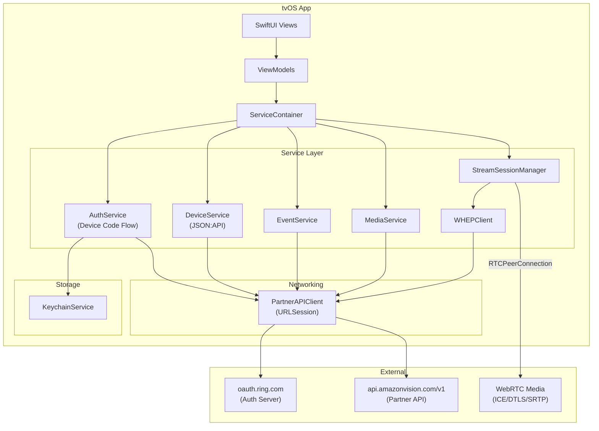

# Design Document: Ring Partner API Migration

## Overview

This design describes the migration of the RingAppleTV tvOS application from Ring's private consumer API (`api.ring.com/clients_api`) to the official Ring Partner API (Amazon Vision API at `api.amazonvision.com/v1`). The migration touches every layer of the networking stack:

1. **Authentication**: Replace email/password OAuth with OAuth 2.0 Device Authorization Grant (RFC 8628) for account linking — the user sees a code on the TV, completes authorization on their phone/computer, and the tvOS app polls for the token.
2. **Device discovery**: Replace the proprietary grouped-JSON device response with JSON:API-formatted device resources, changing device IDs from `Int` to `String`.
3. **Live streaming**: Replace SIP-over-TLS signaling (`SIPSignalingClient`) with WHEP (WebRTC-HTTP Egress Protocol) — a single HTTP POST carrying an SDP offer, receiving an SDP answer. WebRTC `RTCPeerConnection` remains for media transport.
4. **Events and media**: Point event history, video download, and snapshot endpoints at the Partner API equivalents.
5. **Error handling**: Replace `RingAPIError` with `PartnerAPIError`, adding rate-limit retry logic and proactive token refresh.
6. **Cleanup**: Delete all private API code, SIP signaling code, and legacy DTOs.

### Key Research Findings

- **WHEP protocol** ([IETF draft-ietf-wish-whep-02](https://www.ietf.org/archive/id/draft-ietf-wish-whep-02.txt)): WHEP uses a simple HTTP POST to a WHEP endpoint with `Content-Type: application/sdp` carrying the SDP offer. The server responds with `201 Created`, the SDP answer in the body, and a `Location` header pointing to the session resource. Session termination is an HTTP DELETE to that `Location` URL. ICE trickle is supported via HTTP PATCH but Ring's implementation bundles ICE candidates in the initial SDP exchange. Bearer token authentication is the standard WHEP auth mechanism.
- **OAuth 2.0 Device Authorization Grant** ([RFC 8628](https://tools.ietf.org/html/rfc8628)): Designed specifically for input-constrained devices like smart TVs. The device requests a device code and user code from the authorization server, displays the user code (and a verification URL or QR code) on screen, then polls the token endpoint until the user completes authorization on a separate device. This is the simplest auth approach for tvOS — no embedded browser, no complex redirect handling.
- **Ring Partner API** ([developer.amazon.com/docs/ring](https://developer.amazon.com/docs/ring/api-documentation.html)): Uses JSON:API format for device discovery, OAuth 2.0 tokens for auth, and WHEP for live streaming. Base URL is `https://api.amazonvision.com/v1`. Rate limit is 100 TPS per partner.

## Architecture



### Key Design Decisions

1. **Device Authorization Grant (RFC 8628) for tvOS auth**: tvOS has no web browser and limited text input. Rather than attempting to embed a web view or build a complex redirect flow, we use the Device Authorization Grant. The TV displays a short user code and URL (or QR code). The user opens the URL on their phone, enters the code, and authorizes. The tvOS app polls the token endpoint until authorization completes. This is the standard pattern used by YouTube, Netflix, and other tvOS apps. If Ring's OAuth server doesn't support the device code grant, we fall back to displaying a QR code encoding the full authorization URL so the user can scan it with their phone's camera and complete the standard authorization code flow there, with the tvOS app polling a lightweight callback mechanism.

2. **Single `PartnerAPIClient` replaces `DefaultRingAPIClient`**: Rather than modifying the existing client, we create a new `PartnerAPIClient` that targets `api.amazonvision.com/v1`. This allows parallel development and a clean cutover. The old client and all its private-API-specific code are deleted at the end.

3. **`WHEPClient` as a thin HTTP layer**: WHEP is just HTTP — POST an SDP offer, get an SDP answer back, DELETE to terminate. The `WHEPClient` handles only the HTTP exchange. `StreamSessionManager` owns the `RTCPeerConnection` lifecycle, session timers, and state machine. This separation keeps the WHEP protocol logic testable without WebRTC dependencies.

4. **`StreamSessionManager` replaces `DefaultWebRTCStreamService`**: The existing service mixes SIP signaling with WebRTC management. The new `StreamSessionManager` accepts a device ID and power source, delegates the SDP exchange to `WHEPClient`, and manages the `RTCPeerConnection` directly. The `WebRTCStreamService` protocol is updated to accept `(deviceId: String, powerSource: PowerSource)` instead of `StreamSessionResponse`.

5. **Domain model ID migration (`Int` → `String`)**: The Partner API uses string identifiers in JSON:API format. All domain models (`RingDevice`, `RingEvent`, `StreamSession`) change their `id` and related foreign keys from `Int` to `String`. This is a breaking change that propagates through service protocols, view models, and views.

6. **`PartnerAPIError` with retry logic**: The new error enum includes `rateLimited(retryAfter: TimeInterval)` with built-in retry support. The `PartnerAPIClient` automatically retries on 429 responses (up to 3 times) and attempts one token refresh on 401 responses before failing.

7. **Webhook handling deferred**: Requirement 8 specifies webhook event notifications. On tvOS, the app cannot host an HTTP server to receive webhooks directly. Webhook delivery requires a backend service. For the initial migration, we implement polling-based event refresh. Webhook support is noted as a future enhancement requiring a companion backend service.

## Components and Interfaces

### 1. `PartnerAPIClient` (New — replaces `DefaultRingAPIClient`)

The central HTTP client for all Partner API communication.

```swift
protocol PartnerAPIClientProtocol: Sendable {
    // Auth - Device Code Flow
    func requestDeviceCode(clientId: String) async throws -> DeviceCodeResponse
    func pollForToken(clientId: String, clientSecret: String, deviceCode: String) async throws -> AuthTokenResponse
    func refreshToken(clientId: String, clientSecret: String, refreshToken: String) async throws -> AuthTokenResponse

    // Devices
    func fetchDevices(token: String) async throws -> [PartnerDeviceResource]

    // Events
    func fetchEvents(deviceId: String, token: String) async throws -> [PartnerEventResource]

    // Media
    func downloadVideo(deviceId: String, eventId: String, token: String) async throws -> URL
    func downloadSnapshot(deviceId: String, token: String) async throws -> Data

    // WHEP
    func createWHEPSession(deviceId: String, sdpOffer: String, token: String) async throws -> WHEPSessionResponse
    func deleteWHEPSession(sessionURL: URL, token: String) async throws
}
```

**Base URLs:**
- Auth: `https://oauth.ring.com`
- API: `https://api.amazonvision.com/v1`

**Rate limiting**: Client-side token bucket limiting requests to < 100 TPS. On HTTP 429, extract `Retry-After` header and wait before retrying (max 3 retries).

**Token injection**: Every API request (non-auth) includes `Authorization: Bearer {token}`. On 401, attempt one token refresh before failing.

### 2. `AuthService` (Modified)

Updated to use Device Authorization Grant instead of email/password.

```swift
protocol AuthService: Sendable {
    /// Start the device code flow. Returns the user code and verification URL to display.
    func startDeviceCodeFlow() async throws -> DeviceCodeInfo
    /// Poll for authorization completion. Call repeatedly until success or expiry.
    func pollForAuthorization(deviceCode: String) async throws -> AuthToken
    /// Return a non-expired token, refreshing proactively if within 60s of expiry.
    func getValidToken() async throws -> AuthToken
    /// Clear all stored tokens and transition to unauthenticated state.
    func logout() async
    /// Whether a valid token exists.
    var isAuthenticated: Bool { get }
}
```

The `login(email:password:)` and `login(email:password:twoFactorCode:)` methods are removed entirely.

### 3. `WHEPClient` (New)

Thin HTTP client for WHEP session management. No WebRTC dependency.

```swift
protocol WHEPClientProtocol: Sendable {
    /// Send SDP offer, receive SDP answer and session URL.
    func createSession(
        deviceId: String,
        sdpOffer: String,
        token: String
    ) async throws -> WHEPSessionResponse

    /// Terminate a WHEP session.
    func deleteSession(sessionURL: URL, token: String) async throws
}
```

Implementation delegates to `PartnerAPIClient` for the actual HTTP calls.

### 4. `StreamSessionManager` (New — replaces `DefaultWebRTCStreamService`)

Orchestrates the full WHEP + WebRTC lifecycle.

```swift
protocol StreamSessionManagerProtocol: AnyObject, Sendable {
    /// Start a live stream for a device.
    func startStream(deviceId: String, powerSource: PowerSource) async throws
    /// Stop the current stream.
    func stopStream() async
    /// Current connection state.
    var connectionState: WebRTCConnectionState { get }
    var connectionStatePublisher: Published<WebRTCConnectionState>.Publisher { get }
}
```

**Lifecycle:**
1. Create `RTCPeerConnection` (receive-only, no local tracks)
2. Generate SDP offer
3. Send offer to WHEP endpoint via `WHEPClient`
4. Apply SDP answer as remote description
5. Wait for ICE `connected` state
6. Start session duration timer (30s battery / 60s line-powered)
7. On timer expiry or user stop: DELETE session via `WHEPClient`, close `RTCPeerConnection`

### 5. `DeviceService` (Modified)

Updated to parse JSON:API responses and expose `powerSource`.

```swift
protocol DeviceService: Sendable {
    func fetchDevices() async throws -> [RingDevice]
    func filterDevices(_ devices: [RingDevice], by filter: DeviceFilter) -> [RingDevice]
    func sortDevices(_ devices: [RingDevice], by sort: DeviceSort) -> [RingDevice]
    func refreshDevices() async throws -> [RingDevice]
}
```

The implementation changes from parsing `DevicesWrapper` (grouped JSON) to parsing `PartnerDeviceResource` (JSON:API `data` array).

### 6. `EventService` (Modified)

Updated to use Partner API event endpoints with string IDs.

```swift
protocol EventService: Sendable {
    func fetchEvents(for deviceId: String?) async throws -> [RingEvent]
    func fetchEventVideoURL(for event: RingEvent) async throws -> URL
}
```

### 7. `MediaService` (New — extracted from existing video/snapshot services)

Consolidates video download and snapshot download into one service.

```swift
protocol MediaService: Sendable {
    func downloadVideo(deviceId: String, eventId: String) async throws -> URL
    func downloadSnapshot(deviceId: String) async throws -> Data
}
```

## Data Models

### New DTOs (Partner API Responses)

```swift
/// OAuth 2.0 Device Authorization Grant response
struct DeviceCodeResponse: Codable {
    let deviceCode: String
    let userCode: String
    let verificationUri: String
    let verificationUriComplete: String?
    let expiresIn: Int
    let interval: Int  // polling interval in seconds

    enum CodingKeys: String, CodingKey {
        case deviceCode = "device_code"
        case userCode = "user_code"
        case verificationUri = "verification_uri"
        case verificationUriComplete = "verification_uri_complete"
        case expiresIn = "expires_in"
        case interval
    }
}

/// Info displayed to the user during device code flow
struct DeviceCodeInfo {
    let userCode: String
    let verificationUri: String
    let verificationUriComplete: String?
    let expiresIn: TimeInterval
    let pollingInterval: TimeInterval
    let deviceCode: String  // internal, not displayed
}

/// JSON:API device resource from Partner API
struct PartnerDeviceResource: Codable {
    let id: String
    let type: String
    let attributes: DeviceAttributes

    struct DeviceAttributes: Codable {
        let name: String
        let model: String
        let firmwareVersion: String?
        let powerSource: String  // "battery" or "line"

        enum CodingKeys: String, CodingKey {
            case name, model
            case firmwareVersion = "firmware_version"
            case powerSource = "power_source"
        }
    }

    func toDomain() -> RingDevice {
        RingDevice(
            id: id,
            name: attributes.name,
            model: attributes.model,
            deviceType: RingDevice.DeviceType(rawValue: model) ?? .unknown,
            firmwareVersion: attributes.firmwareVersion,
            powerSource: PowerSource(rawValue: attributes.powerSource) ?? .battery,
            isOnline: true
        )
    }
}

/// JSON:API wrapper for device list response
struct PartnerDeviceListResponse: Codable {
    let data: [PartnerDeviceResource]
}

/// Partner API event resource
struct PartnerEventResource: Codable {
    let id: String
    let deviceId: String
    let type: String       // "motion", "ding", "on_demand"
    let createdAt: String  // ISO 8601
    let duration: Int?

    enum CodingKeys: String, CodingKey {
        case id
        case deviceId = "device_id"
        case type
        case createdAt = "created_at"
        case duration
    }

    func toDomain() -> RingEvent {
        let formatter = ISO8601DateFormatter()
        return RingEvent(
            id: id,
            deviceId: deviceId,
            eventType: RingEvent.EventType(rawValue: type) ?? .motion,
            createdAt: formatter.date(from: createdAt) ?? Date(),
            duration: duration.map { TimeInterval($0) }
        )
    }
}

/// WHEP session creation response
struct WHEPSessionResponse {
    let sdpAnswer: String
    let sessionURL: URL
}

/// Partner API error response body
struct PartnerAPIErrorBody: Codable {
    let code: String?
    let message: String?
}
```

### Modified Domain Models

```swift
/// Updated RingDevice — String ID, added powerSource
struct RingDevice: Codable, Identifiable, Equatable {
    let id: String                    // Changed: Int → String
    let name: String                  // Changed: was 'description'
    let model: String                 // New
    let deviceType: DeviceType
    let firmwareVersion: String?
    let powerSource: PowerSource      // New
    var isOnline: Bool

    enum DeviceType: String, Codable, CaseIterable { /* unchanged */ }
}

/// Power source determines session duration limit
enum PowerSource: String, Codable {
    case battery
    case line

    var sessionDurationLimit: TimeInterval {
        switch self {
        case .battery: return 30
        case .line: return 60
        }
    }
}

/// Updated RingEvent — String IDs, removed deviceName/thumbnailURL/videoAvailable
struct RingEvent: Codable, Identifiable, Equatable {
    let id: String                    // Changed: Int → String
    let deviceId: String              // Changed: Int → String
    let eventType: EventType
    let createdAt: Date
    let duration: TimeInterval?

    enum EventType: String, Codable { /* unchanged */ }
}

/// Updated StreamSession — WHEP fields replace SIP fields
struct StreamSession: Equatable {
    let deviceId: String              // Changed: Int → String
    let sessionURL: URL               // New: WHEP session resource URL
    let powerSource: PowerSource      // New
    let createdAt: Date
    let maxDuration: TimeInterval     // Derived from powerSource

    var isValid: Bool { remainingTime > 0 }
    var remainingTime: TimeInterval {
        max(0, maxDuration - Date().timeIntervalSince(createdAt))
    }
}

/// Updated AuthToken — added clientId scope
struct AuthToken: Codable, Equatable {
    let accessToken: String
    let refreshToken: String
    let expiresAt: Date
    let scope: String?
    let tokenType: String
    let clientId: String?             // New: from Partner API token response

    var isExpired: Bool { Date() >= expiresAt }
    var needsRefresh: Bool { Date() >= expiresAt.addingTimeInterval(-60) }  // Changed: 60s threshold
}

/// New error enum replacing RingAPIError
enum PartnerAPIError: Error, Equatable {
    case unauthorized                 // 401
    case forbidden                    // 403
    case notFound                     // 404
    case rateLimited(retryAfter: TimeInterval)  // 429
    case serverError(Int)             // 5xx
    case networkError(String)
    case decodingError(String)
    case authorizationPending         // Device code flow: user hasn't authorized yet
    case slowDown                     // Device code flow: polling too fast
    case expiredDeviceCode            // Device code flow: code expired

    var userMessage: String {
        switch self {
        case .unauthorized:
            return "Your session has expired. Please re-link your Ring account."
        case .forbidden:
            return "Access denied. Please check your account permissions."
        case .notFound:
            return "The requested resource was not found."
        case .rateLimited:
            return "Too many requests. Please wait a moment."
        case .serverError:
            return "Ring servers are temporarily unavailable. Please try later."
        case .networkError:
            return "Network connection error. Please check your connection."
        case .decodingError:
            return "Unexpected response from Ring. Please try again."
        case .authorizationPending:
            return "Waiting for authorization. Please complete sign-in on your phone."
        case .slowDown:
            return "Please wait a moment before trying again."
        case .expiredDeviceCode:
            return "Authorization code expired. Please start the sign-in process again."
        }
    }
}
```

### Deleted Models and Code

| File | Reason |
|---|---|
| `SIPSignalingClient.swift` | SIP signaling replaced by WHEP |
| `SIPError` enum | No longer needed |
| `StreamSessionResponse.swift` | SIP session params replaced by `WHEPSessionResponse` |
| `DevicesWrapper` struct | Private API grouped format replaced by JSON:API |
| `RingDeviceResponse.swift` | Replaced by `PartnerDeviceResource` |
| `RingEventResponse.swift` | Replaced by `PartnerEventResource` |
| `RingAPIError.swift` | Replaced by `PartnerAPIError` |
| `DefaultRingAPIClient.swift` | Replaced by `PartnerAPIClient` |
| `TwoFactorMethod` enum | No 2FA in Partner API flow |
| `VideoURLWrapper` struct | Internal to old API client |


## Correctness Properties

*A property is a characteristic or behavior that should hold true across all valid executions of a system — essentially, a formal statement about what the system should do. Properties serve as the bridge between human-readable specifications and machine-verifiable correctness guarantees.*

### Property 1: Token Keychain Round-Trip

*For any* valid `AuthToken` (with arbitrary `accessToken`, `refreshToken`, `expiresAt`, `scope`, `tokenType`, and `clientId` values), storing the token in the Keychain and then retrieving it should produce an `AuthToken` equal to the original.

**Validates: Requirements 1.4**

### Property 2: Proactive Refresh Threshold

*For any* `AuthToken` with an arbitrary `expiresAt` date, the `needsRefresh` property should return `true` if and only if the current time is within 60 seconds of `expiresAt` (i.e., `now >= expiresAt - 60`), and `isExpired` should return `true` if and only if `now >= expiresAt`.

**Validates: Requirements 1.5**

### Property 3: Bearer Token Header Injection

*For any* non-empty access token string and any Partner API endpoint path, the constructed `URLRequest` should contain an `Authorization` header with the value `"Bearer {token}"` where `{token}` is the exact access token string.

**Validates: Requirements 1.7**

### Property 4: Logout Clears All Token State

*For any* initial token state (with arbitrary stored tokens), after calling `logout()`, the `isAuthenticated` property should be `false` and retrieving tokens from the Keychain should return `nil`.

**Validates: Requirements 1.8**

### Property 5: Device Resource JSON:API Round-Trip

*For any* valid `PartnerDeviceResource` (with arbitrary `id` string, `type`, and `attributes` including `name`, `model`, `firmwareVersion`, and `powerSource`), serializing to JSON:API format and then parsing back should produce an equivalent `PartnerDeviceResource`. Furthermore, calling `toDomain()` should produce a `RingDevice` whose `id`, `name`, `model`, and `powerSource` match the original resource's values.

**Validates: Requirements 2.2, 2.3, 2.6, 11.1, 11.2**

### Property 6: Event Resource Round-Trip

*For any* valid `PartnerEventResource` (with arbitrary `id` string, `deviceId` string, `type`, ISO 8601 `createdAt`, and optional `duration`), serializing to JSON and then parsing back should produce an equivalent `PartnerEventResource`. Furthermore, calling `toDomain()` should produce a `RingEvent` whose `id`, `deviceId`, `eventType`, and `duration` match the original resource's values.

**Validates: Requirements 5.2, 5.3, 11.3**

### Property 7: WHEP Response Parsing

*For any* valid SDP answer string and any valid session URL, when wrapped in an HTTP 201 response (SDP answer in the body, session URL in the `Location` header), the WHEP response parser should extract the exact SDP answer string and the exact session URL.

**Validates: Requirements 3.2, 3.3**

### Property 8: WHEP Request Construction

*For any* valid device ID string and any valid SDP offer string, the constructed WHEP HTTP request should have: (a) method POST, (b) URL matching `https://api.amazonvision.com/v1/devices/{deviceId}/media/streaming/whep/sessions`, (c) `Content-Type` header equal to `application/sdp`, and (d) body equal to the SDP offer string.

**Validates: Requirements 3.1**

### Property 9: HTTP Error Status Mapping

*For any* HTTP status code in the range 400–599, the `PartnerAPIClient` error mapping function should produce the correct `PartnerAPIError` case: 401 → `.unauthorized`, 403 → `.forbidden`, 404 → `.notFound`, 429 → `.rateLimited(retryAfter:)`, 500–599 → `.serverError(statusCode)`, and all other 4xx → a defined error case. No status code in the error range should produce an unhandled case or crash.

**Validates: Requirements 2.5, 3.7, 5.4, 6.3, 7.3, 9.1**

### Property 10: PartnerAPIError User Messages

*For any* `PartnerAPIError` case (including all associated values), the `userMessage` computed property should return a non-empty `String` that does not contain technical jargon like "HTTP", status codes, or stack traces.

**Validates: Requirements 9.5**

## Error Handling

### HTTP Error Mapping

All Partner API HTTP errors are mapped through a single `mapStatusCode` function in `PartnerAPIClient`:

| HTTP Status | `PartnerAPIError` Case | Recovery Action |
|---|---|---|
| 401 | `.unauthorized` | Attempt one token refresh; if refresh fails, clear tokens and prompt re-linking |
| 403 | `.forbidden` | Display user message, no automatic retry |
| 404 | `.notFound` | Display user message (e.g., "device not found" or "no video available") |
| 429 | `.rateLimited(retryAfter:)` | Extract `Retry-After` header, wait, retry up to 3 times |
| 500–599 | `.serverError(statusCode)` | Display user message, no automatic retry |
| Network failure | `.networkError(message)` | Display connectivity message |
| JSON decode failure | `.decodingError(message)` | Log details, display generic error message |

### Device Code Flow Errors

| Scenario | `PartnerAPIError` Case | Handling |
|---|---|---|
| User hasn't authorized yet | `.authorizationPending` | Continue polling at the specified interval |
| Polling too fast | `.slowDown` | Increase polling interval by 5 seconds |
| Device code expired | `.expiredDeviceCode` | Display message, prompt user to restart flow |
| Token endpoint returns error | `.unauthorized` | Display error, prompt restart |

### WHEP Streaming Errors

| Scenario | Handling |
|---|---|
| WHEP POST returns 4xx/5xx | Map to `PartnerAPIError`, transition connection state to `.failed`, display user message |
| `RTCPeerConnection` ICE fails | Transition to `.failed("ICE connection failed")`, send DELETE to session URL if available |
| Session timer expires | Send DELETE to session URL, close `RTCPeerConnection`, transition to `.disconnected` |
| DELETE session fails | Log error, still close local `RTCPeerConnection` (best-effort cleanup) |
| WebRTC framework unavailable | `StreamSessionManager` returns `nil` from `ServiceContainer`, UI shows "Live streaming not available" |

### Token Lifecycle Errors

| Scenario | Handling |
|---|---|
| Token refresh succeeds | Replace stored tokens, retry original request |
| Token refresh returns 401 | Clear all tokens, transition to unauthenticated, prompt re-linking |
| Token refresh network error | Propagate `.networkError` to caller |
| Keychain read/write fails | Propagate `KeychainError`, fall back to in-memory token storage |

## Testing Strategy

### Property-Based Testing Applicability

This feature is well-suited for property-based testing. The core logic involves:
- **Data serialization/deserialization** (JSON:API parsing, token storage) — classic round-trip properties
- **Pure mapping functions** (`toDomain()`, error mapping, URL construction) — input varies meaningfully, universal properties hold
- **State predicates** (`needsRefresh`, `isExpired`) — boolean functions of time, testable across the full input space

PBT is NOT appropriate for:
- Webhook handling (deferred, requires backend)
- Actual HTTP calls to Ring's servers (integration tests)
- WebRTC `RTCPeerConnection` behavior (external framework)
- Keychain access control configuration (smoke tests)
- Codebase cleanup verification (smoke tests / grep)

### Property-Based Testing Configuration

- **Library**: [SwiftCheck](https://github.com/typelift/SwiftCheck) or `swift-testing` with custom generators
- **Minimum iterations**: 100 per property test
- **Tag format**: `Feature: ring-partner-api-migration, Property {N}: {title}`
- Each correctness property (1–10) maps to exactly one property-based test

### Test Plan

#### Property-Based Tests (10 tests)

| Test | Property | What Varies |
|---|---|---|
| `testTokenKeychainRoundTrip` | Property 1 | Random token strings, dates, optional fields |
| `testProactiveRefreshThreshold` | Property 2 | Random `expiresAt` dates relative to `now` |
| `testBearerTokenHeaderInjection` | Property 3 | Random token strings, API endpoint paths |
| `testLogoutClearsAllTokenState` | Property 4 | Random initial token states |
| `testDeviceResourceRoundTrip` | Property 5 | Random device IDs, names, models, power sources |
| `testEventResourceRoundTrip` | Property 6 | Random event IDs, types, ISO 8601 dates, durations |
| `testWHEPResponseParsing` | Property 7 | Random SDP strings, session URLs |
| `testWHEPRequestConstruction` | Property 8 | Random device IDs, SDP offer strings |
| `testHTTPErrorStatusMapping` | Property 9 | Random HTTP status codes 400–599 |
| `testPartnerAPIErrorUserMessages` | Property 10 | All `PartnerAPIError` cases with random associated values |

#### Unit Tests (Example-Based)

| Test | Validates | Description |
|---|---|---|
| `testTokenRefreshOn401ClearsTokens` | Req 1.6 | Mock 401 on refresh → tokens cleared, `isAuthenticated` false |
| `testEmptyDeviceListReturnsEmpty` | Req 2.4 | Empty JSON:API `data` array → empty `[RingDevice]`, no error |
| `testSessionTimerStartsOnICEConnected` | Req 3.4 | Mock ICE connected → timer started with correct duration |
| `testManualStopSendsDeleteAndCloses` | Req 3.6 | Call `stopStream()` → DELETE sent, connection closed |
| `testReceiveOnlyMode` | Req 3.8 | After setup, no local senders have tracks |
| `test401TriggersOneTokenRefresh` | Req 9.3 | Mock 401 on API call → refresh attempted → request retried |
| `testVideoURLExtraction` | Req 6.2 | Mock video download response → URL returned |
| `testSnapshotDataPassthrough` | Req 7.2 | Mock image data response → raw data returned |

#### Integration Tests

| Test | Validates | Description |
|---|---|---|
| `testDeviceFetchEndToEnd` | Req 2.1 | Mock HTTP client verifies GET to correct URL with Bearer token |
| `testEventFetchEndToEnd` | Req 5.1 | Mock HTTP client verifies GET to correct events URL |
| `testVideoDownloadRequest` | Req 6.1 | Mock HTTP client verifies POST to video download URL |
| `testSnapshotDownloadRequest` | Req 7.1 | Mock HTTP client verifies POST to image download URL |
| `testRateLimitRetry` | Req 9.2 | Mock 429 with Retry-After → verify retry count and delay |
| `testClientSideRateLimit` | Req 9.4 | Burst requests → verify throttling to < 100 TPS |

#### Smoke Tests (Codebase Cleanup Verification)

| Test | Validates | Description |
|---|---|---|
| `testNoPrivateAPIReferences` | Req 10.1, 10.2 | Grep for `clients_api`, `ring_official_ios`, `api.ring.com` → zero matches |
| `testSIPCodeRemoved` | Req 4.1, 4.2, 4.3 | Verify `SIPSignalingClient.swift`, `SIPError`, SIP model fields are absent |
| `testLegacyDTOsRemoved` | Req 10.3–10.7 | Verify `DevicesWrapper`, `RingDeviceResponse`, `RingEventResponse`, `StreamSessionResponse`, `RingAPIError` are absent |
| `testDomainModelTypes` | Req 11.1, 11.3, 11.4, 11.5 | Verify `RingDevice.id` is `String`, `RingEvent.id` is `String`, `StreamSession` has `sessionURL`, `AuthToken` has `clientId` |
