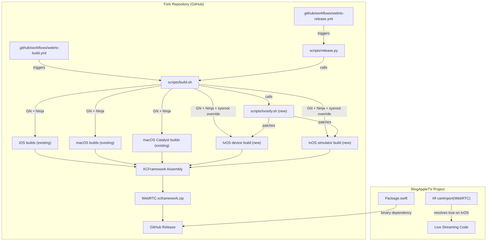

# Design Document: WebRTC tvOS Fork

## Overview

This design describes how to fork `stasel/WebRTC` and extend its GitHub Actions CI pipeline to produce a `WebRTC.xcframework` that includes tvOS device and simulator slices alongside the existing iOS, macOS, and macOS Catalyst slices. The fork will be published as a GitHub release with SPM binary target support, and the RingAppleTV `Package.swift` will be updated to consume it.

The upstream `stasel/WebRTC` repo uses a well-structured build system:
- `scripts/build.sh` — compiles WebRTC from source using GN/Ninja for each platform, then manually assembles an xcframework using `lipo` and `PlistBuddy` (not `xcodebuild -create-xcframework`, due to duplicate architecture errors)
- `scripts/release.py` — automates release creation by checking the Chromium Dashboard for new stable milestones, triggering builds, creating GitHub release drafts, and opening PRs to update `Package.swift`
- Two GitHub Actions workflows: `webrtc-build.yml` (manual) and `webrtc-release.yml` (scheduled daily)

The tvOS build approach is informed by `swarm-cloud/Apple-WebRTC`, which demonstrated that tvOS can be built using `target_os = "ios"` with tvOS SDK sysroot overrides applied post-GN-gen via shell scripts (`tvosify-os.sh` / `tvosify-sim.sh`). However, the upstream `stasel/WebRTC` build script uses a newer GN arg `target_environment` (device/simulator) which may simplify the approach — we will use `target_os = "ios"` with sysroot overrides to the AppleTVOS and AppleTVSimulator SDKs.

## Architecture



### Key Design Decisions

1. **Try `target_environment` first, fall back to full sysroot patching**: The upstream `build_iOS()` already uses `target_environment="device"/"simulator"` as a GN arg. We'll first attempt building tvOS by using `target_os="ios"` + `target_environment` with *only* the sysroot path swapped to the tvOS SDK (no min-version flag patching). If this produces a valid tvOS binary, we skip the heavier sed-based patching. If it fails (e.g., UIKit references that don't exist on tvOS), we fall back to the full `tvosify.sh` approach that also patches min-version flags. The `tvosify.sh` script will be structured to support both modes.

2. **Manual xcframework assembly (preserve upstream pattern)**: The upstream `build.sh` manually constructs the xcframework using `PlistBuddy` and `lipo` rather than `xcodebuild -create-xcframework`. We preserve this pattern and extend it with tvOS entries, maintaining consistency and avoiding the duplicate-architecture error that motivated the upstream approach.

3. **Separate `TVOS` env var toggle**: Following the existing pattern of `IOS`, `MACOS`, `MAC_CATALYST` boolean env vars, we add a `TVOS` env var to `build.sh`. This keeps tvOS builds opt-in and allows the CI to build any combination of platforms.

4. **Version scheme: same milestone + `+tvos` build metadata**: Fork releases use the same milestone version as upstream (e.g., `147.0.0`) with `+tvos` build metadata suffix in documentation only. SPM ignores build metadata in version resolution, so the fork can use identical version numbers to upstream without conflict. Tags will be plain `147.0.0` since this is a fork, not a competing package on the same registry.

5. **Validation via minimal Swift target**: The CI includes a validation step that compiles a minimal Swift file importing WebRTC and instantiating `RTCPeerConnectionFactory` against the tvOS SDK, catching link-time failures before release.

6. **arm64-only tvOS simulator (no x86_64)**: Since all modern Apple Silicon Macs run arm64 simulators natively, we skip the x86_64 tvOS simulator slice. This simplifies the build and eliminates the need for `lipo` on the simulator binary. The tvOS simulator slice will be a single-architecture arm64 binary.

7. **`ios_deployment_target="15.0"` for tvOS builds**: We explicitly set this GN arg to `15.0` for tvOS builds for clarity, even though the sysroot override will ultimately determine the target. This makes the intent clear in the build configuration.

8. **Latest macOS runner**: Use the latest available macOS GitHub Actions runner (currently `macos-14` or `macos-15`) to ensure tvOS SDK availability. No special runner configuration needed.

## Components and Interfaces

### 1. `scripts/build.sh` (Modified)

The existing build script is extended with tvOS support:

**New environment variable:**
- `TVOS` (boolean, default `false`) — enables tvOS device and simulator builds

**New function: `build_tvOS()`**
```bash
build_tvOS() {
    local arch=$1
    local environment=$2  # "device" or "simulator"
    local gen_dir="${OUTPUT_DIR}/tvos-${arch}-${environment}"
    local gen_args="${COMMON_GN_ARGS} target_cpu=\"${arch}\" target_os=\"ios\" target_environment=\"${environment}\" ios_deployment_target=\"15.0\" ios_enable_code_signing=false"
    
    gn gen "${gen_dir}" --args="${gen_args}"
    
    # Patch Ninja files to use tvOS SDK sysroot
    sh scripts/tvosify.sh "${gen_dir}" "${environment}"
    
    ninja -C "${gen_dir}" framework_objc || exit 1
}
```

**XCFramework assembly additions (Step 5.4):**
- tvOS device slice: `tvos-arm64` identifier, platform `tvos`
- tvOS simulator slice: `tvos-arm64-simulator` identifier, platform `tvos`, variant `simulator` (arm64 only, no x86_64)
- No `lipo` needed for tvOS simulator since it's single-architecture

### 2. `scripts/tvosify.sh` (New)

A shell script that patches GN-generated Ninja build files to target tvOS instead of iOS:

```bash
#!/bin/sh
# Patches a GN-generated build directory to target tvOS SDK
# Usage: tvosify.sh <build_dir> <environment>
#   environment: "device" or "simulator"

BUILD_DIR=$1
ENVIRONMENT=$2

if [ "$ENVIRONMENT" = "device" ]; then
    SDK_NAME="appletvos"
    MIN_VERSION_FLAG="-mtvos-version-min=15.0"
else
    SDK_NAME="appletvsimulator"
    MIN_VERSION_FLAG="-mtvos-simulator-version-min=15.0"
fi

TVOS_SDK_PATH=$(xcrun --sdk $SDK_NAME --show-sdk-path)
IOS_SDK_PATH_DEVICE=$(xcrun --sdk iphoneos --show-sdk-path)
IOS_SDK_PATH_SIM=$(xcrun --sdk iphonesimulator --show-sdk-path)

# Replace iOS SDK sysroot with tvOS SDK sysroot in all .ninja files
find "$BUILD_DIR" -name "*.ninja" -exec sed -i '' \
    -e "s|${IOS_SDK_PATH_DEVICE}|${TVOS_SDK_PATH}|g" \
    -e "s|${IOS_SDK_PATH_SIM}|${TVOS_SDK_PATH}|g" \
    -e "s|-miphoneos-version-min=[0-9.]*|${MIN_VERSION_FLAG}|g" \
    -e "s|-mios-simulator-version-min=[0-9.]*|${MIN_VERSION_FLAG}|g" \
    {} +
```

### 3. `scripts/release.py` (Modified)

Extended to include tvOS in the automated release pipeline:

- `buildWebRTC()` sets `TVOS=true` alongside existing platform flags
- No changes to release draft creation, checksum computation, or PR workflow

### 4. `.github/workflows/webrtc-build.yml` (Modified)

Add `tvos` input parameter:
```yaml
tvos:
  description: "Build tvOS libraries"
  required: true
  default: true
  type: boolean
```

Pass to build script:
```yaml
env:
  TVOS: ${{ inputs.tvos }}
```

### 5. `.github/workflows/webrtc-release.yml` (Modified)

No structural changes — `release.py` handles enabling tvOS builds.

### 6. `Package.swift` (Fork)

Updated to declare tvOS platform support:
```swift
platforms: [.iOS(.v12), .macOS(.v10_11), .tvOS(.v15)]
```

Binary target URL and checksum updated per release by `release.py`.

### 7. `scripts/validate_tvos.sh` (New)

A validation script that compiles a minimal Swift file against the tvOS SDK:

```bash
#!/bin/sh
# Validates that the xcframework links correctly on tvOS
XCFRAMEWORK_PATH=$1

# Create a minimal Swift file that imports WebRTC
cat > /tmp/webrtc_tvos_validate.swift << 'EOF'
import WebRTC
let factory = RTCPeerConnectionFactory()
print("RTCPeerConnectionFactory created: \(factory)")
EOF

# Build for tvOS device
xcrun swiftc -target arm64-apple-tvos15.0 \
    -F "${XCFRAMEWORK_PATH}/tvos-arm64/WebRTC.framework/.." \
    -framework WebRTC \
    /tmp/webrtc_tvos_validate.swift -o /dev/null 2>&1

# Build for tvOS simulator
xcrun swiftc -target arm64-apple-tvos15.0-simulator \
    -F "${XCFRAMEWORK_PATH}/tvos-arm64-simulator/WebRTC.framework/.." \
    -framework WebRTC \
    /tmp/webrtc_tvos_validate.swift -o /dev/null 2>&1
```

### 8. `SYNC.md` (New)

Documents the upstream sync procedure for merging new `stasel/WebRTC` releases into the fork.

### 9. RingAppleTV `Package.swift` (Modified)

```swift
dependencies: [
    .package(url: "https://github.com/{org}/WebRTC.git", .upToNextMajor(from: "147.0.0")),
],
// ...
.product(name: "WebRTC", package: "WebRTC", condition: .when(platforms: [.iOS, .macOS, .tvOS]))
```

## Data Models

### Build Metadata (`metadata.json`)

No schema changes from upstream. The existing metadata format is sufficient:

```json
{
    "file": "WebRTC-2025-01-20T12-00-00.xcframework.zip",
    "checksum": "sha256-hex-string",
    "commit": "git-commit-hash",
    "branch": "branch-heads/NNNN"
}
```

### XCFramework Info.plist Structure

The xcframework `Info.plist` gains two additional entries in the `AvailableLibraries` array:

| Library Identifier | SupportedPlatform | SupportedPlatformVariant | Architectures |
|---|---|---|---|
| `ios-arm64` | `ios` | — | `arm64` |
| `ios-x86_64_arm64-simulator` | `ios` | `simulator` | `x86_64`, `arm64` |
| `macos-x86_64_arm64` | `macos` | — | `x86_64`, `arm64` |
| `ios-x86_64_arm64-maccatalyst` | `ios` | `maccatalyst` | `x86_64`, `arm64` |
| **`tvos-arm64`** | **`tvos`** | — | **`arm64`** |
| **`tvos-arm64-simulator`** | **`tvos`** | **`simulator`** | **`arm64`** |

### Release Tag Format

```text
{milestone}.0.0
```

Example: `147.0.0`

The fork uses the same version numbers as upstream since it's a fork, not a competing package. Build metadata `+tvos` is used in release notes for clarity only — SPM ignores build metadata in version resolution.

## Error Handling

### Build Failures

| Error Scenario | Handling |
|---|---|
| GN gen fails for tvOS target | `build.sh` exits immediately (`set -e`); GitHub Actions marks the job as failed |
| Ninja compilation fails for tvOS | `build_tvOS()` calls `exit 1` on ninja failure; propagates to workflow |
| tvosify.sh SDK path not found | `xcrun --sdk` returns error; script fails before patching |
| lipo fails creating fat simulator binary | `lipo` returns non-zero; `set -e` halts the script |
| Validation script fails (WebRTC won't link on tvOS) | `validate_tvos.sh` returns non-zero; `release.py` aborts before creating the GitHub release draft |
| Missing tvOS slice in xcframework | Post-assembly check verifies directory existence; fails with descriptive error naming the missing slice |

### Release Failures

| Error Scenario | Handling |
|---|---|
| GitHub API rate limit during release creation | `release.py` logs the HTTP response and exits with `EX_SOFTWARE` |
| Asset upload fails | `release.py` checks `response.status_code` and exits on failure |
| Package.swift sed replacement fails | `release.py` uses `os.system()` which returns non-zero; logged but currently not checked (upstream behavior) |

### Upstream Sync Failures

| Error Scenario | Handling |
|---|---|
| Merge conflict in `build.sh` | Documented in `SYNC.md` — manual resolution required, focusing on preserving tvOS additions |
| New upstream GN args break tvOS sysroot patching | CI will fail on tvOS build; developer must update `tvosify.sh` sed patterns |
| Upstream changes xcframework assembly logic | Developer must port tvOS additions to the new assembly approach |

## Testing Strategy

### Why Property-Based Testing Does Not Apply

This feature is primarily CI/build infrastructure: GitHub Actions workflows, shell scripts, Python release automation, and `Package.swift` manifest changes. There are no pure functions with meaningful input variation that would benefit from property-based testing. The build scripts are deterministic given fixed SDK paths and source code, and the validation logic checks directory existence — neither has a large or interesting input space.

### Integration Tests (Primary Strategy)

Integration tests validate the end-to-end build pipeline by actually running it:

1. **tvOS device build**: Run `build.sh` with `TVOS=true`, verify `out/tvos-arm64-device/WebRTC.framework` exists and contains an arm64 binary
2. **tvOS simulator build**: Verify `out/tvos-arm64-simulator/WebRTC.framework` and `out/tvos-x64-simulator/WebRTC.framework` exist
3. **XCFramework assembly**: Verify the assembled xcframework contains `tvos-arm64/` and `tvos-x86_64_arm64-simulator/` directories
4. **Fat binary verification**: Run `lipo -info` on the simulator framework binary and verify it contains both arm64 and x86_64
5. **Validation script**: Run `validate_tvos.sh` against the assembled xcframework and verify it exits 0
6. **iOS/macOS regression**: Verify existing iOS and macOS slices are still present and unchanged
7. **SPM resolution**: In the RingAppleTV project, run `swift package resolve` targeting tvOS and verify WebRTC resolves

These integration tests run as part of the GitHub Actions CI pipeline itself — the build workflow IS the integration test.

### Smoke Tests

1. **Fork Package.swift**: Verify it declares `.tvOS(.v15)` in platforms
2. **RingAppleTV Package.swift**: Verify the dependency URL points to the fork and `.tvOS` is in the platform condition
3. **README**: Verify tvOS documentation section exists
4. **SYNC.md**: Verify the sync procedure document exists and covers required topics
5. **Workflow inputs**: Verify `webrtc-build.yml` has a `tvos` input parameter

### Manual Validation Checklist

Before each release:
1. Build the xcframework locally with `TVOS=true`
2. Verify `lipo -info` shows correct architectures for each slice
3. Add the xcframework to a test Xcode project targeting tvOS and verify it compiles
4. Run the RingAppleTV app in the tvOS Simulator and verify `canImport(WebRTC)` evaluates to `true`
5. Verify `RTCPeerConnectionFactory` instantiation succeeds at runtime

